<h1 style="text-align: center;"> Informe del Trabajo Final </h1>
<h3 style="text-align: center;"> Universidad Peruana de Ciencias Aplicadas </h3>

<h5 style="text-align: center"> Área: Ingeniería de Software </h5>

<h5 style="text-align: center"> Curso: Aplicaciones Para Dispositivos Móviles </h5>
<h5 style="text-align: center"> NRC: 353 </h5>

<h5 style="text-align: center"> Docente: Mayta Guillermo, Jorge Luis </h5>

<h5 style="text-align: center"> Startup: MediTech </h5>

<h5 style="text-align: center"> Producto: Dentify </h5>

## Team members:

  
|                Nombre                 |   Código   |
| :-----------------------------------: | :--------: |
| Bohorquez Lerzundi, Gerardo Sebastián | u202224149 |
|  Huanaco Huayta, Elizabeth Lucero   | u20211g522 |
|  Huapaya Cuevas, Anthony       | u202220235 |
|  Silva Tirado, Sebastián Valentino         | u20211g296 |
|     Uribe Quispe, Jesús Guillermo     | u202221876 |

<h5 style="text-align: center"> Ciclo 2025-01 </h5>

# Registro de Versiones del Informe

El objetivo de esta sección es resumir las modificaciones relevantes que se realizan al informe durante el ciclo de vida del proyecto. Esta sección inicia en una página nueva y se incluye un cuadro con la siguiente estructura:

| Versión | Fecha |             Autor             | Descripción de modificación |
| :-----: | :---: | :---------------------------: | --------------------------- |
|   TB1   |   -   | Uribe Quispe, Jesús Guillermo | -                           |

# Project Report Collaboration Insights

URL del repositorio para el reporte del proyecto: https://github.com/TF-AplicacionesMoviles/Documentation

**TB1**

Para el desarrollo del informe perteneciente a la entrega TB1, se dividió la implementación de secciones de la siguiente forma para cada integrante del equipo:

| Integrante                        | Tareas Asignadas |
| --------------------------------- | ---------------- |
| Bohorquez Lerzundi, Gerardo       | -                |
| Huanaco Huayta, Elizabeth         | -                |
| Huapaya Cuevas, Anthony           | -                |
| Silva Tirado, Sebastián Valentino | -                |
| Uribe Quispe, Jesús               | -                |

**Github Collaboration Insights**

Github también presenta un timeline de las ramas principales y los procesos de merge a los que se han sometido. Todas las ramas se crearon tomando en cuenta el diseño de GitFlow para una buena organización cuando se usa un software de control de versiones.

Los integrantes son:

- Bohórquez Lerzundi, Gerardo Sebastián (Sebasbl562)
- Huanaco Huayta, Elizabeth Lucero (lucerohh)
- Huapaya Cuevas, Anthony (AnthonyHuapaya)
- Silva Tirado, Sebastián Valentino (SebasSilvaT)
- Uribe Quispe, Jesús Guillermo(JesusU27)

# Contenido

1. [**Capítulo I: Introducción.**](#1.)  
   1.1. [Startup Profile.](#1.1.)  
   1.1.1. [Descripción del startup.](#1.1.1.) 
   1.1.2.[Perfiles de los integrantes del equipo.](#1.1.2.) 
   1.2. [Solution Profile.](#1.2.) 
   1.2.1. [Antecedentes y Problemática.](#1.2.1.) 
   1.2.2. [Lean UX Process.](#1.2.2.) 
   1.2.2.1 [Entrevistas.](#1.2.2.1.) 
   1.2.2.2. [Lean UX Assumptions.](#1.2.2.2.) 
   1.2.2.3 [Lean UX Hypothesis Statements.](#1.2.2.3.) 
   1.2.2.4 [Lean UX Canvas.](#1.2.2.4.) 
   1.3. [Segmentos objetivo.](#1.3.) 
2. [**Capítulo II: Requirements Elicitation & Analysis.**](#2.) 
   2.1. [Competidores.](#2.1.) 
   2.1.1. [Análisis competitivo.](#2.1.1.) 
   2.1.2. [Estrategias y tácticas frente a competidores.](#2.1.2.) 
   2.2. [Entrevistas.](#2.2.) 
   2.2.1. [Diseño de entrevistas.](#2.2.1.) 
   2.2.2. [Registro de entrevistas.](#2.2.2.) 
   2.2.3. [Análisis de entrevistas.](#2.2.3.) 
   2.3. [Needfinding.](#2.3.) 
   2.3.1. [User Personas.](#2.3.1.) 
   2.3.2. [User Task Matrix.](#2.3.2.) 
   2.3.3. [User Journey Mapping.](#2.3.3.) 
   2.3.4. [Empathy Mapping.](#2.3.4.) 
   2.3.5. [As-is Scenario Mapping.](#2.3.5.) 
   2.4. [Ubiquitous Language](#2.4.) 
3. [**Capítulo III: Requirements Specification.**](#3.) 
   3.1. [To-Be Scenario Mapping.](#3.1.) 
   3.2. [User Stories.](#3.2.) 
   3.3. [Impact Mapping.](#3.3.) 
   3.4. [Product Backlog.](#3.4.) 
8. [Referencias Bibliográficas.](#8.) 
9. [Anexos.](#9.) 

# STUDENT OUTCOME

**ABET – EAC - Student Outcome 7:** La capacidad de adquirir y aplicar nuevos
conocimientos según sea necesario, utilizando estrategias de aprendizaje
apropiadas.

<b>ABET – EAC - Student Outcome 7</b>

| Criterio específico                                                                                                                                                       | Acciones realizadas                                                                                                                                                                                                                                                                               | Conclusiones |
| ------------------------------------------------------------------------------------------------------------------------------------------------------------------------- | ------------------------------------------------------------------------------------------------------------------------------------------------------------------------------------------------------------------------------------------------------------------------------------------------- | ------------ |
| 7.c1. Actualiza conceptos y conocimientos necesarios para su desarrollo profesional y en especial para su proyecto en soluciones de ingeniería de software                | **Bohorquez Lerzundi Gerardo Sebastián**   **TB1:**    **Huanaco Huayta Elizabeth Lucero**   **TB1:**    **Huapaya Cuevas Anthony**   **TB1:**    **Silva Tirado, Sebastián Valentino**   **TB1:**    **Uribe Quispe Jesús Guillermo**   **TB1:**    | **TB1:**     |
| 7.c2. Reconoce la necesidad del aprendizaje permanente para el desempeño profesional y el desarrollo de proyectos en soluciones de tecnologías de ingeniería de software. | **Bohorquez Lerzundi Gerardo Sebastián**   **TB1:**    **Huanaco Huayta Elizabeth Lucero**   **TB1:**    **Huapaya Cuevas Anthony**   **TB1:**    **Silva Tirado, Sebastián Valentino**   **TB1:**    **Uribe Quispe Jesús Guillermo**   **TB1:**    | **TB1:**     |

# OBJETIVOS SMART

Los objetivos SMART son una forma de definir metas de manera clara, medible y alcanzable.

- **Bohorquez Lerzundi, Gerardo Sebastián:**
- **Huanaco Huayta, Elizabeth Lucero:**
- **Huapaya Cuevas, Anthony:**
- **Silva Tirado, Sebastian Valentino:**

Objetivo SMART 1 – Especialización Técnica

Específico: Obtener certificaciones en desarrollo Full Stack e Inteligencia Artificial ofrecidas por IBM y AWS, como primer paso hacia un postgrado en estas áreas.

Medible: Completar al menos dos certificaciones (una de IBM y una de AWS) y desarrollar un proyecto final aplicando lo aprendido.

Alcanzable: Dedicando al menos dos días por semana al estudio y práctica de los contenidos.

Relevante: Estas certificaciones me permitirán fortalecer mi perfil profesional en tecnologías de alta demanda y prepararme para estudios de posgrado.

Temporal: Alcanzar este objetivo dentro del primer año posterior a mi graduación.

Objetivo SMART 2 – Emprendimiento e Impacto Internacional

Específico: Crear una startup tecnológica que desarrolle una aplicación con impacto social, con proyección a internacionalizar el proyecto y trabajar en el extranjero.

Medible: Lanzar una versión funcional de la aplicación, alcanzar los primeros 500 usuarios y generar ingresos sostenibles durante los primeros 2 años.

Alcanzable: Utilizando conocimientos adquiridos durante la carrera, networking profesional y recursos digitales disponibles.

Relevante: Esta meta está alineada con mi visión de emprender y generar soluciones innovadoras para personas con necesidades específicas, como estudiantes o comunidades vulnerables.

Temporal: Tener el proyecto en funcionamiento dentro del primer año y consolidarlo con impacto regional o internacional en un plazo de 1 a 5 años.

- **Uribe Quispe, Jesús Guillermo:**

<h2>Capítulo I: Introducción</h2>

<h3> 1.1 Startup Profile</h3>

En esta sección se presenta la descripción del startup y los perfiles de los miembros del equipo.

<h4> 1.1.1. Descripción del startup</h4>

MediTech es una innovadora startup tecnológica dedicada a transformar la manera en que los consultorios dentales gestionan sus operaciones cotidianas. Nuestro producto Dentify es una aplicación móvil integral diseñada específicamente para cubrir todas las necesidades de gestión de un consultorio dental.

**Misión:** Nuestra misión es simplificar y optimizar la gestión de consultorios dentales, permitiendo que los profesionales se concentren en brindar protección y bienestar al paciente.

**Visión:** Nuestra visión es convertirnos en la plataforma líder de gestión de consultorios dentales en Lima, impulsando la digitalización en la industria odontológica.

**Valores:**

- Calidad y excelencia
- Innovación constante
- Responsabilidad Social

<h4> 1.1.2. Perfiles de los integrantes del equipo</h4>

<table align="center"  border="1" width="70%" style="text-align:center;">
    <tr align="center">
        <td rowspan="3">
            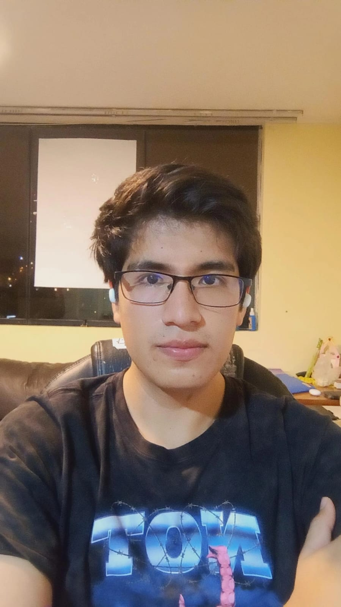 
        </td>
        <td align="left">
            <b>Nombre y Apellido:</b>
             
            Bohorquez Lerzundi, Gerardo Sebastián
        </td>
    </tr>
    <tr>
        <td align="left">
        <b>Carrera:</b>
         
        Ingeniería de Software
        </td>
    </tr>
    <tr>
        <td align="left">
        <b>Acerca de:</b>
          
	Estoy cursando el sexto semestre de Ingeniería de Software en la Universidad UPC. Me distingo por ser una persona 		ágil, comprometida, asertiva y profundamente ética. En este proyecto, me comprometo a aportar lo mejor de mí, no solo 		para alcanzar los objetivos del equipo, sino también para fomentar un ambiente de trabajo positivo y colaborativo.
        </td>
    </tr>
    <tr align="center">
        <td rowspan="3">
            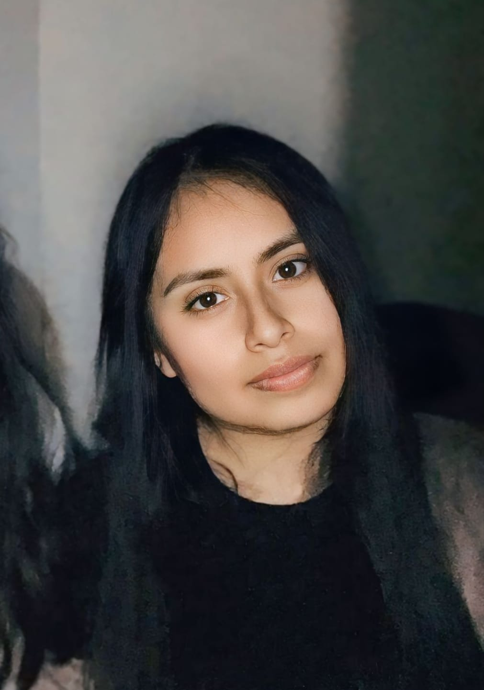
        </td>
        <td align="left">
            <b>Nombre y Apellido:</b>
             
            Huanaco Huayta, Elizabeth Lucero
        </td>
    </tr>
    <tr>
        <td align="left">
        <b>Carrera:</b>
         
          Ingeniería de Software 
        </td>
    </tr>
    <tr>
        <td align="left">
        <b>Acerca de:</b>
         
       Estoy en el sexto ciclo de Ingeniería de Software en la Universidad Peruana de Ciencias Aplicadas. Me considero una persona organizada, resiliente y asertiva. Elegí enfocarme en esta carrera por el interés que tengo en el desarrollo de software, ya que considero que es un área clave para el futuro de la innovación tecnológica. En este proyecto, me comprometo a aplicar mis cualidades y contribuir al logro de los objetivos de mi equipo. 
        </td>
    </tr>
    <tr align="center">
        <td rowspan="3">
            
        </td>
        <td align="left">
            <b>Nombre y Apellido:</b>
             
            Huapaya Cuevas, Anthony Martin
        </td>
    </tr>
    <tr>
        <td align="left">
        <b>Carrera:</b>
         
        Ingeniería de Software
        </td>
    </tr>
    <tr>
        <td align="left">
        <b>Acerca de:</b>
         
        Me encuentro cursando el sexto ciclo de la carrera de Ingeniería de Software en la Universidad Peruana de Ciencias Aplicadas. Me considero una persona perseverante, fácil de adaptarse con respecto al ambiente de trabajo y responsable. Elegí el desarrollo de esta carrera para los avances tecnológicos con respecto al software, por que es una parte fundamental para lograr ese objetivo. Me comprometo con este trabajo mantener un ambiente sano en el equipo y apoyar constantemente con el avance de este.
        </td>
    </tr>
    <tr align="center">
        <td rowspan="3">
            
        </td>
        <td align="left">
            <b>Nombre y Apellido: </b>
             
            Silva Tirado, Sebastián Valentino
        </td>
    </tr>
    <tr>
        <td align="left">
        <b>Carrera:</b>
         
        Ingenieria de Software
        </td>
    </tr>
    <tr>
        <td align="left">
        <b>Acerca de:</b>
         
         Soy estudiante del sétimo ciclo de la carrera de Ingeniería de Software en UPC. Opté por estudiar esta carrera porque me gusta la idea de programar y crear algo que pueda llegar a funcionar y ser útil en el mundo. Por lo cual, la universidad me da la posibilidad de estudiar y ser un profesional exitoso. Deseo ser buen integrante para mi equipo y me comprometo en hacer el mejor trabajo posible, y poder superarme más que el ciclo anterior.
        </td>
    </tr>
    <tr align="center">
        <td rowspan="3">
            
        </td>
        <td align="left">
            <b>Nombre y Apellido:</b>
             
            Uribe Quispe, Jesús Guillermo
        </td>
    </tr>
    <tr>
        <td align="left">
        <b>Carrera:</b>
         
        Ingeniería de Software
        </td>
    </tr>
    <tr>
        <td align="left">
        <b>Acerca de:</b>
         
        Soy estudiante de Ingenieria de Software en la UPC y actualmente estoy en el 6to ciclo. Elegí esta carrera porque me interesó el campo del software y la matemáticas. Me comprometo a
		ayudar a mis compañeros con el trabajo asi como también fuera de este.
        </td>
    </tr>
	 
</table>

<h3> 1.2. Solution Profile</h3>

<h4> 1.2.1. Antecedentes y Problemática</h4>

**Antecedentes:**

La incorporación de tecnologías digitales ha transformado notablemente la gestión de pacientes en consultorios dentales, permitiendo optimizar procesos como la programación de citas, la actualización de historiales clínicos y la comunicación entre el personal médico y los pacientes. En el caso del Perú, el desarrollo de la salud digital aún no se encuentra plenamente consolidado, aunque sí muestra un crecimiento progresivo. 
 Según el Instituto Nacional de Estadística e Informática (INEI, 2022), el 72.7 % de la población tenía acceso a internet en el año 2022, frente al 64.5 % registrado en 2020. Este crecimiento evidencia un contexto propicio para impulsar la digitalización en consultorios dentales, con el objetivo de ofrecer una gestión más eficiente, accesible y adaptada a las necesidades actuales de los pacientes. 
No obstante, cabe señalar que, según datos registrados y analizados por Osiptel, el uso y manejo de dispositivos móviles ha aumentado aproximadamente en un 10 % en 2021, considerando que en 2016 el 78 % de la población ya utilizaba teléfonos móviles (Osiptel, 2022). 
Estos datos reflejan una tendencia creciente hacia la digitalización en la población peruana, así como una fuerte relación entre el uso de dispositivos móviles y el acceso a internet desde estos equipos.

**Problemática:**

No obstante los avances tecnológicos, muchas clínicas dentales, especialmente aquellas de menor tamaño, continúan utilizando métodos manuales o sistemas informáticos desactualizados para gestionar la atención de sus pacientes. Esta situación puede derivar en errores en la programación de citas, pérdida de información clínica relevante y una experiencia poco satisfactoria para los usuarios. Además, la falta de capacitación en el uso adecuado de estas herramientas limita su correcta implementación, afectando tanto la eficiencia operativa como la calidad del servicio. A ello se suma la percepción de que las soluciones digitales son costosas y difíciles de integrar, lo que representa un obstáculo adicional para su adopción en la práctica diaria.

**WHAT (Qué): ¿Cuál es el problema?**

El problema es la ineficiencia y gestión de consultorios o clínicas dentales independientes , lo que se traduce en errores en la programación de citas, pérdida de historiales médicos, posibles pérdidas de boletas y facturas, así como también una mala experiencia para los pacientes debido a la demora de sus atenciones y funciones de dicha clínica.

**WHEN (Cuándo): ¿Cuándo sucede el problema?**

El problema ocurre durante todo el proceso de atención al paciente, desde la programación de la cita hasta el seguimiento post-tratamiento. Es más evidente en momentos de alta demanda o cuando se manejan múltiples pacientes simultáneamente.

**WHERE (Dónde): ¿Dónde surge el problema?**

El problema surge dentro de los consultorios dentales, especialmente de aquellos que aún dependen de métodos manuales para  manejar y gestionar los datos sobre las operaciones cotidianas, dando como posibles problemas la pérdida de datos importantes.

**WHO (Quién): ¿A quiénes les sucede el problema?**

El problema afecta tanto a los dentistas y el personal administrativo que en general son los mismos dueños. Dichos profesionales presentan dificultades para manejar las tareas diarias del consultorio y registrar datos. Este problema repercute indirectamente a los pacientes, ya que, da como resultado una mala atención por falta de orden, gestión y coordinación.

**WHY (Por qué): ¿Cuál es la causa del problema?**

La principal causa radica en la baja adopción de tecnologías digitales eficaces para gestionar pacientes. Esto se debe, en gran parte, a la percepción de que estas soluciones son costosas, a la falta de capacitación en su uso y a la resistencia al cambio que muestran algunos profesionales de la salud.

**HOW (Cómo): ¿Cómo llevó a los involucrados a llegar a esta situación?**

La dependencia de métodos tradicionales, sumada a la escasa inversión en tecnología y a la falta de capacitación continua, ha generado que muchos consultorios no estén preparados para responder eficientemente a las demandas actuales, lo que se traduce en un servicio por debajo del nivel esperado.

**HOW MUCH (Cuánto): ¿Cuánto afecta el problema?**

Este problema impacta de manera directa en la eficiencia operativa de los consultorios, disminuye la satisfacción del paciente y, en consecuencia, afecta negativamente la rentabilidad del negocio. Las clínicas que operan con sistemas de gestión ineficientes corren el riesgo de perder pacientes y reputación, además de incurrir en mayores costos operativos por errores y procesos poco optimizados.

<h4> 1.2.2. Lean UX Process</h4>

<h5> 1.2.2.1. Lean UX Problem Statements</h5>

En la actualidad, los consultorios dentales se enfrentan al reto de gestionar de manera centralizada y eficiente sus actividades diarias, tales como la programación de citas, el manejo de historiales clínicos y la facilitación de pagos en línea. Este reto se vuelve aún más relevante en un contexto donde la digitalización se ha convertido en un factor clave para mejorar la experiencia del paciente y optimizar tanto el tiempo como los recursos del profesional odontológico.

Se ha observado que una gran parte de los consultorios aún recurre a métodos tradicionales y fragmentados para organizar sus procesos, lo cual genera una experiencia poco eficiente para pacientes y profesionales por igual. La ausencia de una solución digital integral dificulta la coordinación oportuna de citas, el acceso ágil a los historiales clínicos y la automatización de los procesos de pago, lo que repercute negativamente en la satisfacción del paciente y en la productividad del consultorio.

**¿Cómo podemos desarrollar una plataforma web integral y fácil de usar que optimice la gestión de los consultorios dentales, permitiendo a los profesionales concentrarse en brindar un servicio de alta calidad, mientras se mejora la experiencia del paciente a través de la digitalización y la automatización de tareas clave?**
  

<h5> 1.2.2.2. Lean UX Assumptions</h5>

**Business Assumptions**
- Creemos que nuestros clientes necesitan una mejor aplicación con respecto a la gestión de citas, historial clínico y los pagos en línea.
- Estas necesidades se pueden resolver mediante el uso de una aplicación móvil que logre integrar la gestión de pacientes, registro de los historiales clínicos, reserva de las citas y la comprobación del pago realizado.
- Los clientes principales son los odontólogos que administran sus propios consultorios, quiénes buscan brindar un servicio eficiente y cómodo para sus pacientes.
- El valor #1 que un cliente quiere del servicio es su efectividad al momento de gestionar su consultorio dental con herramientas que mejoran su experiencia.
- El cliente también puede obtener estos beneficios adicionales gracias a la venta de planes de suscripción con soporte continuo y especializado para su consultorio dental, brindando funcionalidades que le ayudarán a mejorar la organización de esta, como la función offline.
- Vamos a adquirir la mayoría de los clientes mediante el uso del marketing digital y alianzas estratégicas con asociaciones de dentistas profesionales con el fin de ampliar nuestra red de contactos y aumentar la visibilidad de nuestra aplicación móvil.
- Se hará dinero a través de las compras de suscripciones, los cuales le brindarán mayores comodidades para organizar su consultorio de manera eficiente.
- Nuestra competencia principal en el mercado son las aplicaciones móviles que se encargan de gestionar consultorios dentales, pese a que no ofrezcan una integración completa o falta de intuición para los usuarios.
- Los venceremos debido al uso de nuevas tecnologías con un enfoque en las constantes mejoras en la experiencia, tanto para los dentistas como para los pacientes, y soporte continuo.
- Nuestro mayor riesgo es que los dentistas se resistan cambiar a algo nuevo por mantener sus métodos tradicionales en la gestión de sus consultorios dentales.
- Resolveremos esto a través de las demostraciones del software y el enfoque con respecto al soporte al cliente con el fin de ayudar para su rápida adaptación a la aplicación.

**Assumptions Worksheet**
- **¿Quién es el usuario?** Los usuarios son los dentistas con su propio consultorios, quienes buscan una aplicación que pueda gestionar de manera eficiente sus consultorios y a su vez ser moderno.
- **¿Dónde encaja nuestro producto en su trabajo o vida?** Nuestra aplicación móvil se integra a la vida cotidiana de los dentistas, facilitando las gestiones de citas, historiales médicos y los pagos. También implementando una función offline en caso de que no necesite estar conectado todo el tiempo a la red.
- **¿Qué problemas tiene nuestro producto? ¿Resolver?** El desafío que pueden tener algunos dentistas es la adopción de nuevas tecnologías. También puede existir resistencia por el uso de plataformas digitales para la gestión de la información.
- **¿Cuándo y cómo es nuestro producto usado?** La aplicación móvil tiene un uso diario para la gestión de citas, revisión de historiales médicos y la facturación de los pagos.
- **¿Qué características son importantes?** Las principales características son la accesibilidad en los distintos dispositivos móviles con la integración de sistemas de pagos y una interfaz amigable.
- **¿Cómo debe verse nuestro producto y cómo comportarse?** Debe verse limpio, profesional e intuitivo, donde pueda reflejar la seriedad y confianza para el ámbito de salud. Además, la aplicación debe responder rápidamente las acciones del usuario con una navegación sencilla.

<h5> 1.2.2.3. Lean UX Hypothesis Statements</h5>

- Creemos que al brindar las nuevas herramientas para gestionar las citas, historias clínicas y pagos en línea, se mejorará la eficiencia de la clínica y la experiencia del paciente. Sabremos que tenemos éxito en la mejoras de la experiencia de los usuarios cuando observamos mejor organización de las citas y la facturación de los pagos.
- Creemos que al integrar la generación de facturas automáticas, se simplificará el proceso de facturación de los pagos. Sabemos que estamos cumpliendo este objetivo cuando supera el 80% en la reducción del tiempo con respecto a la emisión de facturas.
- Creemos que al integrar un modo offline, facilitará el uso de la aplicación en la visualización de las estadísticas y gestión de citas sin la necesidad de estar conectados a internet. Sabemos que estamos cumpliendo este objetivo con la disminución en los problemas de conectividad, sobre todo en áreas con poco acceso a internet.

<h5> 1.2.2.4. Lean UX Canvas </h5>

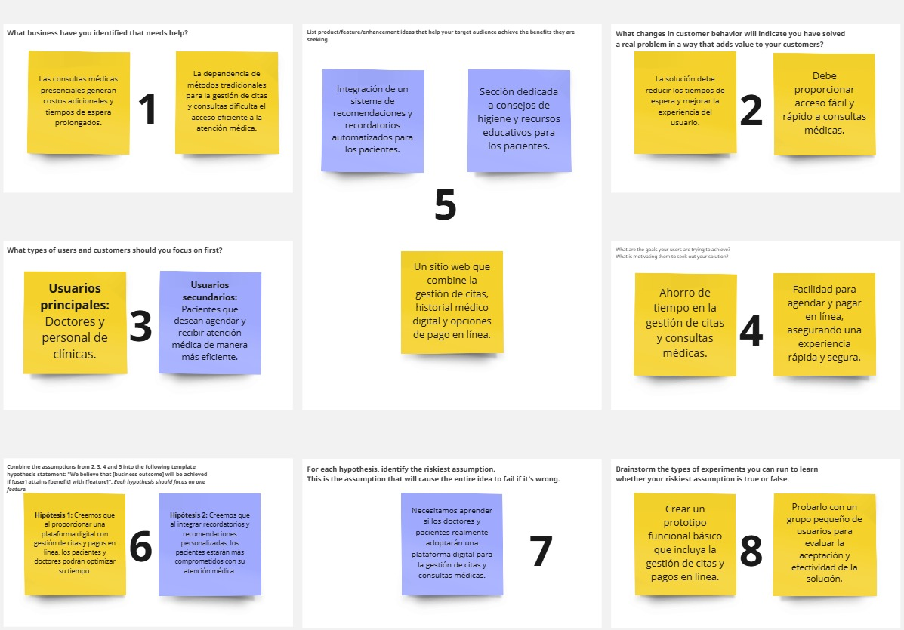

<h3> 1.3 Segmentos Objetivos</h3>

En esta sección, definiremos los perfiles específicos del público objetivo para nuestro producto. Dichos grupos comparten características demográficas, comportamientos o necesidades similares, lo que les diferencia de otros segmentos del mercado y permite ajustar estrategias para satisfacer sus necesidades de una mejor manera.

- **Segmento demográfico:**
Dentistas que poseen un ingreso medio y que tienen la capacidad de hacer una inversión en herramientas y sistemas que mejoren su gestión de pacientes.

- **Segmento geográfico:**
Dentistas en áreas urbanas con una base de pacientes significativa.

- **Segmento psicográfico:**
Profesionales que buscan optimizar sus prácticas y ofrecer un mejor servicio a sus pacientes.

- **Segmento Conductual:**
Dentistas que buscan y necesitan herramientas para optimizar su gestión de citas.

<h2>Capítulo II: Requirements Elicitation & Analysis</h2>

<h3> 2.1 Competidores</h3>

| **Competidor**   |         **Descripción**                                                                                                                                 | **Características**                                                                                                                                       | **Logo** |
|---------------------------|-------------------------------------------------------------------------------------------------------------------------------------------------|-----------------------------------------------------------------------------------------------------------------------------------------------------------|----------|
| **iDentist**  | iDentist es una aplicación móvil para clínicas dentales que facilita la gestión de pacientes, pagos, historias clínicas, imágenes dentales y tratamientos. Además, ofrece automatización de recordatorio de citas por SMS. | - Administración de pacientes   - Gestión de historias clínicas   - Gestión de citas   - Seguimiento de planes de tratamiento   - Diagnósticos   - Registros dentales   - Control contable de ingresos y gastos   - Almacenamiento de imágenes   - Modo offline   - Recordatorios automatizados de citas por SMS   - Interfaz intuitiva   - Modo oscuro   - Compatibilidad con Android, iOS y Windows   - Funcionalidad basada en la nube | 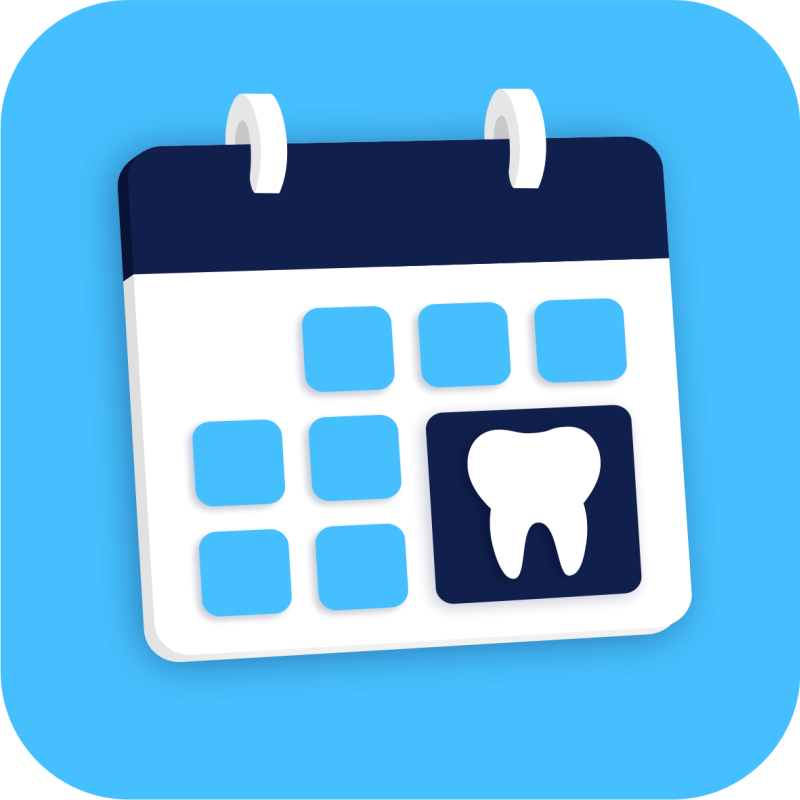  |
| **My Dental Clinic**                | My Dental Clinic es una aplicación móvil para consultorios dentales que optimiza la gestión de consultorios dentales con herramientas avanzadas.                 | - Gestión de pacientes   - Gestión de historial clínico   - Conversión de la ficha clínica a PDF   - Gráficos dentales   - Notas dentales   - Gestión de citas   - Almacenamiento de imágenes dentales   - Gestión de pagos   - Contacto con el paciente por SMS   - Sincronización de citas con el calendario del celular   - Modo offline   - Capacidad para hacer zoom en las imágenes dentales   - Funcionalidad multi-idioma   - Basada en la nube | 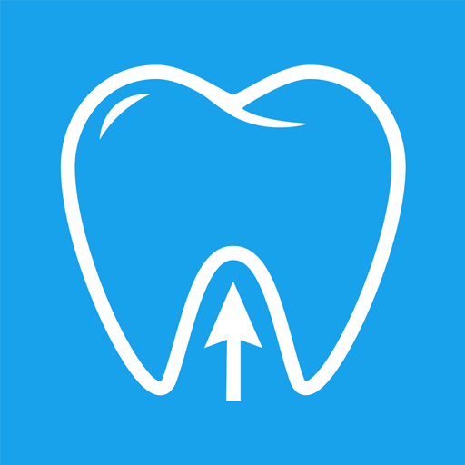 |
| **Cusp Software Dental**           | Cusp Software Dental es una aplicación móvil diseñada para ayudar a gestionar clínicas dentales con herramientas tecnológicas que ayudan a monitorear el tratamiento.                    | - Gestión de pacientes   - Gestión de citas   - Sistema de recordatorio para programar una cita   - Recordatorio de citas por SMS   - Gestión de historias clínicas   - Gestión de pagos   - Odontogramas   - Gráficos para registrar información   - Herramientas de contabilidad   - Seguimiento de tratamiento   - Calendario   - Sincronización de datos con otros dispositivos   - Contacto con pacientes por SMS   - Funcionalidad basada en la nube | 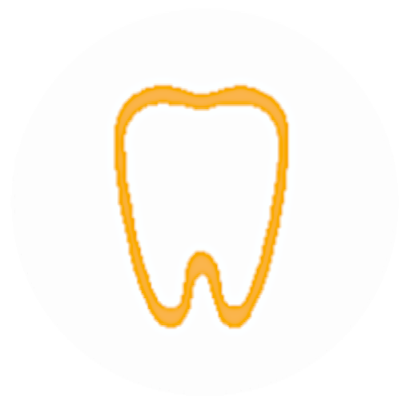 |

<h4> 2.1.1 Análisis competitivo</h4>

| **Competidor**                     |  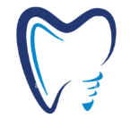                                                                        |                                                                                           |                                                                              |                                                                                   |
|------------------------------------|---------------------------------------------------------------------------------------------|---------------------------------------------------------------------------------------------------|-----------------------------------------------------------------------------------------------------|-----------------------------------------------------------------------------------------------------------|
| **Perfil Overview**                |App móvil para dentistas que facilita citas, pagos y seguimiento de pacientes en tiempo real.       | App móvil para clínicas dentales con enfoque en automatización desde dispositivos móviles.       | App móvil que digitaliza procesos clínicos y administrativos de forma simple.                    | App móvil con herramientas digitales enfocadas en tratamiento y contabilidad para clínicas dentales.     |
| **Ventaja competitiva**            | Gestión total del consultorio desde el móvil, con notificaciones push e interfaz optimizada para smartphones.                        | Multiplataforma (iOS, Android, Windows), modo offline, control de ingresos y gastos.             | Facilidad de uso, integración con calendario y soporte multilenguaje.                            | Buen balance entre funciones clínicas y contables, acceso en múltiples dispositivos.                      |
| **Mercado objetivo**              | Clínicas pequeñas y medianas en zonas urbanas del Perú.                                     | Clínicas modernas que trabajan desde dispositivos móviles.                                        | Consultorios que quieren digitalizar sin complicaciones técnicas.                               | Clínicas que quieren seguimiento visual y contable de tratamientos.                                      |
| **Estrategia de marketing**        | Presencia digital, publicidad en redes, alianzas con gremios dentales.                      | App Store, Play Store, redes sociales, enfoque en movilidad y facilidad.                         | Enfocada en App Stores, recomendaciones y facilidad de uso.                                     | Uso de redes sociales, beneficios de digitalización rápida y clara.                                       |
| **Productos & Servicios**          | Citas, historial, pagos, métricas, backup, dashboard, recordatorios, soporte técnico.       | Citas, pacientes, diagnósticos, pagos, imágenes, gastos, recordatorios SMS, modo oscuro.         | Citas, historial, notas dentales, gráficos dentales, imágenes, PDF, pagos.                      | Citas, pacientes, pagos, odontogramas, contabilidad, gráficos, historial, recordatorios SMS.             |
| **Precios & Costos**              | Precio accesible mensual con prueba gratuita.                                               | Plan de pago mensual/anual (varía según plataforma).                                               | Costos bajos, con versiones gratuitas limitadas y planes premium.                              | Plan de pago mensual con acceso completo desde el inicio.                                                |
| **Canales de distribución**        | Móvil                                                                                         | Móvil                                                                     | Móvil                                                                                             | Móvil                                                                                                     |
| **Debilidades**                    | Nuevo en el mercado, falta de confianza inicial.                                             | Puede no cubrir necesidades avanzadas de grandes clínicas.                                        | Limitado a móviles, poco robusto para clínicas grandes.                                          | Falta de personalización en algunos módulos, riesgo de estancamiento.                                    |
| **Oportunidades**                  | Alta demanda de digitalización en clínicas del Perú.                                         | Aumento de uso de móviles en el rubro médico.                                                     | Gran adopción de móviles en regiones con bajo acceso a PCs.                                    | Interés en herramientas visuales y simples para contabilidad.                                             |
| **Fortalezas**                     | Solución local con soporte completo, adaptable y segura.                                    | Automatización, compatibilidad, almacenamiento en la nube.                                        | Facilidad, conexión con calendario, interfaz amigable.                                           | Funciones clínicas novedosas, sincronización entre dispositivos.                                       |

<h4> 2.1.2. Estrategias y tácticas frente a competidores</h4>

- Proporcionaremos una interfaz intuitiva que facilite el uso del software, con una navegación fluida y rápida, además de soporte personalizado para garantizar una adopción eficiente y una alta satisfacción del usuario.

- Ofreceremos planes de suscripción flexibles y escalonados, diseñados para ajustarse a distintos presupuestos y necesidades. Desde opciones básicas hasta funciones avanzadas, cada plan estará orientado a diferentes tipos de consultorios.

- Incorporaremos testimonios de clientes satisfechos en nuestra estrategia de marketing para reforzar la credibilidad. Estos testimonios serán resaltados en nuestro sitio web y materiales promocionales, contribuyendo a atraer nuevos usuarios y fortalecer la confianza en nuestra plataforma.

<h3> 2.2 Entrevistas</h3>

Esta sección recopila la información obtenida a partir de entrevistas realizadas a odontólogos que gestionan sus propios consultorios. Se incluyen las preguntas formuladas, las entrevistas realizadas y un análisis comparativo. El objetivo es comprender sus necesidades y hábitos actuales para fundamentar el desarrollo de una solución digital adecuada a su entorno real.

<h4> 2.2.1. Diseño de entrevistas.</h4>

**Preguntas para los odontólogos independientes**
1. ¿Cuál es tu nombre?
2. ¿Qué edad tienes?
3. ¿A qué te dedicas actualmente?
4. ¿En qué lugar vives o trabajas?
5. ¿Podrías contarme un poco sobre ti? Por ejemplo, ¿cuántos pacientes sueles atender semanalmente?
6. ¿Dónde está ubicado tu consultorio?
7. ¿Cuánto tiempo lleva funcionando tu consultorio?
8. ¿Utilizas alguna app o software para organizar las tareas diarias en tu clínica? Si es así, ¿podrías contarme cómo funciona y qué te parece?
9. ¿Qué tan necesario es para ti que esa aplicación funcione sin conexión a internet (modo offline)?
10. ¿Qué dificultades enfrentas al organizar tu agenda y las citas de tus pacientes?
11. ¿Cómo manejas la comunicación con los pacientes, especialmente cuando hay cancelaciones o cambios en las citas?
12. Si pudieras añadir nuevas funciones al software que usas, ¿cuáles agregarías y por qué?
13. ¿Qué marcas, dispositivos o plataformas digitales prefieres para trabajar y mantenerte al día?
14. ¿Cómo organizas tu jornada diaria para asegurarte de que todas las citas se realicen sin inconvenientes?
15. ¿Qué tan complicado te resulta mantener actualizados los registros y tratamientos de tus pacientes? ¿Qué métodos usas para llevar el control de las historias clínicas?
16. ¿Cómo controlas los ingresos del consultorio y haces seguimiento de los pagos pendientes?
17. ¿Qué tan relevante es para ti recibir opiniones de tus pacientes? ¿Cómo sabes si recomiendan tus servicios?
18. ¿Qué tan importante es para ti que la información del consultorio esté segura y bien respaldada?
19. ¿Estarías dispuesto(a) a pagar por una aplicación que te ayude a gestionar tu consultorio? ¿Qué precio te parecería razonable?

<h3> 2.2.2. Entrevistas</h3>

<table style="width: 100%; border-collapse: collapse;">
    <tr>
        <td>Entrevistado N°1</td>
        <td>Fabrisio Belahonia</td>
    </tr> 
    <tr>
        <td>Edad</td>
        <td>25</td>
    </tr> 
    <tr>
        <td>Distrito de residencia</td>
        <td>San Borja</td>
    </tr> 
    <tr>
        <td>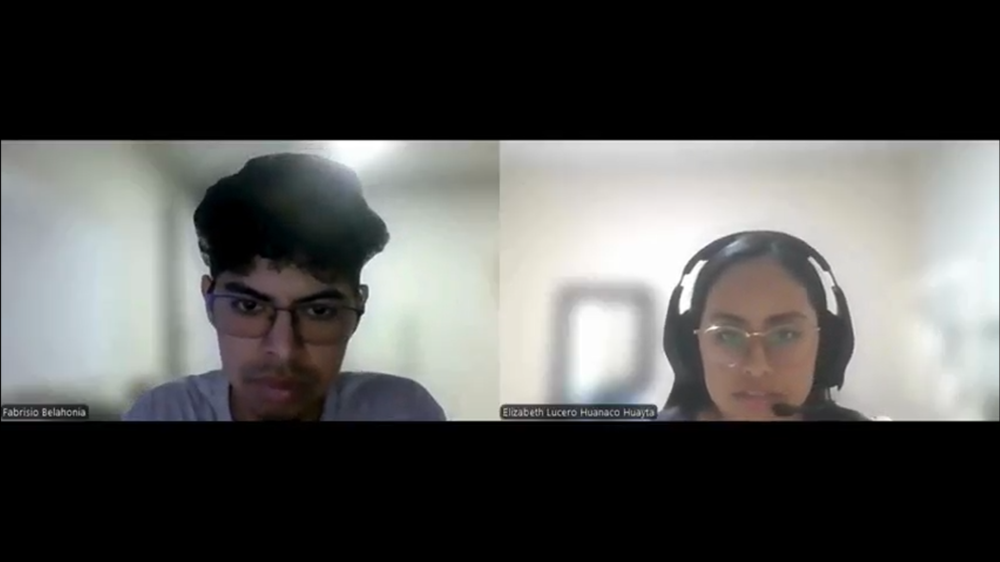</td>
        <td>Fabrisio Belahonia es un odontólogo de 25 años con 3 años de experiencia en su consultorio ubicado en San Borja. Actualmente atiende 
        a 50 pacientes por semana y, para organizarse, utiliza herramientas como Excel, una agenda física y WhatsApp Business. Sin embargo, a pesar de sus esfuerzos, ha tenido cruces de citas debido a la falta de automatización en su gestión. Su principal motivación es brindar un servicio excelente y eficiente a sus pacientes; por ello, le interesan funciones como el historial clínico digital, recordatorios automáticos, un calendario integrado y estándares de seguridad en el manejo de datos.</td>
    </tr> 
    <tr>
        <td>Timing: 0:00 - 7:24</td>
        <td>URL: <a href="https://upcedupe-my.sharepoint.com/:v:/g/personal/u202220235_upc_edu_pe/EVi0RngO5thJqF1nZZ-HpTQBQqMD679kftRv7LBZbx6PKA?e=sGO9aU&nav=eyJyZWZlcnJhbEluZm8iOnsicmVmZXJyYWxBcHAiOiJTdHJlYW1XZWJBcHAiLCJyZWZlcnJhbFZpZXciOiJTaGFyZURpYWxvZy1MaW5rIiwicmVmZXJyYWxBcHBQbGF0Zm9ybSI6IldlYiIsInJlZmVycmFsTW9kZSI6InZpZXcifSwicGxheWJhY2tPcHRpb25zIjp7fX0%3D" target="_blank">https://upcedupe-my.sharepoint.com/:v:/g/personal/u202220235_upc_edu_pe/EVi0RngO5thJqF1nZZ-HpTQBQqMD679kftRv7LBZbx6PKA?e=sGO9aU&nav=eyJyZWZlcnJhbEluZm8iOnsicmVmZXJyYWxBcHAiOiJTdHJlYW1XZWJBcHAiLCJyZWZlcnJhbFZpZXciOiJTaGFyZURpYWxvZy1MaW5rIiwicmVmZXJyYWxBcHBQbGF0Zm9ybSI6IldlYiIsInJlZmVycmFsTW9kZSI6InZpZXcifSwicGxheWJhY2tPcHRpb25zIjp7fX0%3D</a></td>
    </tr> 
    <tr>
        <td>Entrevistado N°2</td>
        <td>Yesenia Olorte</td>
    </tr> 
    <tr>
        <td>Edad</td>
        <td>49</td>
    </tr> 
    <tr>
        <td>Distrito de residencia</td>
        <td>Santiago de Surco</td>
    </tr> 
    <tr>
        <td>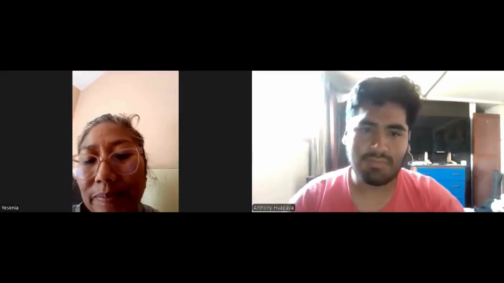</td>
        <td>La Dra. Yesenia Olorte Himato, cirujana dentista especializada en cirugía y estética ortodoncia, atiende en su consultorio en Santiago de Surco desde hace 5 a 6 años. Trabaja con un promedio de 10 pacientes semanales, manejando sus citas a través de una agenda y WhatsApp. Su principal problema es la reprogramación de citas, ya que no utiliza aplicaciones de gestión. Prefiere usar el celular por comodidad y se mantiene actualizada mediante revistas y cursos del colegio médico. Controla personalmente los ingresos y valora mucho la opinión de sus pacientes, además de estar comprometida con la seguridad de su consultorio.</td>
    </tr> 
    <tr>
        <td>Timing: 7:24 - 23:08</td>
        <td>URL: <a href="https://upcedupe-my.sharepoint.com/:v:/g/personal/u202220235_upc_edu_pe/EVi0RngO5thJqF1nZZ-HpTQBQqMD679kftRv7LBZbx6PKA?e=H0jt4C&nav=eyJyZWZlcnJhbEluZm8iOnsicmVmZXJyYWxBcHAiOiJTdHJlYW1XZWJBcHAiLCJyZWZlcnJhbFZpZXciOiJTaGFyZURpYWxvZy1MaW5rIiwicmVmZXJyYWxBcHBQbGF0Zm9ybSI6IldlYiIsInJlZmVycmFsTW9kZSI6InZpZXcifSwicGxheWJhY2tPcHRpb25zIjp7InN0YXJ0VGltZUluU2Vjb25kcyI6NDQzLjUzfX0%3D" target="_blank">https://upcedupe-my.sharepoint.com/:v:/g/personal/u202220235_upc_edu_pe/EVi0RngO5thJqF1nZZ-HpTQBQqMD679kftRv7LBZbx6PKA?e=H0jt4C&nav=eyJyZWZlcnJhbEluZm8iOnsicmVmZXJyYWxBcHAiOiJTdHJlYW1XZWJBcHAiLCJyZWZlcnJhbFZpZXciOiJTaGFyZURpYWxvZy1MaW5rIiwicmVmZXJyYWxBcHBQbGF0Zm9ybSI6IldlYiIsInJlZmVycmFsTW9kZSI6InZpZXcifSwicGxheWJhY2tPcHRpb25zIjp7InN0YXJ0VGltZUluU2Vjb25kcyI6NDQzLjUzfX0%3D</a></td>
    </tr> 
    <tr>
        <td>Entrevistado N°3</td>
        <td>Carlos Santa María</td>
    </tr> 
    <tr>
        <td>Edad</td>
        <td>46</td>
    </tr> 
    <tr>
        <td>Distrito de residencia</td>
        <td>Miraflores</td>
    </tr> 
    <tr>
        <td>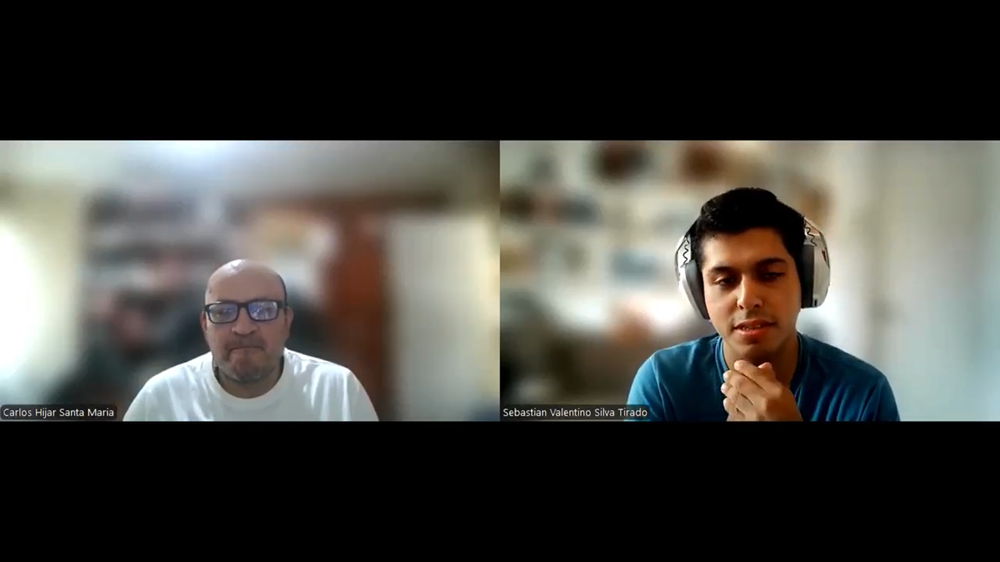</td>
        <td>El Dr. Carlos Hijar, odontólogo con 10 años de experiencia, atiende en su consultorio en Miraflores, Lima, desde hace 6 años. Trabaja con un promedio de 25 a 30 pacientes por semana y utiliza un software clínico para organizar sus tareas, aunque considera fundamental que funcione también sin internet. Su mayor reto es la gestión de citas ante cancelaciones. Se comunica con sus pacientes por WhatsApp y prefiere dispositivos Apple. Valora la opinión de sus pacientes, gestiona personalmente sus ingresos y considera esencial la seguridad digital. Estaría dispuesto a pagar por una app que le ayude a mejorar la gestión de su consultorio.</td>
    </tr> 
    <tr>
        <td>Timing: 23:08 - 32:06</td>
        <td style="word-wrap: break-word;">URL: <a href="https://upcedupe-my.sharepoint.com/:v:/g/personal/u202220235_upc_edu_pe/EVi0RngO5thJqF1nZZ-HpTQBQqMD679kftRv7LBZbx6PKA?e=O10mfP&nav=eyJyZWZlcnJhbEluZm8iOnsicmVmZXJyYWxBcHAiOiJTdHJlYW1XZWJBcHAiLCJyZWZlcnJhbFZpZXciOiJTaGFyZURpYWxvZy1MaW5rIiwicmVmZXJyYWxBcHBQbGF0Zm9ybSI6IldlYiIsInJlZmVycmFsTW9kZSI6InZpZXcifSwicGxheWJhY2tPcHRpb25zIjp7InN0YXJ0VGltZUluU2Vjb25kcyI6MTM4OC4yNH19" target="_blank">https://upcedupe-my.sharepoint.com/:v:/g/personal/u202220235_upc_edu_pe/EVi0RngO5thJqF1nZZ-HpTQBQqMD679kftRv7LBZbx6PKA?e=O10mfP&nav=eyJyZWZlcnJhbEluZm8iOnsicmVmZXJyYWxBcHAiOiJTdHJlYW1XZWJBcHAiLCJyZWZlcnJhbFZpZXciOiJTaGFyZURpYWxvZy1MaW5rIiwicmVmZXJyYWxBcHBQbGF0Zm9ybSI6IldlYiIsInJlZmVycmFsTW9kZSI6InZpZXcifSwicGxheWJhY2tPcHRpb25zIjp7InN0YXJ0VGltZUluU2Vjb25kcyI6MTM4OC4yNH19</a></td>
    </tr> 
</table>

<h4> 2.2.3. Analisis de Entrevistas.</h4>

A continuación, se presenta el análisis de las entrevistas realizadas a odontólogos independientes. Este estudio permite identificar patrones, necesidades y oportunidades clave para el diseño de la solución digital.

 

**Caraterísticas comunes entre odontólogos entrevistados**

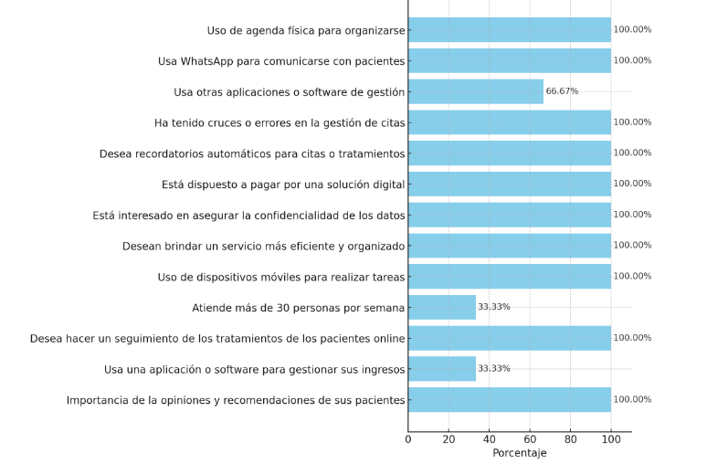

**Fuente**: Datos recolectados mediante entrevistas aplicadas a tres odontólogos independientes en Lima Metropolitana.

 
De acuerdo al análisis realizado, todos los entrevistados utilizan agendas físicas y WhatsApp para gestionar sus citas y comunicarse con pacientes, pero también han experimentado errores como cruces de citas. Esto ha generado un fuerte interés por funcionalidades como recordatorios automáticos, seguimiento digital de tratamientos, confidencialidad de datos y organización más eficiente. Además, todos expresaron estar dispuestos a pagar por una solución tecnológica que les ayude a mejorar la gestión de sus consultorios, incluso sin tener todos acceso a software especializado actualmente. La importancia que le dan a las recomendaciones de sus pacientes refuerza su motivación por brindar un servicio de alta calidad. Aunque solo uno de los tres gestiona sus ingresos con software y atiende a más de 30 pacientes por semana, el uso de dispositivos móviles para el trabajo es generalizado. Esto muestra que hay una base tecnológica sobre la cual construir una aplicación accesible, útil y adaptada a sus necesidades reales.

<h3> 2.3. NeedFinding. </h3>

Es una técnica de diseño centrado en el usuario que busca descubrir necesidades reales de las personas, incluso aquellas que no expresan explícitamente. A través de entrevistas, observaciones y análisis del comportamiento, se identifican problemas, frustraciones, deseos y oportunidades que pueden guiar el desarrollo de soluciones más útiles y significativas.

<h4> 2.3.1. User Personas.</h4>

<h4> 2.3.2. User Task Matrix.</h4>

A continuación, se presenta una matriz de tareas enfocada en el odontólogo independiente Carlos Hijar Santa María. Esta herramienta permite identificar y clasificar las actividades clave que realiza en su día a día, considerando la frecuencia con la que las lleva a cabo y el nivel de importancia que representan dentro de su práctica profesional.  

<table border="1">
  <thead>
    <tr>
      <th rowspan="2">Tarea</th>
      <th colspan="2">Carlos Hijar Santa María</th>
    </tr>
    <tr>
      <th>Frecuencia</th>
      <th>Importancia</th>
    </tr>
  </thead>
  <tbody>
    <tr>
      <td>Agendar citas</td>
      <td>Alta</td>
      <td>Alta</td>
    </tr>
    <tr>
      <td>Registrar historia clínica</td>
      <td>Media</td>
      <td>Alta</td>
    </tr>
    <tr>
      <td>Hacer seguimiento de tratamientos</td>
      <td>Alta</td>
      <td>Alta</td>
    </tr>
    <tr>
      <td>Revisar y gestionar ingresos</td>
      <td>Alta</td>
      <td>Alta</td>
    </tr>
    <tr>
      <td>Revisar insumos y equipo</td>
      <td>Media</td>
      <td>Alta</td>
    </tr>
    <tr>
      <td>Recordar tratamientos periódicos</td>
      <td>Baja</td>
      <td>Alta</td>
    </tr>
    <tr>
      <td>Comunicarse con pacientes</td>
      <td>Alta</td>
      <td>Alta</td>
    </tr>
    <tr>
      <td>Revisar estado general del consultorio</td>
      <td>Baja</td>
      <td>Media</td>
    </tr>
  </tbody>
</table>

 
Del análisis de la matriz de tareas de Carlos Hijar Santa María, se destaca que las actividades más frecuentes y de mayor importancia están relacionadas directamente con la atención al paciente y la gestión financiera: agendar citas, hacer seguimiento de tratamientos, revisar ingresos y comunicarse con los pacientes. Estas tareas son claves en su rutina diaria y representan puntos críticos que una solución digital debe priorizar. Asimismo, aunque tareas como recordar tratamientos periódicos, revisar insumos y equipos, y revisar estado general del consultorio no se realizan con tanta frecuencia, sí tienen un nivel de importancia alto, lo que indica oportunidades para automatización o recordatorios que aumenten la eficiencia y reduzcan errores. 

<h4> 2.3.3. User Journey Mapping.</h4>

<h4> 2.3.4. Empathy Mapping.</h4>

Utilizaremos esta herramienta visual que nos ayudará a comprender mejor a los usuarios que hemos escogido viendo desde una perspectiva más humana y emocional, en este caso para los odontólogos independientes.

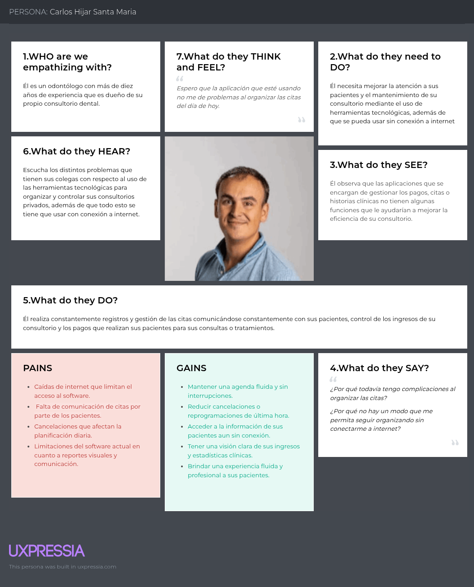

<h4> 2.3.5. As-Is Scenario Mapping.</h4>

El As-Is Scenario Mapping muestra cómo los odontólogos gestionan actualmente su consultorio sin una solución digital integrada. A partir de entrevistas realizadas, se identificaron procesos, herramientas, pensamientos y emociones relacionados con tareas clave como citas, pagos, historias clínicas e inventario. Esta información permite detectar puntos de mejora y fundamentar el desarrollo de una solución más eficiente y centrada en sus necesidades.  

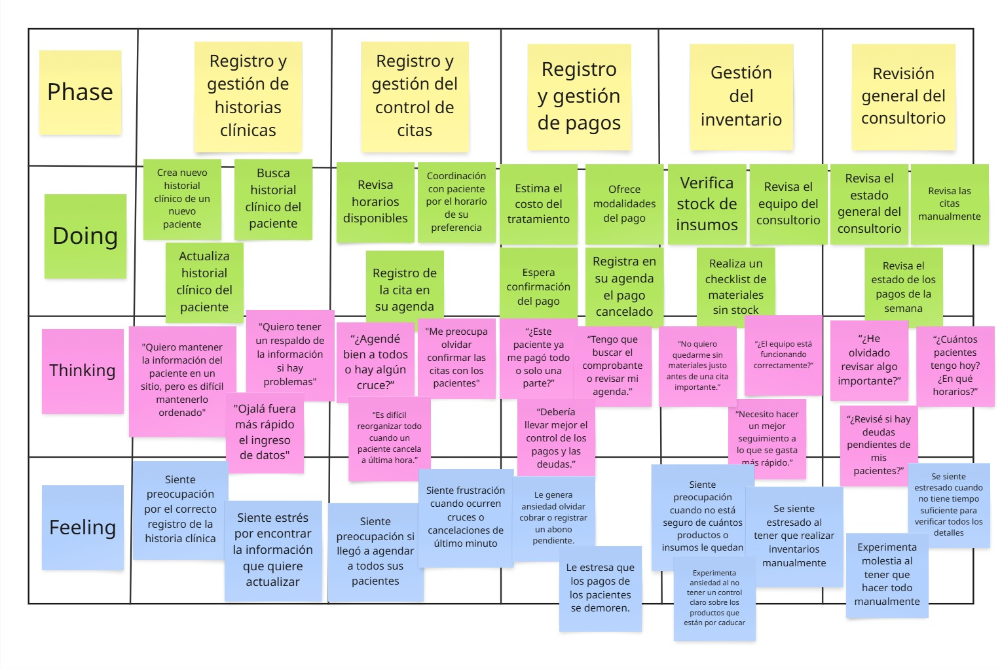

<h4> 2.4. Ubiquitous Language.</h4>

**Patient Record (Historia clínica):**
Conjunto estructurado de documentos e información relacionada con la salud del paciente, que incluye antecedentes médicos, diagnósticos, tratamientos realizados y procedimientos llevados a cabo en el consultorio dental.

**Appointment Scheduling (Programación de citas):**
Proceso mediante el cual se asigna una fecha y hora determinadas para que el paciente acuda al consultorio dental a recibir atención.

**Dental Charting (Odontograma):**
Representación gráfica detallada del estado bucodental del paciente, que registra las condiciones de los dientes y encías.

**Billing (Facturación):**
Procedimiento administrativo orientado a la elaboración y emisión de facturas dirigidas a los pacientes o a sus aseguradoras, detallando los costos asociados a los tratamientos y procedimientos realizados.

**Electronic Health Record – EHR (Registro Electrónico de Salud):**
Sistema digital que almacena y organiza la información médica del paciente, permitiendo un acceso ágil, seguro y centralizado a sus antecedentes, resultados de exámenes y tratamientos previos.

**Oral Hygiene Education (Educación en higiene oral):**
Estrategia de orientación dirigida a los pacientes, centrada en promover prácticas adecuadas de cuidado dental —como el cepillado correcto y el uso de hilo dental— con el fin de prevenir enfermedades y mantener una buena salud bucal.

**Radiographic Imaging (Imágenes radiográficas):**
Técnica diagnóstica basada en el uso de radiografías (rayos X) para visualizar las estructuras internas de la cavidad oral, como dientes, raíces y huesos maxilares.

**Patient Portal (Portal del paciente):**
Plataforma digital segura que permite al paciente interactuar con el consultorio dental, facilitando el acceso a su información clínica, la programación de citas, el pago de facturas y la comunicación con el profesional de salud.

**Revenue Cycle Management – RCM (Gestión del ciclo de ingresos):**
Proceso integral de gestión financiera que abarca desde la programación de citas hasta la facturación y el cobro, con el objetivo de optimizar los ingresos y reducir los costos operativos del consultorio.

**Compliance (Cumplimiento):**
Adopción y seguimiento riguroso de normativas legales, reglamentarias y éticas establecidas por organismos gubernamentales y profesionales que regulan el ejercicio de la odontología.

**Dental Practice Management Software (Software de gestión de consultorios dentales):**
Solución digital diseñada para asistir en la administración diaria del consultorio, incluyendo la gestión de citas, historiales clínicos, pagos, inventario y comunicaciones internas.

**Continuing Education (Educación continua):**
Programas formativos y cursos especializados orientados a que los profesionales odontológicos actualicen y amplíen sus conocimientos, asegurando la aplicación de técnicas modernas y el uso de tecnologías actuales en su práctica clínica.

<h2>CAPITULO III: REQUIREMENTS SPECIFICATIONS </h2>

<h3>3.1. To-Be Scenario Mapping</h3>

<h3>3.2. User Stories</h3>

<h2>REFERENCIAS BIBLIOGRÁFICAS</h2>

Osiptel. (2022). Los servicios de telecomunicaciones en los hogares peruanos: Encuesta Residencial de Servicios de Telecomunicaciones – ERESTEL 2021. https://www.osiptel.gob.pe/media/dujjruwd/erestel-2021.pdf
 

<h2>ANEXOS</h2>

**Anexo A**

**Caraterísticas comunes entre odontólogos entrevistados**

**Fuente**: Datos recolectados mediante entrevistas aplicadas a tres odontólogos independientes en Lima Metropolitana.
