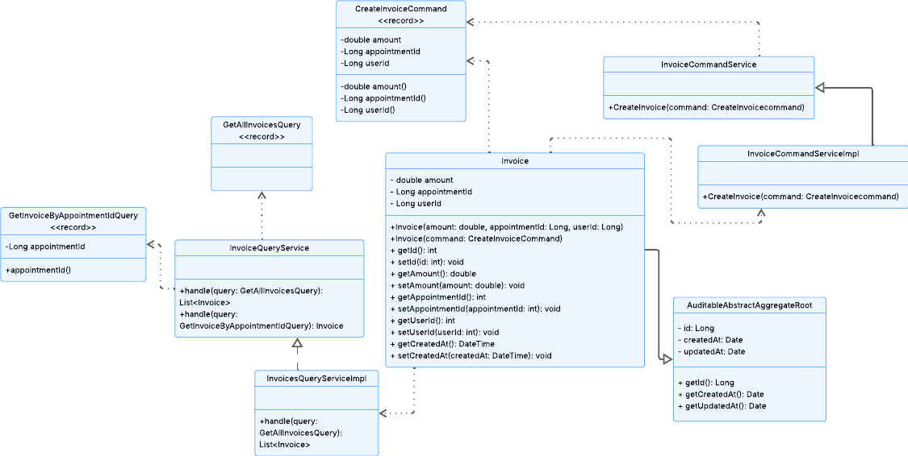
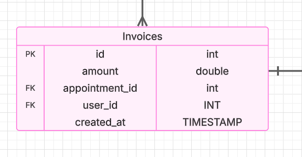

<h1 style="text-align: center;"> Informe del Trabajo Final </h1>
<h3 style="text-align: center;"> Universidad Peruana de Ciencias Aplicadas </h3>

<h5 style="text-align: center"> Área: Ingeniería de Software </h5>

<h5 style="text-align: center"> Curso: Aplicaciones Para Dispositivos Móviles </h5>
<h5 style="text-align: center"> NRC: 353 </h5>

<h5 style="text-align: center"> Docente: Mayta Guillermo, Jorge Luis </h5>

<h5 style="text-align: center"> Startup: MediTech </h5>

<h5 style="text-align: center"> Producto: Dentify </h5>

## Team members:

  
|                Nombre                 |   Código   |
| :-----------------------------------: | :--------: |
| Bohorquez Lerzundi, Gerardo Sebastián | u202224149 |
|  Huanaco Huayta, Elizabeth Lucero   | u20211g522 |
|  Huapaya Cuevas, Anthony       | u202220235 |
|  Silva Tirado, Sebastián Valentino         | u20211g296 |
|     Uribe Quispe, Jesús Guillermo     | u202221876 |

<h5 style="text-align: center"> Ciclo 2025-01 </h5>

# Registro de Versiones del Informe

El objetivo de esta sección es resumir las modificaciones relevantes que se realizan al informe durante el ciclo de vida del proyecto. Esta sección inicia en una página nueva y se incluye un cuadro con la siguiente estructura:

| Versión |   Fecha    |             Autor             | Descripción de modificación                                                                                                                                                                       |
| :-----: | :--------: | :---------------------------: | ------------------------------------------------------------------------------------------------------------------------------------------------------------------------------------------------- |
|   TB1   | 24/04/2025 | Uribe Quispe, Jesús Guillermo | Realización de:   - Capítulo I: Presentación - Capítulo II: Requirements Elicitation & Analysis,  - Capítulo III: Requirements specification  - Capítulo IV: Solution Software Design |

# Project Report Collaboration Insights

URL del repositorio para el reporte del proyecto: https://github.com/TF-AplicacionesMoviles/Documentation

**TB1**

Para el desarrollo del informe perteneciente a la entrega TB1, se dividió la implementación de secciones de la siguiente forma para cada integrante del equipo:

| Integrante                        | Tareas Asignadas                                                                                                                                            |
| --------------------------------- | ----------------------------------------------------------------------------------------------------------------------------------------------------------- |
| Bohorquez Lerzundi, Gerardo       | Analisis Competitivo y User Stories                                                                                                                         |
| Huanaco Huayta, Elizabeth         | Entrevistas, Análisis de entrevistas y Needfinding, As to Be escenario, Elaboración de PPT                                                                  |
| Huapaya Cuevas, Anthony           | Lean Ux, Entrevistas, Análisis de entrevistas y Needfinding, impact map                                                                                     |
| Silva Tirado, Sebastián Valentino | Lean Ux, User Stories, NeedFinding, Elaboración de PPT                                                                                                      |
| Uribe Quispe, Jesús               | Antecedentes y problemática, User and Technical Stories, Product Backlog, Capítulo IV: Solution Software Design, Elaboración de primera versión del BackEnd |

**Github Collaboration Insights**

Github también presenta un timeline de las ramas principales y los procesos de merge a los que se han sometido. Todas las ramas se crearon tomando en cuenta el diseño de GitFlow para una buena organización cuando se usa un software de control de versiones.

Los integrantes son:

- Bohórquez Lerzundi, Gerardo Sebastián (Sebasbl562)
- Huanaco Huayta, Elizabeth Lucero (lucerohh)
- Huapaya Cuevas, Anthony (AnthonyHuapaya)
- Silva Tirado, Sebastián Valentino (SebasSilvaT)
- Uribe Quispe, Jesús Guillermo(JesusU27)

# Contenido

1. [**Capítulo I: Introducción.**](#1.)  
   1.1. [Startup Profile.](#1.1.)  
   1.1.1. [Descripción del startup.](#1.1.1.) 
   1.1.2.[Perfiles de los integrantes del equipo.](#1.1.2.) 
   1.2. [Solution Profile.](#1.2.) 
   1.2.1. [Antecedentes y Problemática.](#1.2.1.) 
   1.2.2. [Lean UX Process.](#1.2.2.) 
   1.2.2.1 [Entrevistas.](#1.2.2.1.) 
   1.2.2.2. [Lean UX Assumptions.](#1.2.2.2.) 
   1.2.2.3 [Lean UX Hypothesis Statements.](#1.2.2.3.) 
   1.2.2.4 [Lean UX Canvas.](#1.2.2.4.) 
   1.3. [Segmentos objetivo.](#1.3.) 
2. [**Capítulo II: Requirements Elicitation & Analysis.**](#2.) 
   2.1. [Competidores.](#2.1.) 
   2.1.1. [Análisis competitivo.](#2.1.1.) 
   2.1.2. [Estrategias y tácticas frente a competidores.](#2.1.2.) 
   2.2. [Entrevistas.](#2.2.) 
   2.2.1. [Diseño de entrevistas.](#2.2.1.) 
   2.2.2. [Registro de entrevistas.](#2.2.2.) 
   2.2.3. [Análisis de entrevistas.](#2.2.3.) 
   2.3. [Needfinding.](#2.3.) 
   2.3.1. [User Personas.](#2.3.1.) 
   2.3.2. [User Task Matrix.](#2.3.2.) 
   2.3.3. [User Journey Mapping.](#2.3.3.) 
   2.3.4. [Empathy Mapping.](#2.3.4.) 
   2.3.5. [As-is Scenario Mapping.](#2.3.5.) 
   2.4. [Ubiquitous Language](#2.4.) 
3. [**Capítulo III: Requirements Specification.**](#3.) 
   3.1. [To-Be Scenario Mapping.](#3.1.) 
   3.2. [User Stories.](#3.2.) 
   3.3. [Impact Mapping.](#3.3.) 
   3.4. [Product Backlog.](#3.4.) 

4. [**Capítulo IV: Solution Software Design.**](#4.) 
   4.1. [Strategic-Level Domain-Driven Design](#4.1.) 
   4.1.1. [EventStorming](#4.1.1.)  
   4.1.1.1. [Candidate Context Discovery](#4.1.1.1.)  
   4.1.1.2. [Domain Message Flows Modeling](#4.1.1.2.)  
   4.1.1.3. [Bounded Context Canvases](#4.1.1.3.)  
   4.1.2. [Context Mapping](#4.1.2.)  
   4.1.3. [Software Architecture](#4.1.3.)  
   4.1.3.1. [Software Architecture Context Level Diagrams](#4.1.3.1.)  
   4.1.3.2. [Software Architecture Container Level Diagrams](#4.1.3.2.)  
   4.1.3.3. [Software Architecture Deployment Diagrams](#4.1.3.3.) 

   4.2. [Tactical-Level Domain-Driven Design](#4.2.)   
   4.2.1. [Bounded Context: IAM](#4.2.1.)  
   4.2.1.1. [Domain Layer](#4.2.1.1.)  
   4.2.1.2. [Interface Layer](#4.2.1.2.)  
   4.2.1.3. [Application Layer](#4.2.1.3.)  
   4.2.1.4. [Infrastructure Layer](#4.2.1.4.)  
   4.2.1.5. [Bounded Context Software Architecture Component Level Diagrams](#4.2.1.5.)  
   4.2.1.6. [Bounded Context Software Architecture Code Level Diagrams](#4.2.1.6.)  
   4.2.1.6.1. [Bounded Context Domain Layer Class Diagrams](#4.2.1.6.1.)  
   4.2.1.6.2. [Bounded Context Database Design Diagram](#4.2.1.6.2.) 

   4.2.2. [Bounded Context: Inventory](#4.2.2.)  
   4.2.2.1. [Domain Layer](#4.2.2.1.)  
   4.2.2.2. [Interface Layer](#4.2.2.2.)  
   4.2.2.3. [Application Layer](#4.2.2.3.)  
   4.2.2.4. [Infrastructure Layer](#4.2.2.4.)  
   4.2.2.5. [Bounded Context Software Architecture Component Level Diagrams](#4.2.2.5.)  
   4.2.2.6. [Bounded Context Software Architecture Code Level Diagrams](#4.2.2.6.)  
   4.2.2.6.1. [Bounded Context Domain Layer Class Diagrams](#4.2.2.6.1.)  
   4.2.2.6.2. [Bounded Context Database Design Diagram](#4.2.2.6.2.)  

   4.2.3. [Bounded Context: Management](#4.2.3.)  
   4.2.3.1. [Domain Layer](#4.2.3.1.)  
   4.2.3.2. [Interface Layer](#4.2.3.2.)  
   4.2.3.3. [Application Layer](#4.2.3.3.)  
   4.2.3.4. [Infrastructure Layer](#4.2.3.4.)  
   4.2.3.5. [Bounded Context Software Architecture Component Level Diagrams](#4.2.3.5.)  
   4.2.3.6. [Bounded Context Software Architecture Code Level Diagrams](#4.2.3.6.)  
   4.2.3.6.1. [Bounded Context Domain Layer Class Diagrams](#4.2.3.6.1.)  
   4.2.3.6.2. [Bounded Context Database Design Diagram](#4.2.3.6.2.)  

   4.2.4. [Bounded Context: Invoices](#4.2.4.)  
   4.2.4.1. [Domain Layer](#4.2.4.1.)  
   4.2.4.2. [Interface Layer](#4.2.4.2.)  
   4.2.4.3. [Application Layer](#4.2.4.3.)  
   4.2.4.4. [Infrastructure Layer](#4.2.4.4.)  
   4.2.4.5. [Bounded Context Software Architecture Component Level Diagrams](#4.2.4.5.)  
   4.2.4.6. [Bounded Context Software Architecture Code Level Diagrams](#4.2.4.6.)  
   4.2.4.6.1. [Bounded Context Domain Layer Class Diagrams](#4.2.4.6.1.)  
   4.2.4.6.2. [Bounded Context Database Design Diagram](#4.2.4.6.2.)  

5. [**Capítulo V: Solution UI/UX Design.**](#5.) 
   5.1. [Product design.](#5.1.) 
   5.1.1. [Style Guidelines.](#5.1.1.) 
   5.1.1.1. [General Style Guidelines.](#5.1.1.1.) 
   5.1.2. [Information Architecture.](#5.1.2.) 
   5.1.2.1. [Organization Systems.](#5.1.2.1.) 
   5.1.2.2. [Labelling Systems.](#5.1.2.2.) 
   5.1.2.3. [SEO Tags and Meta Tags.](#5.1.2.3.) 
   5.1.2.4. [Searching Systems.](#5.1.2.4.) 
   5.1.2.5. [Navigation Systems.](#5.1.2.5.) 
   5.1.3. [Landing Page UI Design.](#5.1.3.) 
   5.1.3.1. [Landing Page Wireframe.](#5.1.3.1.) 
   5.1.3.2. [Landing Page Mock-up.](#5.1.3.2.) 
   5.1.4. [Mobile Applications UX/UI Design.](#5.1.4.) 
   5.1.4.1. [Mobile Applications Wireframes.](#5.1.4.1.) 
   5.1.4.2. [Mobile Applications Wireflow Diagrams.](#5.1.4.2.) 
   5.1.4.3. [Mobile Applications Mock-ups.](#5.1.4.3.) 
   5.1.4.4. [Mobile Applications User Flow Diagrams.](#5.1.4.4.) 
   5.1.4.5. [Mobile Applications Prototyping.](#5.1.4.5.) 

6. [**Capítulo VI: Product Implementation, Validation & Deployment.**](#6.) 
   6.1. [Software Configuration Management.](#6.1.) 
   6.1.1. [Software Development Environment Configuration.](#6.1.1.) 
   6.1.2. [Source Code Management.](#6.1.2.) 
   6.1.3. [Source Code Style Guide & Conventions.](#6.1.3.) 
   6.1.4. [Software Deployment Configuration.](#6.1.4.) 
   6.2. [Landing Page & Mobile Application Implementation.](#6.2.) 
   6.2.X. [Sprint n.](#6.2.X.) 
   6.2.X.1. [Sprint Planning n.](#6.2.X.1.) 
   6.2.X.2. [Sprint Backlog n.](#6.2.X.2.) 
   6.2.X.3. [Development Evidence for Sprint Review.](#6.2.X.3.) 
   6.2.X.4. [Testing Suite Evidence for Sprint Review.](#6.2.X.4.) 
   6.2.X.5. [Execution Evidence for Sprint Review.](#6.2.X.5.) 
   6.2.X.6. [Services Documentation Evidence for Sprint Review.](#6.2.X.6.) 
   6.2.X.7. [Software Deployment Evidence for Sprint Review.](#6.2.X.7.) 
   6.2.X.8. [Team Collaboration Insights during Sprint.](#6.2.X.8.) 

7. [Conclusiones](#7.)
8. [Referencias Bibliográficas.](#8.) 
9. [Anexos.](#9.) 

# STUDENT OUTCOME

**ABET – EAC - Student Outcome 7:** La capacidad de adquirir y aplicar nuevos
conocimientos según sea necesario, utilizando estrategias de aprendizaje
apropiadas.

<b>ABET – EAC - Student Outcome 7</b>

| Criterio específico                                                                                                                                                       | Acciones realizadas                                                                                                                                                                                                                                                                                                                                                                                                                                                                                                                                                                                                                                                                                                                                                                                                                                                                                                                                                                                                                                                                                                                                                                                                                                                                                                                                                                                                                                                                                                                                                                                                                                                                                                                                                                                                                                                                                                                                                                                                                                                                                                                                                                                                                                                                                                                                                                                                                                                                                                                                                                                                                                                                                                                                                                                                                                                                                                                                                                                                                                                                                                                                                                                                                                                                                                                                   | Conclusiones                                                                                                                                                                                                                                                                                                                                                                                                                                                                                                                                                                                                                                                                                                                                                                                                                                                                                                                                                                                                                                                                                                                                                                    |
| ------------------------------------------------------------------------------------------------------------------------------------------------------------------------- | ----------------------------------------------------------------------------------------------------------------------------------------------------------------------------------------------------------------------------------------------------------------------------------------------------------------------------------------------------------------------------------------------------------------------------------------------------------------------------------------------------------------------------------------------------------------------------------------------------------------------------------------------------------------------------------------------------------------------------------------------------------------------------------------------------------------------------------------------------------------------------------------------------------------------------------------------------------------------------------------------------------------------------------------------------------------------------------------------------------------------------------------------------------------------------------------------------------------------------------------------------------------------------------------------------------------------------------------------------------------------------------------------------------------------------------------------------------------------------------------------------------------------------------------------------------------------------------------------------------------------------------------------------------------------------------------------------------------------------------------------------------------------------------------------------------------------------------------------------------------------------------------------------------------------------------------------------------------------------------------------------------------------------------------------------------------------------------------------------------------------------------------------------------------------------------------------------------------------------------------------------------------------------------------------------------------------------------------------------------------------------------------------------------------------------------------------------------------------------------------------------------------------------------------------------------------------------------------------------------------------------------------------------------------------------------------------------------------------------------------------------------------------------------------------------------------------------------------------------------------------------------------------------------------------------------------------------------------------------------------------------------------------------------------------------------------------------------------------------------------------------------------------------------------------------------------------------------------------------------------------------------------------------------------------------------------------------------------------------- | ------------------------------------------------------------------------------------------------------------------------------------------------------------------------------------------------------------------------------------------------------------------------------------------------------------------------------------------------------------------------------------------------------------------------------------------------------------------------------------------------------------------------------------------------------------------------------------------------------------------------------------------------------------------------------------------------------------------------------------------------------------------------------------------------------------------------------------------------------------------------------------------------------------------------------------------------------------------------------------------------------------------------------------------------------------------------------------------------------------------------------------------------------------------------------- |
| 7.c1. Actualiza conceptos y conocimientos necesarios para su desarrollo profesional y en especial para su proyecto en soluciones de ingeniería de software                | **Bohorquez Lerzundi Gerardo Sebastián**   **TB1:** Al desarrollar el análisis competitivo y las user stories, reforcé conceptos clave de metodologías ágiles y análisis de mercado, lo que me permitió comprender mejor cómo estructurar requerimientos funcionales en proyectos reales. Esto contribuyó a mi formación profesional al aplicar conocimientos actualizados en un contexto práctico.    **Huanaco Huayta Elizabeth Lucero**   **TB1:** Las tareas que desarrollé me ayudaron a actualizar mis conocimientos en ingeniería de software para el proyecto. La investigación de competidores me permitió conocer las herramientas y prácticas del mercado. Diseñar y realizar entrevistas me dio una mejor comprensión de las necesidades del usuario. Además, al desarrollar herramientas como la User Task Matrix, el As-is scenario mapping y el To-be scenario mapping, pude mejorar el diseño de la solución y aplicar lo aprendido de manera práctica.    **Huapaya Cuevas Anthony Martin**   **TB1:** Las actividades que realicé contribuyeron a reforzar mis conocimientos en ingeniería de software, aplicándolos directamente en el proyecto. La investigación y suposiciones que realicé me ayudó a ver una mejor forma sobre a donde nos dirigimos con nuestra aplicación por los Assumptions e Hypothesis. A través del diseño y ejecución de las entrevistas, me ayudó a comprender de mejor manera las necesidades que tienen los usuarios que nos enfocamos. Asimismo, al elaborar el análisis de las entrevistas, la realización del As-Is Map y el Emphaty Mapping con respecto al User Persona que se realizó, donde ayuda de mejor manera comprender la necesidad de nuestro cliente.   **Silva Tirado, Sebastián Valentino**   **TB1:** Durante esta etapa, me enfoqué en la redacción y estructuración de las user stories, aplicando conceptos actualizados de metodologías ágiles y priorización de funcionalidades desde la perspectiva del usuario. Además, complementé el repositorio en formato Markdown, asegurando una documentación clara y alineada a estándares colaborativos, fortaleciendo así la trazabilidad del proyecto.    **Uribe Quispe Jesús Guillermo**   **TB1:** Durante el desarrollo de este proyecto, actualicé y consolidé de manera significativa mis conocimientos y conceptos clave en el ámbito de la ingeniería de software. Herramientas como la construcción de user stories y la priorización del product backlog me permitieron comprender de forma integral el contexto del problema y definir una solución alineada a las necesidades reales. Además, al aplicar técnicas de Domain-Driven Design a nivel estratégico—como EventStorming, Candidate Context Discovery, Bounded Context Canvases y Context Mapping—fortalecí mi capacidad para estructurar dominios complejos y entender sus límites. Los diagramas de arquitectura a distintos niveles (contexto, contenedor y despliegue) fueron clave para visualizar la solución completa y asegurar su coherencia técnica. Este proceso representó un crecimiento profesional relevante y me permitió afianzar habilidades esenciales para mi formación como ingeniero de software.                                                                                         | **TB1:** Durante el desarrollo de nuestro proyecto en soluciones de ingeniería de software, actualizamos constantemente los conceptos y conocimientos necesarios para afrontar cada etapa del proceso con una base sólida. El trabajo con herramientas como el solution profile, las entrevistas, el needfinding y la elaboración de user stories y del product backlog, nos permitió comprender profundamente las necesidades de los usuarios y traducirlas en requerimientos funcionales claros. Asimismo, al aplicar metodologías avanzadas como el Domain-Driven Design a nivel estratégico—incluyendo EventStorming, Candidate Context Discovery, Bounded Context Canvases y Context Mapping—fortalecimos nuestras capacidades de diseño conceptual y organizacional del software. Complementamos esto con la elaboración de distintos niveles de diagramas de arquitectura (contexto, contenedor y despliegue), lo que nos permitió estructurar la solución de forma coherente, escalable y alineada con las mejores prácticas de la industria. Este proceso representó una actualización constante de conocimientos clave para nuestro desarrollo profesional colectivo. |
| 7.c2. Reconoce la necesidad del aprendizaje permanente para el desempeño profesional y el desarrollo de proyectos en soluciones de tecnologías de ingeniería de software. | **Bohorquez Lerzundi Gerardo Sebastián**   **TB1:** Estas actividades me hicieron ver la importancia de estar en constante aprendizaje, ya que para poder plantear buenas historias de usuario y entender la competencia, tuve que investigar nuevas herramientas y enfoques. Aprendí que el desarrollo profesional en ingeniería de software exige una mejora continua.   **Huanaco Huayta Elizabeth Lucero**   **TB1:** Las tareas que desarrollé me permitieron reconocer la importancia del aprendizaje constante en mi carrera profesional. La investigación de competidores me ayudó a entender las tendencias del mercado y la necesidad de actualizarme continuamente en tecnologías emergentes. Diseñar y realizar entrevistas me enseñó a aplicar métodos efectivos de recolección de datos. Además, al desarrollar herramientas como la User Task Matrix, el As-is scenario mapping y el To-be scenario mapping, comprendí la relevancia de adaptarme a las necesidades del usuario y cómo el aprendizaje continuo mejora la calidad del proyecto.    **Huapaya Cuevas Anthony Martin**   **TB1:** Las tareas que llevé a cabo me permitieron valorar la importancia del aprendizaje continuo en mi desarrollo profesional. La aplicación del enfoque Lean UX, mediante la elaboración de suposiciones e hipótesis, me ayudó a identificar tendencias y necesidades clave en el diseño centrado en el usuario. Diseñar y conducir entrevistas me permitió aplicar métodos eficaces de recolección de información, y su análisis posterior fue fundamental para extraer insights relevantes. Asimismo, al trabajar con herramientas como el As-is scenario mapping y el Empathy Mapping, comprendí la importancia de adaptar la solución a las necesidades reales del usuario, reafirmando cómo el aprendizaje constante impacta positivamente en la calidad de los proyectos.   **Silva Tirado, Sebastián Valentino**   **TB1:** A lo largo del desarrollo del proyecto, reconocí la importancia del aprendizaje constante, especialmente al enfrentar nuevos retos en la redacción de user stories, donde fue necesario investigar y aplicar buenas prácticas para representar correctamente las necesidades del usuario. Asimismo, el complemento del repositorio Markdown me motivó a actualizarme en herramientas de documentación colaborativa y estructuración técnica.    **Uribe Quispe Jesús Guillermo**   **TB1:** Reconozco plenamente la importancia del aprendizaje permanente para mantenerme actualizado y competente dentro del campo de la ingeniería de software. Este proyecto me brindó la oportunidad de enfrentarme a nuevos retos que exigieron no solo aplicar conocimientos previos, sino también investigar y aprender constantemente. Explorar metodologías como el Domain-Driven Design en sus niveles estratégico y táctico, y diseñar arquitecturas de software bien fundamentadas, me permitió no solo resolver problemas técnicos complejos, sino también entender mejor la dinámica entre el negocio, los usuarios y la tecnología. Este enfoque de mejora continua es clave para mi desarrollo profesional, y reafirma mi compromiso con una carrera en constante evolución, centrada en la creación de soluciones útiles, sostenibles y bien diseñadas.    | **TB1:** Como equipo, reconocemos que el aprendizaje permanente es una necesidad fundamental para nuestro desempeño profesional y el desarrollo de proyectos efectivos en el ámbito de las tecnologías de ingeniería de software. A lo largo del proyecto, nos enfrentamos a múltiples desafíos que requerían no solo conocimientos previos, sino también la disposición de investigar, analizar y aplicar nuevas herramientas y enfoques. La implementación de prácticas como el Domain-Driven Design en su nivel táctico, junto con el diseño de arquitecturas modernas y centradas en el dominio, nos permitió ampliar nuestras competencias técnicas y reforzar nuestra capacidad de construir soluciones relevantes, sostenibles y orientadas al usuario. Este proceso de aprendizaje continuo no solo enriqueció nuestra experiencia académica, sino que también nos preparó mejor para enfrentar los retos del ejercicio profesional real.                                                                                                                                                                                                                               |

# OBJETIVOS SMART

Los objetivos SMART son una forma de definir metas de manera clara, medible y alcanzable.

<table border="1">
  <thead>
    <tr>
      <th>Nombre</th>
      <th>Objetivo SMART</th>
      <th>Específico</th>
      <th>Medible</th>
      <th>Alcanzable</th>
      <th>Relevante</th>
      <th>Temporal</th>
    </tr>
  </thead>
  <tbody>
    <tr>
  <td rowspan="2">Bohorquez Lerzundi, Gerardo Sebastián</td>
  <td>Objetivo SMART 1</td>
  <td>Convertirme en desarrollador Full Stack con sólidos conocimientos en ciberseguridad, aplicando buenas prácticas en todos los proyectos.</td>
  <td>Completar al menos dos cursos certificados (uno de desarrollo web avanzado y otro de ciberseguridad práctica), y desarrollar un sistema web que aplique principios OWASP.</td>
  <td>Estudiando 5 horas semanales y aplicando lo aprendido en proyectos personales.</td>
  <td>Esta meta fortalecerá mi perfil profesional integrando seguridad en el desarrollo, una habilidad clave en el mundo actual.</td>
  <td>Alcanzar este objetivo en los próximos 6 meses.</td>
</tr>
<tr>
  <td>Objetivo SMART 2</td>
  <td>Construir una marca personal como desarrollador Full Stack enfocado en ciberseguridad, compartiendo contenido técnico en LinkedIn y GitHub.</td>
  <td>Publicar 1 post técnico por semana en LinkedIn, completar 3 proyectos documentados en GitHub, y alcanzar 200 seguidores nuevos en 3 meses.</td>
  <td>Asignando 3 horas semanales para escribir, revisar y publicar contenido basado en experiencias propias.</td>
  <td>Potenciar mi visibilidad profesional y demostrar mis conocimientos al público profesional.</td>
  <td>Lograrlo en 3 meses, y mantener una frecuencia mensual de publicaciones posteriormente.</td>
</tr>
    <tr>
      <td rowspan="2">Huanaco Huayta, Elizabeth Lucero</td>
      <td>Desarrollo de habilidades full stack con Angular y Spring Boot</td>
      <td>Mejorar mis habilidades de desarrollo web con Angular para el frontend y Spring Boot para el backend, usando buenas prácticas.</td>
      <td>Terminar un pequeño proyecto web y subirlo a GitHub.</td>
      <td>Dedicar 4 horas por semana al estudio y práctica de Angular y Spring Boot, usando tutoriales y documentación oficial.</td>
      <td>Adquirir conocimientos en desarrollo web full stack es clave para poder avanzar profesionalmente, ya que estas tecnologías son ampliamente utilizadas y demandadas en el mercado laboral.</td>
      <td>Alcanzar este objetivo en un plazo de 3 meses.</td>
    </tr>
    <tr>
      <td>Especialización en desarrollo y diseño de aplicaciones móviles</td>
      <td>Adquirir habilidades en el desarrollo de aplicaciones móviles utilizando Flutter, enfocándome tanto en la programación funcional como en el diseño de interfaces de usuario modernas, atractivas y centradas en la experiencia del usuario.</td>
      <td>Diseñar y desarrollar una aplicación móvil pequeña con una interfaz de usuario (UI) funcional y moderna, centrada en ofrecer una experiencia de usuario (UX) intuitiva y agradable, y publicarla en GitHub</td>
      <td>Dedicar 6 horas por semana al aprendizaje y práctica del desarrollo móvil y diseño de interfaces usando Flutter.</td>
      <td>Flutter es un framework popular y demandado en la industria por su capacidad para crear aplicaciones multiplataforma con interfaces de alta calidad. Estas habilidades son clave para destacar en el mercado laboral.</td>
      <td>Alcanzar este objetivo en un plazo de 4 meses.</td>
    </tr>
    <tr>
      <td rowspan="2">Huapaya Cuevas, Anthony Martin</td>
      <td>Especialización en testeo y calidad de software</td>
      <td>Convertirme en especialista en pruebas automatizadas y control de calidad de software.</td>
      <td>Completar como mínimo dos cursos certificados (como Selenium + Cypress) y contribuir en dos proyectos.</td>
      <td>Con tiempo de estudio de seis horas semanales con accesos a cursos en línea como Coursera o Udemy.</td>
      <td>Me permitirá a mejorar la calidad de los productos en los que me encuentro trabajando y aumentar mis oportunidades laborales.</td>
      <td>Alcanzar este objetivo en 6 meses, comenzando luego de este ciclo.</td>
    </tr>
    <tr>
      <td>Desarrollo de videojuegos</td>
      <td>Aprender a desarrollar videojuegos usando Unity y programar un juego 2D como proyecto final.</td>
      <td>Completar un curso estructurado de Unity, y tener un prototipo funcional que tenga como mínimo dos niveles jugables.</td>
      <td>Dedicarle ocho horas semanales, con recursos gratuitos y pagos disponibles en línea.</td>
      <td>Explorar mi creatividad, aprender la lógica que tiene los juegos y abrirme a nuevas oportunidades laborales.</td>
      <td>Lograrlo en un plazo de 4 o 5 meses. Finalizar el prototipo antes que termine el año.</td>
    </tr>
    <tr>
      <td rowspan="2">Silva Tirado, Sebastian Valentino</td>
     <td>Especialización Técnica</td>
      <td>Obtener certificaciones en desarrollo Full Stack e Inteligencia Artificial ofrecidas por IBM y AWS, como primer paso hacia un postgrado en estas áreas.</td>
      <td>Completar al menos dos certificaciones (una de IBM y una de AWS) y desarrollar un proyecto final aplicando lo aprendido.</td>
      <td>Dedicando al menos dos días por semana al estudio y práctica de los contenidos.</td>
      <td>Estas certificaciones me permitirán fortalecer mi perfil profesional en tecnologías de alta demanda y prepararme para estudios de posgrado.</td>
      <td>Alcanzar este objetivo dentro del primer año posterior a mi graduación.</td>
    </tr>
    <tr>
      <td>Emprendimiento e Impacto Internacional</td>
      <td>Crear una startup tecnológica que desarrolle una aplicación con impacto social, con proyección a internacionalizar el proyecto y trabajar en el extranjero.</td>
      <td>Lanzar una versión funcional de la aplicación, alcanzar los primeros 500 usuarios y generar ingresos sostenibles durante los primeros 2 años.</td>
      <td>Utilizando conocimientos adquiridos durante la carrera, networking profesional y recursos digitales disponibles.</td>
      <td>Esta meta está alineada con mi visión de emprender y generar soluciones innovadoras para personas con necesidades específicas, como estudiantes o comunidades vulnerables.</td>
      <td>Tener el proyecto en funcionamiento dentro del primer año y consolidarlo con impacto regional o internacional en un plazo de 1 a 5 años.</td>
    </tr>
    <tr>
      <td rowspan="2">Uribe Quispe, Jesús Guillermo</td>
      <td>Especialización en tecnologías móviles</td>
      <td>Mejorar mis habilidades en desarrollo web utilizando Angular.</td>
      <td>Completar 3 proyectos pequeños y subirlos a GitHub.</td>
      <td>Dedicar 5 horas por semana al aprendizaje y desarrollo.</td>
      <td>Angular es un framework demandado en el mercado laboral.</td>
      <td>En 2 meses.</td>
    </tr>
    <tr>
      <td>Desarrollo de aplicaciones Backend</td>
      <td>Aprender backend con Java Springboot creando una API REST con buenos principios de arquitectura de software.</td>
      <td>API funcional con rutas protegidas, validación y base de datos.</td>
      <td>Con tiempo semanal dedicado (4 horas).</td>
      <td>Java es una tecnología muy usada en el stack moderno.</td>
      <td>10 semanas.</td>
    </tr>
  </tbody>
</table>

<h2>Capítulo I: Introducción</h2>

<h3> 1.1 Startup Profile</h3>

En esta sección se presenta la descripción del startup y los perfiles de los miembros del equipo.

<h4> 1.1.1. Descripción del startup</h4>

MediTech es una innovadora startup tecnológica dedicada a transformar la manera en que los consultorios dentales gestionan sus operaciones cotidianas. Nuestro producto Dentify es una aplicación móvil integral diseñada específicamente para cubrir todas las necesidades de gestión de un consultorio dental.

**Misión:** Nuestra misión es simplificar y optimizar la gestión de consultorios dentales, permitiendo que los profesionales se concentren en brindar protección y bienestar al paciente.

**Visión:** Nuestra visión es convertirnos en la plataforma líder de gestión de consultorios dentales en Lima, impulsando la digitalización en la industria odontológica.

**Valores:**

- Calidad y excelencia
- Innovación constante
- Responsabilidad Social

<h4> 1.1.2. Perfiles de los integrantes del equipo</h4>

<table align="center"  border="1" width="70%" style="text-align:center;">
    <tr align="center">
        <td rowspan="3">
             
        </td>
        <td align="left">
            <b>Nombre y Apellido:</b>
             
            Bohorquez Lerzundi, Gerardo Sebastián
        </td>
    </tr>
    <tr>
        <td align="left">
        <b>Carrera:</b>
         
        Ingeniería de Software
        </td>
    </tr>
    <tr>
        <td align="left">
        <b>Acerca de:</b>
          
	Estoy cursando el sexto semestre de Ingeniería de Software en la Universidad UPC. Me distingo por ser una persona 		ágil, comprometida, asertiva y profundamente ética. En este proyecto, me comprometo a aportar lo mejor de mí, no solo 		para alcanzar los objetivos del equipo, sino también para fomentar un ambiente de trabajo positivo y colaborativo.
        </td>
    </tr>
    <tr align="center">
        <td rowspan="3">
            
        </td>
        <td align="left">
            <b>Nombre y Apellido:</b>
             
            Huanaco Huayta, Elizabeth Lucero
        </td>
    </tr>
    <tr>
        <td align="left">
        <b>Carrera:</b>
         
          Ingeniería de Software 
        </td>
    </tr>
    <tr>
        <td align="left">
        <b>Acerca de:</b>
         
       Estoy en el sexto ciclo de Ingeniería de Software en la Universidad Peruana de Ciencias Aplicadas. Me considero una persona organizada, resiliente y asertiva. Elegí enfocarme en esta carrera por el interés que tengo en el desarrollo de software, ya que considero que es un área clave para el futuro de la innovación tecnológica. En este proyecto, me comprometo a aplicar mis cualidades y contribuir al logro de los objetivos de mi equipo. 
        </td>
    </tr>
    <tr align="center">
        <td rowspan="3">
            
        </td>
        <td align="left">
            <b>Nombre y Apellido:</b>
             
            Huapaya Cuevas, Anthony Martin
        </td>
    </tr>
    <tr>
        <td align="left">
        <b>Carrera:</b>
         
        Ingeniería de Software
        </td>
    </tr>
    <tr>
        <td align="left">
        <b>Acerca de:</b>
         
        Me encuentro cursando el sexto ciclo de la carrera de Ingeniería de Software en la Universidad Peruana de Ciencias Aplicadas. Me considero una persona perseverante, fácil de adaptarse con respecto al ambiente de trabajo y responsable. Elegí el desarrollo de esta carrera para los avances tecnológicos con respecto al software, por que es una parte fundamental para lograr ese objetivo. Me comprometo con este trabajo mantener un ambiente sano en el equipo y apoyar constantemente con el avance de este.
        </td>
    </tr>
    <tr align="center">
        <td rowspan="3">
            
        </td>
        <td align="left">
            <b>Nombre y Apellido: </b>
             
            Silva Tirado, Sebastián Valentino
        </td>
    </tr>
    <tr>
        <td align="left">
        <b>Carrera:</b>
         
        Ingenieria de Software
        </td>
    </tr>
    <tr>
        <td align="left">
        <b>Acerca de:</b>
         
         Soy estudiante del séptimo ciclo de la carrera de Ingeniería de Software en UPC. Opté por estudiar esta carrera porque me gusta la idea de programar y crear algo que pueda llegar a funcionar y ser útil en el mundo. Por lo cual, la universidad me da la posibilidad de estudiar y ser un profesional exitoso. Deseo ser buen integrante para mi equipo y me comprometo en hacer el mejor trabajo posible, y poder superarme más que el ciclo anterior.
        </td>
    </tr>
    <tr align="center">
        <td rowspan="3">
            
        </td>
        <td align="left">
            <b>Nombre y Apellido:</b>
             
            Uribe Quispe, Jesús Guillermo
        </td>
    </tr>
    <tr>
        <td align="left">
        <b>Carrera:</b>
         
        Ingeniería de Software
        </td>
    </tr>
    <tr>
        <td align="left">
        <b>Acerca de:</b>
         
        Soy estudiante de Ingenieria de Software en la UPC y actualmente estoy en el 6to ciclo. Elegí esta carrera porque me interesó el campo del software y la matemáticas. Me comprometo a
		ayudar a mis compañeros con el trabajo asi como también fuera de este.
        </td>
    </tr>
	 
</table>

<h3> 1.2. Solution Profile</h3>

<h4> 1.2.1. Antecedentes y Problemática</h4>

**Antecedentes:**

La incorporación de tecnologías digitales ha transformado notablemente la gestión de pacientes en consultorios dentales, permitiendo optimizar procesos como la programación de citas, la actualización de historiales clínicos y la comunicación entre el personal médico y los pacientes. En el caso del Perú, el desarrollo de la salud digital aún no se encuentra plenamente consolidado, aunque sí muestra un crecimiento progresivo. 

Según el Instituto Nacional de Estadística e Informática (INEI, 2022), el 72.7 % de la población tenía acceso a internet en el año 2022, frente al 64.5 % registrado en 2020. Este crecimiento evidencia un contexto propicio para impulsar la digitalización en consultorios dentales, con el objetivo de ofrecer una gestión más eficiente, accesible y adaptada a las necesidades actuales de los pacientes. 

No obstante, cabe señalar que, según datos registrados y analizados por Osiptel, el uso y manejo de dispositivos móviles ha aumentado aproximadamente en un 10 % en 2021, considerando que en 2016 el 78 % de la población ya utilizaba teléfonos móviles (Osiptel, 2022). 
Estos datos reflejan una tendencia creciente hacia la digitalización en la población peruana, así como una fuerte relación entre el uso de dispositivos móviles y el acceso a internet desde estos equipos.

**Problemática:**

No obstante los avances tecnológicos, muchas clínicas dentales, especialmente aquellas de menor tamaño, continúan utilizando métodos manuales o sistemas informáticos desactualizados para gestionar la atención de sus pacientes. Esta situación puede derivar en errores en la programación de citas, pérdida de información clínica relevante y una experiencia poco satisfactoria para los usuarios. Además, la falta de capacitación en el uso adecuado de estas herramientas limita su correcta implementación, afectando tanto la eficiencia operativa como la calidad del servicio. A ello se suma la percepción de que las soluciones digitales son costosas y difíciles de integrar, lo que representa un obstáculo adicional para su adopción en la práctica diaria.

**WHAT (Qué): ¿Cuál es el problema?**

El problema es la ineficiencia y gestión de consultorios o clínicas dentales independientes , lo que se traduce en errores en la programación de citas, pérdida de historiales médicos, posibles pérdidas de boletas y facturas, así como también una mala experiencia para los pacientes debido a la demora de sus atenciones y funciones de dicha clínica.

**WHEN (Cuándo): ¿Cuándo sucede el problema?**

El problema ocurre durante todo el proceso de atención al paciente, desde la programación de la cita hasta el seguimiento post-tratamiento. Es más evidente en momentos de alta demanda o cuando se manejan múltiples pacientes simultáneamente.

**WHERE (Dónde): ¿Dónde surge el problema?**

El problema surge dentro de los consultorios dentales, especialmente de aquellos que aún dependen de métodos manuales para manejar y gestionar los datos sobre las operaciones cotidianas, dando como posibles problemas la pérdida de datos importantes.

**WHO (Quién): ¿A quiénes les sucede el problema?**

El problema afecta tanto a los dentistas y el personal administrativo que en general son los mismos dueños. Dichos profesionales presentan dificultades para manejar las tareas diarias del consultorio y registrar datos. Este problema repercute indirectamente a los pacientes, ya que, da como resultado una mala atención por falta de orden, gestión y coordinación.

**WHY (Por qué): ¿Cuál es la causa del problema?**

La principal causa radica en la baja adopción de tecnologías digitales eficaces para gestionar pacientes. Esto se debe, en gran parte, a la percepción de que estas soluciones son costosas, a la falta de capacitación en su uso y a la resistencia al cambio que muestran algunos profesionales de la salud.

**HOW (Cómo): ¿Cómo llevó a los involucrados a llegar a esta situación?**

La dependencia de métodos tradicionales, sumada a la escasa inversión en tecnología y a la falta de capacitación continua, ha generado que muchos consultorios no estén preparados para responder eficientemente a las demandas actuales, lo que se traduce en un servicio por debajo del nivel esperado.

**HOW MUCH (Cuánto): ¿Cuánto afecta el problema?**

Este problema impacta de manera directa en la eficiencia operativa de los consultorios, disminuye la satisfacción del paciente y, en consecuencia, afecta negativamente la rentabilidad del negocio. Las clínicas que operan con sistemas de gestión ineficientes corren el riesgo de perder pacientes y reputación, además de incurrir en mayores costos operativos por errores y procesos poco optimizados.

<h4> 1.2.2. Lean UX Process</h4>

<h5> 1.2.2.1. Lean UX Problem Statements</h5>

En la actualidad, los consultorios dentales se enfrentan al reto de gestionar de manera centralizada y eficiente sus actividades diarias, tales como la programación de citas, el manejo de historiales clínicos y la facilitación de pagos en línea. Este reto se vuelve aún más relevante en un contexto donde la digitalización se ha convertido en un factor clave para mejorar la experiencia del paciente y optimizar tanto el tiempo como los recursos del profesional odontológico.

Se ha observado que una gran parte de los consultorios aún recurre a métodos tradicionales y fragmentados para organizar sus procesos, lo cual genera una experiencia poco eficiente para pacientes y profesionales por igual. La ausencia de una solución digital integral dificulta la coordinación oportuna de citas, el acceso ágil a los historiales clínicos y la automatización de los procesos de pago, lo que repercute negativamente en la satisfacción del paciente y en la productividad del consultorio.

**¿Cómo podemos desarrollar una plataforma web integral y fácil de usar que optimice la gestión de los consultorios dentales, permitiendo a los profesionales concentrarse en brindar un servicio de alta calidad, mientras se mejora la experiencia del paciente a través de la digitalización y la automatización de tareas clave?**
  

<h5> 1.2.2.2. Lean UX Assumptions</h5>

**Business Assumptions**

- Creemos que nuestros clientes necesitan una mejor aplicación con respecto a la gestión de citas, historial clínico y los pagos en línea.
- Estas necesidades se pueden resolver mediante el uso de una aplicación móvil que logre integrar la gestión de pacientes, registro de los historiales clínicos, reserva de las citas y la comprobación del pago realizado.
- Los clientes principales son los odontólogos que administran sus propios consultorios, quiénes buscan brindar un servicio eficiente y cómodo para sus pacientes.
- El valor #1 que un cliente quiere del servicio es su efectividad al momento de gestionar su consultorio dental con herramientas que mejoran su experiencia.
- El cliente también puede obtener estos beneficios adicionales gracias a la venta de planes de suscripción con soporte continuo y especializado para su consultorio dental, brindando funcionalidades que le ayudarán a mejorar la organización de esta, como la función offline.
- Vamos a adquirir la mayoría de los clientes mediante el uso del marketing digital y alianzas estratégicas con asociaciones de dentistas profesionales con el fin de ampliar nuestra red de contactos y aumentar la visibilidad de nuestra aplicación móvil.
- Se hará dinero a través de las compras de suscripciones, los cuales le brindarán mayores comodidades para organizar su consultorio de manera eficiente.
- Nuestra competencia principal en el mercado son las aplicaciones móviles que se encargan de gestionar consultorios dentales, pese a que no ofrezcan una integración completa o falta de intuición para los usuarios.
- Los venceremos debido al uso de nuevas tecnologías con un enfoque en las constantes mejoras en la experiencia, tanto para los dentistas como para los pacientes, y soporte continuo.
- Nuestro mayor riesgo es que los dentistas se resistan cambiar a algo nuevo por mantener sus métodos tradicionales en la gestión de sus consultorios dentales.
- Resolveremos esto a través de las demostraciones del software y el enfoque con respecto al soporte al cliente con el fin de ayudar para su rápida adaptación a la aplicación.

**Assumptions Worksheet**

- **¿Quién es el usuario?** Los usuarios son los dentistas con su propio consultorios, quienes buscan una aplicación que pueda gestionar de manera eficiente sus consultorios y a su vez ser moderno.
- **¿Dónde encaja nuestro producto en su trabajo o vida?** Nuestra aplicación móvil se integra a la vida cotidiana de los dentistas, facilitando las gestiones de citas, historiales médicos y los pagos. También implementando una función offline en caso de que no necesite estar conectado todo el tiempo a la red.
- **¿Qué problemas tiene nuestro producto? ¿Resolver?** El desafío que pueden tener algunos dentistas es la adopción de nuevas tecnologías. También puede existir resistencia por el uso de plataformas digitales para la gestión de la información.
- **¿Cuándo y cómo es nuestro producto usado?** La aplicación móvil tiene un uso diario para la gestión de citas, revisión de historiales médicos y la facturación de los pagos.
- **¿Qué características son importantes?** Las principales características son la accesibilidad en los distintos dispositivos móviles con la integración de sistemas de pagos y una interfaz amigable.
- **¿Cómo debe verse nuestro producto y cómo comportarse?** Debe verse limpio, profesional e intuitivo, donde pueda reflejar la seriedad y confianza para el ámbito de salud. Además, la aplicación debe responder rápidamente las acciones del usuario con una navegación sencilla.

<h5> 1.2.2.3. Lean UX Hypothesis Statements</h5>

- Creemos que al brindar las nuevas herramientas para gestionar las citas, historias clínicas y pagos en línea, se mejorará la eficiencia de la clínica y la experiencia del paciente. Sabremos que tenemos éxito en la mejoras de la experiencia de los usuarios cuando observamos mejor organización de las citas y la facturación de los pagos.
- Creemos que al integrar la generación de facturas automáticas, se simplificará el proceso de facturación de los pagos. Sabemos que estamos cumpliendo este objetivo cuando supera el 80% en la reducción del tiempo con respecto a la emisión de facturas.
- Creemos que al integrar un modo offline, facilitará el uso de la aplicación en la visualización de las estadísticas y gestión de citas sin la necesidad de estar conectados a internet. Sabemos que estamos cumpliendo este objetivo con la disminución en los problemas de conectividad, sobre todo en áreas con poco acceso a internet.

<h5> 1.2.2.4. Lean UX Canvas </h5>

<h3> 1.3 Segmentos Objetivos</h3>

En esta sección, definiremos los perfiles específicos del público objetivo para nuestro producto. Dichos grupos comparten características demográficas, comportamientos o necesidades similares, lo que les diferencia de otros segmentos del mercado y permite ajustar estrategias para satisfacer sus necesidades de una mejor manera.

- **Segmento demográfico:**
  Dentistas que poseen un ingreso medio y que tienen la capacidad de hacer una inversión en herramientas y sistemas que mejoren su gestión de pacientes.

- **Segmento geográfico:**
  Dentistas en áreas urbanas con una base de pacientes significativa.

- **Segmento psicográfico:**
  Profesionales que buscan optimizar sus prácticas y ofrecer un mejor servicio a sus pacientes.

- **Segmento Conductual:**
  Dentistas que buscan y necesitan herramientas para optimizar su gestión de citas.

<h2>Capítulo II: Requirements Elicitation & Analysis</h2>

<h3> 2.1 Competidores</h3>

| **Competidor**           | **Descripción**                                                                                                                                                                                                            | **Características**                                                                                                                                                                                                                                                                                                                                                                                                                                                                               | **Logo**                                                                                                          |
| ------------------------ | -------------------------------------------------------------------------------------------------------------------------------------------------------------------------------------------------------------------------- | ------------------------------------------------------------------------------------------------------------------------------------------------------------------------------------------------------------------------------------------------------------------------------------------------------------------------------------------------------------------------------------------------------------------------------------------------------------------------------------------------- | ----------------------------------------------------------------------------------------------------------------- |
| **iDentist**             | iDentist es una aplicación móvil para clínicas dentales que facilita la gestión de pacientes, pagos, historias clínicas, imágenes dentales y tratamientos. Además, ofrece automatización de recordatorio de citas por SMS. | - Administración de pacientes   - Gestión de historias clínicas   - Gestión de citas   - Seguimiento de planes de tratamiento   - Diagnósticos   - Registros dentales   - Control contable de ingresos y gastos   - Almacenamiento de imágenes   - Modo offline   - Recordatorios automatizados de citas por SMS   - Interfaz intuitiva   - Modo oscuro   - Compatibilidad con Android, iOS y Windows   - Funcionalidad basada en la nube                  |                          |
| **My Dental Clinic**     | My Dental Clinic es una aplicación móvil para consultorios dentales que optimiza la gestión de consultorios dentales con herramientas avanzadas.                                                                           | - Gestión de pacientes   - Gestión de historial clínico   - Conversión de la ficha clínica a PDF   - Gráficos dentales   - Notas dentales   - Gestión de citas   - Almacenamiento de imágenes dentales   - Gestión de pagos   - Contacto con el paciente por SMS   - Sincronización de citas con el calendario del celular   - Modo offline   - Capacidad para hacer zoom en las imágenes dentales   - Funcionalidad multi-idioma   - Basada en la nube    |          |
| **Cusp Software Dental** | Cusp Software Dental es una aplicación móvil diseñada para ayudar a gestionar clínicas dentales con herramientas tecnológicas que ayudan a monitorear el tratamiento.                                                      | - Gestión de pacientes   - Gestión de citas   - Sistema de recordatorio para programar una cita   - Recordatorio de citas por SMS   - Gestión de historias clínicas   - Gestión de pagos   - Odontogramas   - Gráficos para registrar información   - Herramientas de contabilidad   - Seguimiento de tratamiento   - Calendario   - Sincronización de datos con otros dispositivos   - Contacto con pacientes por SMS   - Funcionalidad basada en la nube |  |

<h4> 2.1.1 Análisis competitivo</h4>

| **Competidor**              |      |   |  |  |
| --------------------------- | ------------------------------------------------------------------------------------------------------------- | ------------------------------------------------------------------------------------------ | --------------------------------------------------------------------------------------------------------- | ----------------------------------------------------------------------------------------------------------------- |
| **Perfil Overview**         | App móvil para dentistas que facilita citas, pagos y seguimiento de pacientes en tiempo real.                 | App móvil para clínicas dentales con enfoque en automatización desde dispositivos móviles. | App móvil que digitaliza procesos clínicos y administrativos de forma simple.                             | App móvil con herramientas digitales enfocadas en tratamiento y contabilidad para clínicas dentales.              |
| **Ventaja competitiva**     | Gestión total del consultorio desde el móvil, con notificaciones push e interfaz optimizada para smartphones. | Multiplataforma (iOS, Android, Windows), modo offline, control de ingresos y gastos.       | Facilidad de uso, integración con calendario y soporte multilenguaje.                                     | Buen balance entre funciones clínicas y contables, acceso en múltiples dispositivos.                              |
| **Mercado objetivo**        | Clínicas pequeñas y medianas en zonas urbanas del Perú.                                                       | Clínicas modernas que trabajan desde dispositivos móviles.                                 | Consultorios que quieren digitalizar sin complicaciones técnicas.                                         | Clínicas que quieren seguimiento visual y contable de tratamientos.                                               |
| **Estrategia de marketing** | Presencia digital, publicidad en redes, alianzas con gremios dentales.                                        | App Store, Play Store, redes sociales, enfoque en movilidad y facilidad.                   | Enfocada en App Stores, recomendaciones y facilidad de uso.                                               | Uso de redes sociales, beneficios de digitalización rápida y clara.                                               |
| **Productos & Servicios**   | Citas, historial, pagos, métricas, backup, dashboard, recordatorios, soporte técnico.                         | Citas, pacientes, diagnósticos, pagos, imágenes, gastos, recordatorios SMS, modo oscuro.   | Citas, historial, notas dentales, gráficos dentales, imágenes, PDF, pagos.                                | Citas, pacientes, pagos, odontogramas, contabilidad, gráficos, historial, recordatorios SMS.                      |
| **Precios & Costos**        | Precio accesible mensual con prueba gratuita.                                                                 | Plan de pago mensual/anual (varía según plataforma).                                       | Costos bajos, con versiones gratuitas limitadas y planes premium.                                         | Plan de pago mensual con acceso completo desde el inicio.                                                         |
| **Canales de distribución** | Móvil                                                                                                         | Móvil                                                                                      | Móvil                                                                                                     | Móvil                                                                                                             |
| **Debilidades**             | Nuevo en el mercado, falta de confianza inicial.                                                              | Puede no cubrir necesidades avanzadas de grandes clínicas.                                 | Limitado a móviles, poco robusto para clínicas grandes.                                                   | Falta de personalización en algunos módulos, riesgo de estancamiento.                                             |
| **Oportunidades**           | Alta demanda de digitalización en clínicas del Perú.                                                          | Aumento de uso de móviles en el rubro médico.                                              | Gran adopción de móviles en regiones con bajo acceso a PCs.                                               | Interés en herramientas visuales y simples para contabilidad.                                                     |
| **Fortalezas**              | Solución local con soporte completo, adaptable y segura.                                                      | Automatización, compatibilidad, almacenamiento en la nube.                                 | Facilidad, conexión con calendario, interfaz amigable.                                                    | Funciones clínicas novedosas, sincronización entre dispositivos.                                                  |

<h4> 2.1.2. Estrategias y tácticas frente a competidores</h4>

- Proporcionaremos una interfaz intuitiva que facilite el uso del software, con una navegación fluida y rápida, además de soporte personalizado para garantizar una adopción eficiente y una alta satisfacción del usuario.

- Ofreceremos planes de suscripción flexibles y escalonados, diseñados para ajustarse a distintos presupuestos y necesidades. Desde opciones básicas hasta funciones avanzadas, cada plan estará orientado a diferentes tipos de consultorios.

- Incorporaremos testimonios de clientes satisfechos en nuestra estrategia de marketing para reforzar la credibilidad. Estos testimonios serán resaltados en nuestro sitio web y materiales promocionales, contribuyendo a atraer nuevos usuarios y fortalecer la confianza en nuestra plataforma.

<h3> 2.2 Entrevistas</h3>

Esta sección recopila la información obtenida a partir de entrevistas realizadas a odontólogos que gestionan sus propios consultorios. Se incluyen las preguntas formuladas, las entrevistas realizadas y un análisis comparativo. El objetivo es comprender sus necesidades y hábitos actuales para fundamentar el desarrollo de una solución digital adecuada a su entorno real.

<h4> 2.2.1. Diseño de entrevistas.</h4>

**Preguntas para los odontólogos independientes**

1. ¿Cuál es tu nombre?
2. ¿Qué edad tienes?
3. ¿A qué te dedicas actualmente?
4. ¿En qué lugar vives o trabajas?
5. ¿Podrías contarme un poco sobre ti? Por ejemplo, ¿cuántos pacientes sueles atender semanalmente?
6. ¿Dónde está ubicado tu consultorio?
7. ¿Cuánto tiempo lleva funcionando tu consultorio?
8. ¿Utilizas alguna app o software para organizar las tareas diarias en tu clínica? Si es así, ¿podrías contarme cómo funciona y qué te parece?
9. ¿Qué tan necesario es para ti que esa aplicación funcione sin conexión a internet (modo offline)?
10. ¿Qué dificultades enfrentas al organizar tu agenda y las citas de tus pacientes?
11. ¿Cómo manejas la comunicación con los pacientes, especialmente cuando hay cancelaciones o cambios en las citas?
12. Si pudieras añadir nuevas funciones al software que usas, ¿cuáles agregarías y por qué?
13. ¿Qué marcas, dispositivos o plataformas digitales prefieres para trabajar y mantenerte al día?
14. ¿Cómo organizas tu jornada diaria para asegurarte de que todas las citas se realicen sin inconvenientes?
15. ¿Qué tan complicado te resulta mantener actualizados los registros y tratamientos de tus pacientes? ¿Qué métodos usas para llevar el control de las historias clínicas?
16. ¿Cómo controlas los ingresos del consultorio y haces seguimiento de los pagos pendientes?
17. ¿Qué tan relevante es para ti recibir opiniones de tus pacientes? ¿Cómo sabes si recomiendan tus servicios?
18. ¿Qué tan importante es para ti que la información del consultorio esté segura y bien respaldada?
19. ¿Estarías dispuesto(a) a pagar por una aplicación que te ayude a gestionar tu consultorio? ¿Qué precio te parecería razonable?

<h3> 2.2.2. Entrevistas</h3>

<table style="width: 100%; border-collapse: collapse;">
    <tr>
        <td>Entrevistado N°1</td>
        <td>Fabrisio Belahonia</td>
    </tr> 
    <tr>
        <td>Edad</td>
        <td>25</td>
    </tr> 
    <tr>
        <td>Distrito de residencia</td>
        <td>San Borja</td>
    </tr> 
    <tr>
        <td></td>
        <td>Fabrisio Belahonia es un odontólogo de 25 años con 3 años de experiencia en su consultorio ubicado en San Borja. Actualmente atiende 
        a 50 pacientes por semana y, para organizarse, utiliza herramientas como Excel, una agenda física y WhatsApp Business. Sin embargo, a pesar de sus esfuerzos, ha tenido cruces de citas debido a la falta de automatización en su gestión. Su principal motivación es brindar un servicio excelente y eficiente a sus pacientes; por ello, le interesan funciones como el historial clínico digital, recordatorios automáticos, un calendario integrado y estándares de seguridad en el manejo de datos.</td>
    </tr> 
    <tr>
        <td>Timing: 0:00 - 7:24</td>
        <td>URL: <a href="https://upcedupe-my.sharepoint.com/:v:/g/personal/u202220235_upc_edu_pe/EVi0RngO5thJqF1nZZ-HpTQBQqMD679kftRv7LBZbx6PKA?e=sGO9aU&nav=eyJyZWZlcnJhbEluZm8iOnsicmVmZXJyYWxBcHAiOiJTdHJlYW1XZWJBcHAiLCJyZWZlcnJhbFZpZXciOiJTaGFyZURpYWxvZy1MaW5rIiwicmVmZXJyYWxBcHBQbGF0Zm9ybSI6IldlYiIsInJlZmVycmFsTW9kZSI6InZpZXcifSwicGxheWJhY2tPcHRpb25zIjp7fX0%3D" target="_blank">https://upcedupe-my.sharepoint.com/:v:/g/personal/u202220235_upc_edu_pe/EVi0RngO5thJqF1nZZ-HpTQBQqMD679kftRv7LBZbx6PKA?e=sGO9aU&nav=eyJyZWZlcnJhbEluZm8iOnsicmVmZXJyYWxBcHAiOiJTdHJlYW1XZWJBcHAiLCJyZWZlcnJhbFZpZXciOiJTaGFyZURpYWxvZy1MaW5rIiwicmVmZXJyYWxBcHBQbGF0Zm9ybSI6IldlYiIsInJlZmVycmFsTW9kZSI6InZpZXcifSwicGxheWJhY2tPcHRpb25zIjp7fX0%3D</a></td>
    </tr> 
    <tr>
        <td>Entrevistado N°2</td>
        <td>Yesenia Olorte</td>
    </tr> 
    <tr>
        <td>Edad</td>
        <td>49</td>
    </tr> 
    <tr>
        <td>Distrito de residencia</td>
        <td>Santiago de Surco</td>
    </tr> 
    <tr>
        <td></td>
        <td>La Dra. Yesenia Olorte Himato, cirujana dentista especializada en cirugía y estética ortodoncia, atiende en su consultorio en Santiago de Surco desde hace 5 a 6 años. Trabaja con un promedio de 10 pacientes semanales, manejando sus citas a través de una agenda y WhatsApp. Su principal problema es la reprogramación de citas, ya que no utiliza aplicaciones de gestión. Prefiere usar el celular por comodidad y se mantiene actualizada mediante revistas y cursos del colegio médico. Controla personalmente los ingresos y valora mucho la opinión de sus pacientes, además de estar comprometida con la seguridad de su consultorio.</td>
    </tr> 
    <tr>
        <td>Timing: 7:24 - 23:08</td>
        <td>URL: <a href="https://upcedupe-my.sharepoint.com/:v:/g/personal/u202220235_upc_edu_pe/EVi0RngO5thJqF1nZZ-HpTQBQqMD679kftRv7LBZbx6PKA?e=H0jt4C&nav=eyJyZWZlcnJhbEluZm8iOnsicmVmZXJyYWxBcHAiOiJTdHJlYW1XZWJBcHAiLCJyZWZlcnJhbFZpZXciOiJTaGFyZURpYWxvZy1MaW5rIiwicmVmZXJyYWxBcHBQbGF0Zm9ybSI6IldlYiIsInJlZmVycmFsTW9kZSI6InZpZXcifSwicGxheWJhY2tPcHRpb25zIjp7InN0YXJ0VGltZUluU2Vjb25kcyI6NDQzLjUzfX0%3D" target="_blank">https://upcedupe-my.sharepoint.com/:v:/g/personal/u202220235_upc_edu_pe/EVi0RngO5thJqF1nZZ-HpTQBQqMD679kftRv7LBZbx6PKA?e=H0jt4C&nav=eyJyZWZlcnJhbEluZm8iOnsicmVmZXJyYWxBcHAiOiJTdHJlYW1XZWJBcHAiLCJyZWZlcnJhbFZpZXciOiJTaGFyZURpYWxvZy1MaW5rIiwicmVmZXJyYWxBcHBQbGF0Zm9ybSI6IldlYiIsInJlZmVycmFsTW9kZSI6InZpZXcifSwicGxheWJhY2tPcHRpb25zIjp7InN0YXJ0VGltZUluU2Vjb25kcyI6NDQzLjUzfX0%3D</a></td>
    </tr> 
    <tr>
        <td>Entrevistado N°3</td>
        <td>Carlos Santa María</td>
    </tr> 
    <tr>
        <td>Edad</td>
        <td>46</td>
    </tr> 
    <tr>
        <td>Distrito de residencia</td>
        <td>Miraflores</td>
    </tr> 
    <tr>
        <td></td>
        <td>El Dr. Carlos Hijar, odontólogo con 10 años de experiencia, atiende en su consultorio en Miraflores, Lima, desde hace 6 años. Trabaja con un promedio de 25 a 30 pacientes por semana y utiliza un software clínico para organizar sus tareas, aunque considera fundamental que funcione también sin internet. Su mayor reto es la gestión de citas ante cancelaciones. Se comunica con sus pacientes por WhatsApp y prefiere dispositivos Apple. Valora la opinión de sus pacientes, gestiona personalmente sus ingresos y considera esencial la seguridad digital. Estaría dispuesto a pagar por una app que le ayude a mejorar la gestión de su consultorio.</td>
    </tr> 
    <tr>
        <td>Timing: 23:08 - 32:06</td>
        <td style="word-wrap: break-word;">URL: <a href="https://upcedupe-my.sharepoint.com/:v:/g/personal/u202220235_upc_edu_pe/EVi0RngO5thJqF1nZZ-HpTQBQqMD679kftRv7LBZbx6PKA?e=O10mfP&nav=eyJyZWZlcnJhbEluZm8iOnsicmVmZXJyYWxBcHAiOiJTdHJlYW1XZWJBcHAiLCJyZWZlcnJhbFZpZXciOiJTaGFyZURpYWxvZy1MaW5rIiwicmVmZXJyYWxBcHBQbGF0Zm9ybSI6IldlYiIsInJlZmVycmFsTW9kZSI6InZpZXcifSwicGxheWJhY2tPcHRpb25zIjp7InN0YXJ0VGltZUluU2Vjb25kcyI6MTM4OC4yNH19" target="_blank">https://upcedupe-my.sharepoint.com/:v:/g/personal/u202220235_upc_edu_pe/EVi0RngO5thJqF1nZZ-HpTQBQqMD679kftRv7LBZbx6PKA?e=O10mfP&nav=eyJyZWZlcnJhbEluZm8iOnsicmVmZXJyYWxBcHAiOiJTdHJlYW1XZWJBcHAiLCJyZWZlcnJhbFZpZXciOiJTaGFyZURpYWxvZy1MaW5rIiwicmVmZXJyYWxBcHBQbGF0Zm9ybSI6IldlYiIsInJlZmVycmFsTW9kZSI6InZpZXcifSwicGxheWJhY2tPcHRpb25zIjp7InN0YXJ0VGltZUluU2Vjb25kcyI6MTM4OC4yNH19</a></td>
    </tr> 
</table>

<h4> 2.2.3. Analisis de Entrevistas.</h4>

A continuación, se presenta el análisis de las entrevistas realizadas a odontólogos independientes. Este estudio permite identificar patrones, necesidades y oportunidades clave para el diseño de la solución digital.

 

**Caraterísticas comunes entre odontólogos entrevistados**

**Fuente**: Datos recolectados mediante entrevistas aplicadas a tres odontólogos independientes en Lima Metropolitana.

 
De acuerdo al análisis realizado, todos los entrevistados utilizan agendas físicas y WhatsApp para gestionar sus citas y comunicarse con pacientes, pero también han experimentado errores como cruces de citas. Esto ha generado un fuerte interés por funcionalidades como recordatorios automáticos, seguimiento digital de tratamientos, confidencialidad de datos y organización más eficiente. Además, todos expresaron estar dispuestos a pagar por una solución tecnológica que les ayude a mejorar la gestión de sus consultorios, incluso sin tener todos acceso a software especializado actualmente. La importancia que le dan a las recomendaciones de sus pacientes refuerza su motivación por brindar un servicio de alta calidad. Aunque solo uno de los tres gestiona sus ingresos con software y atiende a más de 30 pacientes por semana, el uso de dispositivos móviles para el trabajo es generalizado. Esto muestra que hay una base tecnológica sobre la cual construir una aplicación accesible, útil y adaptada a sus necesidades reales.

<h3> 2.3. NeedFinding. </h3>

Es una técnica de diseño centrado en el usuario que busca descubrir necesidades reales de las personas, incluso aquellas que no expresan explícitamente. A través de entrevistas, observaciones y análisis del comportamiento, se identifican problemas, frustraciones, deseos y oportunidades que pueden guiar el desarrollo de soluciones más útiles y significativas.

<h4> 2.3.1. User Personas.</h4>

**a. User Persona de un Dueño de Consultorio**

<h4> 2.3.2. User Task Matrix.</h4>

A continuación, se presenta una matriz de tareas enfocada en el odontólogo independiente Carlos Hijar Santa María. Esta herramienta permite identificar y clasificar las actividades clave que realiza en su día a día, considerando la frecuencia con la que las lleva a cabo y el nivel de importancia que representan dentro de su práctica profesional.  

<table border="1">
  <thead>
    <tr>
      <th rowspan="2">Tarea</th>
      <th colspan="2">Carlos Hijar Santa María</th>
    </tr>
    <tr>
      <th>Frecuencia</th>
      <th>Importancia</th>
    </tr>
  </thead>
  <tbody>
    <tr>
      <td>Agendar citas</td>
      <td>Alta</td>
      <td>Alta</td>
    </tr>
    <tr>
      <td>Registrar historia clínica</td>
      <td>Media</td>
      <td>Alta</td>
    </tr>
    <tr>
      <td>Hacer seguimiento de tratamientos</td>
      <td>Alta</td>
      <td>Alta</td>
    </tr>
    <tr>
      <td>Revisar y gestionar ingresos</td>
      <td>Alta</td>
      <td>Alta</td>
    </tr>
    <tr>
      <td>Revisar insumos y equipo</td>
      <td>Media</td>
      <td>Alta</td>
    </tr>
    <tr>
      <td>Recordar tratamientos periódicos</td>
      <td>Baja</td>
      <td>Alta</td>
    </tr>
    <tr>
      <td>Comunicarse con pacientes</td>
      <td>Alta</td>
      <td>Alta</td>
    </tr>
    <tr>
      <td>Revisar estado general del consultorio</td>
      <td>Baja</td>
      <td>Media</td>
    </tr>
  </tbody>
</table>

 
Del análisis de la matriz de tareas de Carlos Hijar Santa María, se destaca que las actividades más frecuentes y de mayor importancia están relacionadas directamente con la atención al paciente y la gestión financiera: agendar citas, hacer seguimiento de tratamientos, revisar ingresos y comunicarse con los pacientes. Estas tareas son claves en su rutina diaria y representan puntos críticos que una solución digital debe priorizar. Asimismo, aunque tareas como recordar tratamientos periódicos, revisar insumos y equipos, y revisar estado general del consultorio no se realizan con tanta frecuencia, sí tienen un nivel de importancia alto, lo que indica oportunidades para automatización o recordatorios que aumenten la eficiencia y reduzcan errores.

<h4> 2.3.3. User Journey Mapping.</h4>

<h4> 2.3.4. Empathy Mapping.</h4>

Utilizaremos esta herramienta visual que nos ayudará a comprender mejor a los usuarios que hemos escogido viendo desde una perspectiva más humana y emocional, en este caso para los odontólogos independientes.

<h4> 2.3.5. As-Is Scenario Mapping.</h4>

El As-Is Scenario Mapping muestra cómo los odontólogos gestionan actualmente su consultorio sin una solución digital integrada. A partir de entrevistas realizadas, se identificaron procesos, herramientas, pensamientos y emociones relacionados con tareas clave como citas, pagos, historias clínicas e inventario. Esta información permite detectar puntos de mejora y fundamentar el desarrollo de una solución más eficiente y centrada en sus necesidades.  

<h4> 2.4. Ubiquitous Language.</h4>

**Patient Record (Historia clínica):**
Conjunto estructurado de documentos e información relacionada con la salud del paciente, que incluye antecedentes médicos, diagnósticos, tratamientos realizados y procedimientos llevados a cabo en el consultorio dental.

**Appointment Scheduling (Programación de citas):**
Proceso mediante el cual se asigna una fecha y hora determinadas para que el paciente acuda al consultorio dental a recibir atención.

**Dental Charting (Odontograma):**
Representación gráfica detallada del estado bucodental del paciente, que registra las condiciones de los dientes y encías.

**Billing (Facturación):**
Procedimiento administrativo orientado a la elaboración y emisión de facturas dirigidas a los pacientes o a sus aseguradoras, detallando los costos asociados a los tratamientos y procedimientos realizados.

**Electronic Health Record – EHR (Registro Electrónico de Salud):**
Sistema digital que almacena y organiza la información médica del paciente, permitiendo un acceso ágil, seguro y centralizado a sus antecedentes, resultados de exámenes y tratamientos previos.

**Oral Hygiene Education (Educación en higiene oral):**
Estrategia de orientación dirigida a los pacientes, centrada en promover prácticas adecuadas de cuidado dental —como el cepillado correcto y el uso de hilo dental— con el fin de prevenir enfermedades y mantener una buena salud bucal.

**Radiographic Imaging (Imágenes radiográficas):**
Técnica diagnóstica basada en el uso de radiografías (rayos X) para visualizar las estructuras internas de la cavidad oral, como dientes, raíces y huesos maxilares.

**Patient Portal (Portal del paciente):**
Plataforma digital segura que permite al paciente interactuar con el consultorio dental, facilitando el acceso a su información clínica, la programación de citas, el pago de facturas y la comunicación con el profesional de salud.

**Revenue Cycle Management – RCM (Gestión del ciclo de ingresos):**
Proceso integral de gestión financiera que abarca desde la programación de citas hasta la facturación y el cobro, con el objetivo de optimizar los ingresos y reducir los costos operativos del consultorio.

**Compliance (Cumplimiento):**
Adopción y seguimiento riguroso de normativas legales, reglamentarias y éticas establecidas por organismos gubernamentales y profesionales que regulan el ejercicio de la odontología.

**Dental Practice Management Software (Software de gestión de consultorios dentales):**
Solución digital diseñada para asistir en la administración diaria del consultorio, incluyendo la gestión de citas, historiales clínicos, pagos, inventario y comunicaciones internas.

**Continuing Education (Educación continua):**
Programas formativos y cursos especializados orientados a que los profesionales odontológicos actualicen y amplíen sus conocimientos, asegurando la aplicación de técnicas modernas y el uso de tecnologías actuales en su práctica clínica.

<h2>CAPITULO III: REQUIREMENTS SPECIFICATIONS </h2>

<h3>3.1. To-Be Scenario Mapping</h3>

El To-Be Scenario Mapping muestra cómo los odontólogos podrán gestionar su consultorio de forma más eficiente con esta aplicación móvil. A partir del As-Is Scenario Mapping, que permitió identificar cómo trabajan actualmente y los problemas que enfrentan, se definió un escenario futuro optimizado. Esta comparación ayudó a detectar oportunidades de mejora en tareas como citas, pagos, historias clínicas e inventario, y a diseñar una solución centrada en sus necesidades, precisa y fácil de usar.

<h3>3.2. User Stories</h3>

<table>
  <thead>
     <tr>
    <th class="tg-4zxv">Epic / Story ID</th>
    <th class="tg-4zxv">Título</th>
    <th class="tg-4zxv">Descripción</th>
    <th class="tg-4zxv">Criterios de Aceptación</th>
    <th class="tg-4zxv">Relacionado con (Epic ID)</th>
  </tr>
  </thead>
  <tbody>
<tr>
      <td>US01</td>
      <td>Registrar usuario</td>
      <td>Como personal del consultorio, quiero registrarme en la aplicación para acceder a los servicios.</td>
      <td>Escenario 1: Personal del consultorio se registra en la aplicación  
    Dado que el consultorio odontológico se ha registrado en la aplicación 
    Cuando esté en registro 
    Y complete los datos solicitados en el formulario de registro 
    Y seleccione el botón Registrarme 
    Entonces la aplicación redirigirá al personal odontológico a la pantalla de inicio.</td>
      <td>Epic 01</td>
</tr>
<tr>
  <td>US02</td>
  <td>Iniciar sesión</td>
  <td>Como personal del consultorio, quiero iniciar sesión en la aplicación para acceder a las funcionalidades.</td>
  <td>
    Escenario 1: Personal del consultorio inicia sesión correctamente  
    Dado que el personal del consultorio ya se encuentra registrado en la aplicación 
    Cuando ingrese su correo y contraseña en el formulario de inicio de sesión 
    Y seleccione el botón Iniciar Sesión 
    Entonces la aplicación lo redirigirá a la pantalla de inicio con acceso a sus funcionalidades.
  </td>
  <td>Epic 01</td>
</tr>
<tr>
      <td>US03</td>
      <td>Recordatorio de citas</td>
      <td>Como paciente, quiero recibir recordatorios automáticos de mis citas dentales para no olvidar mis compromisos y asistir puntualmente.</td>
      <td>
        <strong>Escenario 1: Envío automático de recordatorio por correo electrónico</strong> 
        Dado que una cita ha sido registrada con al menos 24h de anticipación 
        Cuando se acerque la fecha y hora de la cita 
        Entonces el sistema enviará un correo recordatorio al paciente.  
        <strong>Escenario 2: Envío de notificación interna</strong> 
        Dado que el paciente ha iniciado sesión 
        Cuando tenga una cita próxima (24h antes) 
        Entonces el sistema mostrará una notificación en la plataforma.
      </td>
      <td>Epic 02</td>
</tr>
<tr>
  <td>US04</td>
  <td>Mostrar citas</td>
  <td>Como personal del consultorio, quiero visualizar todas las citas registradas para poder gestionar los horarios de atención.</td>
  <td>
    Escenario 1: Visualización de citas registradas  
    Dado que el personal del consultorio ha iniciado sesión 
    Y accede a la sección de citas 
    Cuando se cargue la pantalla de citas 
    Entonces la aplicación mostrará una lista con todas las citas registradas, incluyendo la información del paciente, fecha y hora.
  </td>
  <td>Epic 02</td>
</tr>
<tr>
      <td>US05</td>
      <td>Editar cita</td>
      <td>Como asistente, quiero poder editar la información de una cita ya registrada para corregir errores o adaptarla a cambios de disponibilidad.</td>
      <td>
        <strong>Escenario 1: Modificación exitosa de una cita</strong> 
        Dado que el asistente visualiza una cita futura 
        Cuando edite los campos permitidos (fecha, hora, tratamiento, profesional) 
        Entonces la información se actualizará correctamente en el sistema.  
        <strong>Escenario 2: Cita pasada no editable</strong> 
        Dado que una cita ya ha pasado 
        Cuando el asistente intente editarla 
        Entonces el sistema mostrará un mensaje indicando que no puede ser modificada.
      </td>
    <td>Epic 02</td>
</tr>
<tr>
  <td>US06</td>
  <td>Añadir citas</td>
  <td>Como personal del consultorio, quiero registrar nuevas citas para poder agendar la atención de los pacientes.</td>
  <td>
    Escenario 1: Registro de una nueva cita  
    Dado que el personal del consultorio ha iniciado sesión 
    Y se encuentra en la sección de citas 
    Cuando seleccione la opción para añadir nueva cita 
    Y complete los campos requeridos como paciente, fecha y hora 
    Y confirme el registro 
    Entonces la aplicación guardará la nueva cita y la mostrará en la lista de citas registradas.
  </td>
  <td>Epic 02</td>
</tr>
<tr>
      <td>US07</td>
      <td>Eliminar cita</td>
      <td>Como asistente, quiero eliminar una cita del sistema para evitar confusiones si un paciente cancela o reprograma.</td>
      <td>
        <strong>Escenario 1: Eliminación confirmada de cita futura</strong> 
        Dado que el asistente accede a la lista de citas 
        Cuando seleccione una cita futura y confirme la eliminación 
        Entonces la cita será eliminada del sistema y se notificará al paciente.  
        <strong>Escenario 2: Intento de eliminar cita pasada</strong> 
        Dado que la cita ya ocurrió 
        Cuando se intente eliminar 
        Entonces el sistema impedirá la acción y mostrará un mensaje de restricción.
      </td>
      <td>Epic 02</td>
</tr>
<tr>
  <td>US08</td>
  <td>Buscar citas</td>
  <td>Como personal del consultorio, quiero buscar citas por fecha o mediante filtros para localizar rápidamente una cita específica.</td>
  <td>
    Escenario 1: Búsqueda de cita por fecha  
    Dado que el personal del consultorio se encuentra en la sección de citas 
    Cuando ingrese una fecha en el campo de búsqueda 
    Y seleccione el botón Buscar 
    Entonces la aplicación mostrará las citas programadas para esa fecha.  
    Escenario 2: Busqueda de citas por DNI  
    Dado que el personal del consultorio se encuentra en la sección de citas 
    Cuando ingrese el DNI de un paciente en el campo de busqueda 
    Y seleccione el boton Buscar 
    Entonces la aplicación mostrará las citas que coincidan con el DNI correspondiente.
  </td>
  <td>Epic 02</td>
</tr>
<tr>
  <td>US09</td>
  <td>Gestionar horarios de atención</td>
  <td>Como administrador de un consultorio dental, quisiera gestionar los horarios de atención de mi consultorio con las citas ya agendadas para poder optimizar la disponibilidad de los especialistas.</td>
  <td>
    <strong>Escenario 1: Ver horarios de atención con citas agendadas</strong> 
    Dado que soy un administrador autenticado en el sistema 
    Cuando accedo a la sección de gestión de horarios de atención 
    Entonces debo poder ver los horarios disponibles y ocupados, con las citas agendadas reflejadas en la agenda.  
    <strong>Escenario 2: Editar horarios de atención</strong> 
    Dado que soy un administrador autenticado en el sistema 
    Cuando modifico los horarios de atención de un especialista 
    Entonces el sistema debe actualizar automáticamente la disponibilidad y bloquear esos horarios para nuevas reservas si ya están ocupados por citas.
  </td>
  <td>Epic 02</td>
</tr>
<tr>
  <td>US10</td>
  <td>Pagar tratamiento</td>
  <td>Como paciente, quiero pagar mi tratamiento desde la plataforma para mayor comodidad y rapidez en el proceso de atención.</td>
  <td>
    <strong>Escenario 1: Pago exitoso desde la plataforma</strong> 
    Dado que el paciente ha iniciado sesión y tiene un tratamiento pendiente de pago 
    Cuando acceda a la sección de pagos y complete los datos de su tarjeta 
    Entonces el sistema procesará el pago y mostrará una confirmación.  
    <strong>Escenario 2: Error en el pago</strong> 
    Dado que el paciente intenta pagar 
    Cuando ocurra un error en la transacción (fondos insuficientes, datos inválidos, etc.) 
    Entonces el sistema mostrará un mensaje de error y permitirá reintentar el pago.  
    <strong>Escenario 3: Ver historial de pagos</strong> 
    Dado que el paciente ha realizado pagos anteriores 
    Cuando acceda a la sección de historial 
    Entonces podrá visualizar el detalle de los pagos realizados y sus estados.
  </td>
  <td>Epic 05</td>
</tr>
<tr>
  <td>US11</td>
  <td>Historial de pagos</td>
  <td>Como personal del consultorio, quiero visualizar el historial de pagos realizados para tener un control financiero detallado.</td>
  <td>
    Escenario 1: Visualización de historial de pagos  
    Dado que el personal accede al módulo de pagos 
    Cuando seleccione la opción "Historial de pagos" 
    Entonces la aplicación mostrará una lista de todos los pagos registrados con su fecha, monto y paciente asociado.
  </td>
  <td>Epic 05</td>
</tr>
<tr>
  <td>US12</td>
  <td>Mostrar pacientes</td>
  <td>Como personal del consultorio, quiero visualizar la lista de pacientes registrados para consultar y gestionar sus datos.</td>
  <td>
    Escenario 1: Visualización de pacientes registrados  
    Dado que el personal ha iniciado sesión en la aplicación 
    Y accede a la sección de pacientes 
    Cuando se cargue la pantalla 
    Entonces la aplicación mostrará una lista con los datos de todos los pacientes registrados.
  </td>
  <td>Epic 03</td>
</tr>
<tr>
  <td>US13</td>
  <td>Añadir pacientes</td>
  <td>Como personal del consultorio, quiero registrar nuevos pacientes para poder gestionarlos en las citas y tratamientos.</td>
  <td>
    Escenario 1: Registro de paciente  
    Dado que el personal accede a la sección de pacientes 
    Cuando complete el formulario con los datos del nuevo paciente 
    Y presione "Guardar" 
    Entonces la aplicación registrará al paciente y lo mostrará en la lista.
  </td>
  <td>Epic 03</td>
</tr>
<tr>
  <td>US14</td>
  <td>Editar paciente</td>
  <td>Como personal del consultorio, quiero modificar los datos de un paciente para mantener su información actualizada.</td>
  <td>
    Escenario 1: Edición de datos exitosa  
    Dado que el personal accede a la sección de pacientes 
    Y selecciona a un paciente de la lista 
    Cuando actualice los datos en el formulario 
    Y presione el botón "Guardar cambios" 
    Entonces el sistema actualizará la información del paciente correctamente.
  </td>
  <td>Epic 03</td>
</tr>
<tr>
  <td>US15</td>
  <td>Eliminar pacientes</td>
  <td>Como personal del consultorio, quiero eliminar un paciente inactivo o registrado por error para mantener limpia la base de datos.</td>
  <td>
    Escenario 1: Eliminación de paciente  
    Dado que el personal accede a la lista de pacientes 
    Cuando seleccione un paciente 
    Y elija la opción de eliminar 
    Y confirme la acción 
    Entonces la aplicación eliminará dicho registro de la base de datos.
  </td>
  <td>Epic 03</td>
</tr>
<tr>
  <td>US16</td>
  <td>Buscar pacientes</td>
  <td>Como personal del consultorio, quiero buscar pacientes por DNI para encontrarlos rápidamente en el sistema.</td>
  <td>
    Escenario 1: Búsqueda exitosa por DNI  
    Dado que existen pacientes registrados 
    Cuando el personal ingrese un número de DNI en el campo de búsqueda 
    Y seleccione el botón de buscar 
    Entonces la aplicación mostrará al paciente correspondiente en los resultados.
  </td>
  <td>Epic 03</td>
</tr>
<tr>
  <td>US17</td>
  <td>Añadir historial clínico</td>
  <td>Como personal del consultorio, quiero registrar un nuevo historial clínico para tener un seguimiento detallado del paciente.</td>
  <td>
    Escenario 1: Registro de historial clínico  
    Dado que el personal accede al perfil de un paciente 
    Cuando seleccione "Añadir historial clínico" 
    Y complete los campos requeridos 
    Y presione "Guardar" 
    Entonces la aplicación almacenará el nuevo historial vinculado al paciente.
  </td>
  <td>Epic 03</td>
</tr>
<tr>
  <td>US18</td>
  <td>Eliminar historial clínico</td>
  <td>Como personal del consultorio, quiero eliminar un historial clínico para mantener la información actualizada y precisa.</td>
  <td>
    Escenario 1: Eliminación de historial clínico  
    Dado que el personal accede al historial clínico de un paciente 
    Cuando seleccione la opción de eliminar historial 
    Y confirme la acción 
    Entonces la aplicación eliminará dicho historial y actualizará la vista.
  </td>
  <td>Epic 03</td>
</tr>
<tr>
  <td>US19</td>
  <td>Mostrar historial clínico</td>
  <td>Como personal del consultorio, quiero visualizar el historial clínico de un paciente para revisar sus antecedentes y tratamientos.</td>
  <td>
    Escenario 1: Visualización del historial clínico  
    Dado que el personal accede al perfil de un paciente 
    Cuando seleccione "Ver historial clínico" 
    Entonces la aplicación mostrará todos los registros clínicos asociados a dicho paciente.
  </td>
  <td>Epic 03</td>
</tr>
<tr>
  <td>US20</td>
  <td>Inventario</td>
  <td>Como personal del consultorio, quiero acceder al inventario general para revisar la disponibilidad de materiales y equipos.</td>
  <td>
    Escenario 1: Visualización del inventario  
    Dado que el personal se encuentra correctamente logueado en la apliacion. 
    Cuando acceda al módulo de inventario 
    Entonces la aplicación mostrará la lista de todos los objetos registrados con su stock disponible.
  </td>
  <td>Epic 04</td>
</tr>
<tr>
  <td>US21</td>
  <td>Añadir objeto al inventario</td>
  <td>Como personal del consultorio, quiero añadir nuevos objetos al inventario para mantener actualizado el stock disponible.</td>
  <td>
    Escenario 1: Registro de nuevo objeto  
    Dado que el personal accede al módulo de inventario 
    Cuando seleccione "Añadir objeto" 
    Y complete los campos requeridos (nombre, tipo, cantidad) 
    Entonces la aplicación registrará el objeto en el inventario.
  </td>
  <td>Epic 04</td>
</tr>
<tr>
  <td>US22</td>
  <td>Editar objeto de inventario</td>
  <td>Como personal del consultorio, quiero modificar los datos de un objeto del inventario para reflejar información correcta y actualizada.</td>
  <td>
    Escenario 1: Modificación de objeto del inventario  
    Dado que el personal accede a la sección de inventario 
    Cuando seleccione un objeto de la lista 
    Y actualice su información 
    Y presione "Guardar cambios" 
    Entonces la aplicación guardará la información modificada del objeto.
  </td>
  <td>Epic 04</td>
</tr>
<tr>
  <td>US23</td>
  <td>Eliminar objeto de inventario</td>
  <td>Como personal del consultorio, quiero eliminar objetos del inventario.</td>
  <td>
    Escenario 1: Eliminación de objeto  
    Dado que el personal accede a la lista del inventario 
    Cuando seleccione un objeto 
    Y presione "Eliminar" 
    Y confirme la acción 
    Entonces la aplicación eliminará el objeto seleccionado.
  </td>
  <td>Epic 04/td>
</tr>
<tr>
  <td>US24</td>
  <td>Dashboard de inventario</td>
  <td>Como personal del consultorio, quiero visualizar un resumen del inventario para tomar decisiones sobre abastecimiento.</td>
  <td>
    Escenario 1: Visualización del dashboard  
    Dado que el personal accede a la seccion de inventario 
    Cuando seleccione la opción de "Dashboard" 
    Entonces la aplicación mostrará gráficos y métricas de stock, consumo y disponibilidad.
  </td>
  <td>Epic 04</td>
</tr>
<tr>
  <td>US25</td>
  <td>Guardar fecha de ajuste</td>
  <td>Como personal del consultorio, quiero que se guarde la fecha del ajuste del inventario para poder llevar un seguimiento de movimientos.</td>
  <td>
    Escenario 1: Registro de fecha de ajuste  
    Dado que se está registrando una acción de consumo o edición en el inventario 
    Cuando se complete el proceso 
    Entonces la aplicación registrará automáticamente la fecha del ajuste en el historial.
  </td>
  <td>Epic 04</td>
</tr>
<tr>
  <td>US26</td>
  <td>Guardar ID de item</td>
  <td>Como personal del consultorio, quiero que se guarde el identificador del objeto usado en un tratamiento para registrar el consumo exacto.</td>
  <td>
    Escenario 1: Registro del ID del ítem consumido  
    Dado que se está realizando un registro de facturación 
    Cuando se añadan ítems al tratamiento 
    Entonces la aplicación almacenará automáticamente los IDs de los objetos seleccionados.
  </td>
  <td>Epic 04</td>
</tr>
<tr>
  <td>US27</td>
  <td>Guardar ID de facturación</td>
  <td>Como personal del consultorio, quiero que se guarde el ID de la facturación al momento del consumo de materiales para mantener la trazabilidad.</td>
  <td>
    Escenario 1: Registro del ID de facturación  
    Dado que se está generando una factura con objetos del inventario 
    Cuando se complete el proceso de facturación 
    Entonces la aplicación almacenará el ID de esa factura junto al registro de consumo.
  </td>
  <td>Epic 05</td>
</tr>
<tr>
  <td>US28</td>
  <td>Registrar cantidad consumida de ítems</td>
  <td>Como personal del consultorio, quiero registrar la cantidad de objetos usados en cada tratamiento para llevar un control detallado de insumos.</td>
  <td>
    Escenario 1: Registro de consumo de objetos  
    Dado que se realiza una facturación asociada a un tratamiento 
    Cuando se especifique la cantidad utilizada de cada objeto 
    Entonces el sistema almacenará dicha cantidad como parte del historial de consumo.
  </td>
  <td>Epic 04</td>
</tr>
<tr>
  <td>US29</td>
  <td>Menú</td>
  <td>Como personal del consultorio, quiero acceder a un menú general para navegar fácilmente entre las secciones del sistema.</td>
  <td>
    Escenario 1: Acceso al menú de navegación  
    Dado que el personal ha iniciado sesión 
    Cuando acceda a la aplicación 
    Entonces visualizará un menú con las secciones disponibles como citas, pacientes, inventario, perfil, pagos y dashboard.
  </td>
  <td>Epic 01</td>
</tr>
<tr>
  <td>US30</td>
  <td>Perfil</td>
  <td>Como personal del consultorio, quiero acceder y editar mi perfil para mantener mi información personal actualizada.</td>
  <td>
    Escenario 1: Visualización y edición del perfil  
    Dado que el personal ha iniciado sesión 
    Cuando acceda a la sección de perfil 
    Entonces podrá visualizar su información registrada 
    Y si edita sus datos y guarda los cambios 
    Entonces la aplicación actualizará su perfil correctamente.
  </td>
  <td>Epic 01</td>
</tr>
<tr>
  <td>US31</td>
  <td>Visualización del menú principal</td>
  <td>Como visitante del sitio, quiero ver un menú principal en la parte superior de la página para acceder fácilmente a otras secciones.</td>
  <td>
    - Dado que estoy en la landing page, 
    - Cuando se carga el sitio, 
    - Entonces el menú principal debe estar visible en la parte superior y mostrar enlaces a About Us, Services, Contact Us y Formulario.
  </td>
  <td>EP06</td>
</tr>
<tr>
  <td>US32</td>
  <td>Navegación por la barra principal</td>
  <td>Como visitante del sitio, quiero poder hacer clic en los elementos del menú para navegar a las secciones correspondientes de la misma página.</td>
  <td>
    - Dado que estoy en la landing page, 
    - Cuando hago clic en "About Us", 
    - Entonces la vista debe desplazarse suavemente a la sección "About Us". 
    - Y lo mismo debe suceder con "Services", "Contact Us" y "Formulario".
  </td>
  <td>EP06</td>
</tr>
<tr>
  <td>US33</td>
  <td>Sección About Us</td>
  <td>Como visitante del sitio, quiero ver información sobre la empresa en la sección About Us para conocer su misión y valores.</td>
  <td>
    - Dado que he navegado a la sección About Us, 
    - Entonces debo ver texto con información clara sobre la empresa, 
    - Y un diseño consistente con el resto de la página.
  </td>
  <td>EP06</td>
</tr>
<tr>
  <td>US34</td>
  <td>Sección de Servicios</td>
  <td>Como visitante del sitio, quiero conocer los servicios ofrecidos para saber si se ajustan a mis necesidades.</td>
  <td>
    - Dado que estoy en la sección de Servicios, 
    - Entonces debo ver una lista o tarjetas con los servicios ofrecidos, 
    - Y cada servicio debe tener un título y una breve descripción.
  </td>
  <td>EP06</td>
</tr>
<tr>
  <td>US35</td>
  <td>Sección Contact Us</td>
  <td>Como visitante del sitio, quiero tener acceso a datos de contacto para poder comunicarme con la empresa.</td>
  <td>
    - Dado que estoy en la sección de Contact Us, 
    - Entonces debo ver una dirección, número de teléfono y correo electrónico válidos, 
    - Y deben estar visibles y legibles.
  </td>
  <td>EP06</td>
</tr>
<tr>
  <td>US36</td>
  <td>Formulario de contacto</td>
  <td>Como visitante del sitio, quiero poder enviar un formulario de contacto con mis datos para recibir más información.</td>
  <td>
    - Dado que estoy en la sección del formulario, 
    - Cuando completo mis datos (nombre, email, mensaje), 
    - Y presiono el botón enviar, 
    - Entonces el sistema debe confirmar que el mensaje fue enviado correctamente o mostrar un mensaje de error en caso contrario.
  </td>
  <td>EP06</td>
</tr>
<tr>
  <td>US37</td>
  <td>Footer informativo</td>
  <td>Como visitante del sitio, quiero ver información adicional en el pie de página para acceder a datos legales o complementarios.</td>
  <td>
    - Dado que estoy al final de la página, 
    - Entonces debo ver un footer con información como derechos de autor, 
    - Y enlaces a redes sociales o políticas del sitio si están disponibles.
  </td>
  <td>EP06</td>
</tr>
<tr>
  <td>TS01</td>
  <td>Registro exitoso del personal</td>
  <td>Verificar que el personal pueda registrarse correctamente en la aplicación completando el formulario.</td>
  <td>
    - Dado que el consultorio ya está registrado 
    - Cuando el personal complete el formulario de registro 
    - Y presione "Registrarme" 
    - Entonces debe redirigirlo a la pantalla de inicio.
  </td>
  <td>EP01</td>
</tr>
<tr>
  <td>TS02</td>
  <td>Inicio de sesión exitoso</td>
  <td>Verificar que el personal registrado pueda iniciar sesión con sus credenciales válidas.</td>
  <td>
    - Dado que el personal ya está registrado 
    - Cuando ingrese su correo y contraseña 
    - Y presione "Iniciar Sesión" 
    - Entonces debe ser redirigido a la pantalla de inicio.
  </td>
  <td>EP01</td>
</tr>
<tr>
  <td>TS03</td>
  <td>Registro fallido</td>
  <td>Verificar que el usuario pueda ver un fallo en el registro</td>
  <td>
    - Dado que el personal esta en la zona de registro 
    - Cuando ingrese datos en blanco 
    - Y presione "Registrarse" 
    - Entonces debe ser advertido de que faltan campos por completar  
  </td>
  <td>EP01</td>
</tr>
<tr>
  <td>TS04</td>
  <td>Inicio de sesión fallido</td>
  <td>Verificar que el personal registrado pueda ver un fallo en el inicio de sesión.</td>
  <td>
    - Dado que el personal ya está registrado 
    - Cuando ingrese su correo y contraseña 
    - Y presione "Iniciar Sesión" 
    - Entonces debe ser advertido de que las credenciales son incorrectas  
  </td>
  <td>EP01</td>
</tr>
<tr>
  <td>TS05</td>
  <td>Edición de cita futura</td>
  <td>Verificar que una cita futura pueda ser editada correctamente.</td>
  <td>
    - Dado que el asistente ve una cita futura 
    - Cuando modifique sus campos 
    - Entonces el sistema debe actualizarla exitosamente.
  </td>
  <td>EP02</td>
</tr>
<tr>
  <td>TS06</td>
  <td>Bloqueo de edición para cita pasada</td>
  <td>Verificar que no se pueda editar una cita ya pasada.</td>
  <td>
    - Dado que la cita ya pasó 
    - Cuando se intente editar 
    - Entonces el sistema debe mostrar un mensaje de restricción.
  </td>
  <td>EP02</td>
</tr>
<tr>
  <td>TS07</td>
  <td>Registro de nueva cita</td>
  <td>Verificar que se pueda registrar una nueva cita correctamente.</td>
  <td>
    - Dado que el personal está autenticado 
    - Cuando complete los datos de la cita y presione "Registrar" 
    - Entonces debe guardarse y aparecer en la lista.
  </td>
  <td>EP02</td>
</tr>
<tr>
  <td>TS08</td>
  <td>Eliminación de cita futura</td>
  <td>Verificar que una cita futura pueda ser eliminada y notificar al paciente.</td>
  <td>
    - Dado que el asistente selecciona una cita futura 
    - Cuando confirme la eliminación 
    - Entonces debe eliminarse y enviarse la notificación.
  </td>
  <td>EP02</td>
</tr>
<tr>
  <td>TS09</td>
  <td>Restricción para eliminar cita pasada</td>
  <td>Verificar que no se pueda eliminar una cita que ya ocurrió.</td>
  <td>
    - Dado que la cita ya ocurrió 
    - Cuando se intente eliminar 
    - Entonces el sistema debe bloquear la acción con un mensaje.
  </td>
  <td>EP02</td>
</tr>
<tr>
  <td>TS10</td>
  <td>Búsqueda de cita por fecha</td>
  <td>Verificar que se puedan buscar citas por fecha correctamente.</td>
  <td>
    - Dado que el personal está en la sección de citas 
    - Cuando ingrese una fecha y presione buscar 
    - Entonces debe mostrar las citas de esa fecha.
  </td>
  <td>EP02</td>
</tr>
<tr>
  <td>TS11</td>
  <td>Búsqueda de cita por DNI</td>
  <td>Verificar que se puedan buscar citas mediante el DNI del paciente.</td>
  <td>
    - Dado que el personal está en la sección de citas 
    - Cuando ingrese un DNI y presione buscar 
    - Entonces debe mostrar las citas que coincidan con ese paciente.
  </td>
  <td>EP02</td>
</tr>
<tr>
  <td>TS12</td>
  <td>Pago exitoso por parte del paciente</td>
  <td>Verificar que el paciente pueda pagar un tratamiento desde la plataforma.</td>
  <td>
    - Dado que el paciente tiene un tratamiento pendiente 
    - Cuando complete los datos de pago 
    - Entonces el sistema debe procesar y confirmar el pago.
  </td>
  <td>EP05</td>
</tr>
<tr>
  <td>TS13</td>
  <td>Error en el pago del paciente</td>
  <td>Verificar que el sistema muestre un mensaje ante un error de pago y permita reintentar.</td>
  <td>
    - Dado que hay un error de transacción 
    - Cuando el paciente intente pagar 
    - Entonces debe ver un mensaje de error y opción de reintento.
  </td>
  <td>EP05</td>
</tr>
<tr>
  <td>TS14</td>
  <td>Visualización del historial de pagos</td>
  <td>Verificar que el paciente pueda ver el historial de sus pagos anteriores.</td>
  <td>
    - Dado que el paciente accede al historial 
    - Cuando lo visualice 
    - Entonces debe mostrar los pagos previos y sus estados.
  </td>
  <td>EP05</td>
</tr>
<tr>
  <td>TS15</td>
  <td>Registro de pago por parte del personal</td>
  <td>Verificar que el personal pueda registrar un pago de tratamiento y generar la factura.</td>
  <td>
    - Dado que el paciente recibió un tratamiento 
    - Cuando el personal registre el monto pagado 
    - Entonces debe actualizar el estado como pagado y reducir el stock médico.
  </td>
  <td>EP05</td>
</tr>
<tr>
  <td>TS16</td>
  <td>Visualizar historial de pagos</td>
  <td>Validar que el personal pueda ver una lista de pagos con fecha, monto y paciente.</td>
  <td>
    Dado que el personal accede al módulo de pagos 
    Cuando seleccione la opción "Historial de pagos" 
    Entonces la aplicación mostrará una lista de todos los pagos registrados con su fecha, monto y paciente asociado.
  </td>
  <td>EP05</td>
</tr>
<tr>
  <td>TS17</td>
  <td>Visualizar lista de pacientes</td>
  <td>Validar que el sistema muestre correctamente los pacientes registrados.</td>
  <td>
    Dado que el personal ha iniciado sesión en la aplicación 
    Y accede a la sección de pacientes 
    Cuando se cargue la pantalla 
    Entonces la aplicación mostrará una lista con los datos de todos los pacientes registrados.
  </td>
  <td>EP03</td>
</tr>
<tr>
  <td>TS18</td>
  <td>Registrar nuevo paciente</td>
  <td>Validar que el sistema permita guardar nuevos pacientes correctamente.</td>
  <td>
    Dado que el personal accede a la sección de pacientes 
    Cuando complete el formulario con los datos del nuevo paciente 
    Y presione "Guardar" 
    Entonces la aplicación registrará al paciente y lo mostrará en la lista.
  </td>
  <td>EP03</td>
</tr>
<tr>
  <td>TS19</td>
  <td>Editar datos de un paciente</td>
  <td>Validar que se actualicen correctamente los datos de un paciente.</td>
  <td>
    Dado que el personal accede a la sección de pacientes 
    Y selecciona a un paciente de la lista 
    Cuando actualice los datos en el formulario 
    Y presione el botón "Guardar cambios" 
    Entonces el sistema actualizará la información del paciente correctamente.
  </td>
  <td>EP03</td>
</tr>
<tr>
  <td>TS20</td>
  <td>Eliminar un paciente</td>
  <td>Validar que el sistema permita eliminar pacientes con confirmación.</td>
  <td>
    Dado que el personal accede a la lista de pacientes 
    Cuando seleccione un paciente 
    Y elija la opción de eliminar 
    Y confirme la acción 
    Entonces la aplicación eliminará dicho registro de la base de datos.
  </td>
  <td>EP03</td>
</tr>
<tr>
  <td>TS21</td>
  <td>Buscar paciente por DNI</td>
  <td>Validar que el sistema muestre resultados correctos al buscar por DNI.</td>
  <td>
    Dado que existen pacientes registrados 
    Cuando el personal ingrese un número de DNI en el campo de búsqueda 
    Y seleccione el botón de buscar 
    Entonces la aplicación mostrará al paciente correspondiente en los resultados.
  </td>
  <td>EP03</td>
</tr>
<tr>
  <td>TS22</td>
  <td>Registrar historial clínico</td>
  <td>Validar que se pueda añadir un historial clínico a un paciente.</td>
  <td>
    Dado que el personal accede al perfil de un paciente 
    Cuando seleccione "Añadir historial clínico" 
    Y complete los campos requeridos 
    Y presione "Guardar" 
    Entonces la aplicación almacenará el nuevo historial vinculado al paciente.
  </td>
  <td>EP03</td>
</tr>
<tr>
  <td>TS23</td>
  <td>Eliminar historial clínico</td>
  <td>Validar que el personal pueda eliminar un historial clínico con confirmación.</td>
  <td>
    Dado que el personal accede al historial clínico de un paciente 
    Cuando seleccione la opción de eliminar historial 
    Y confirme la acción 
    Entonces la aplicación eliminará dicho historial y actualizará la vista.
  </td>
  <td>EP03</td>
</tr>
<tr>
   <td>TS24</td>
   <td>Visualizar historial clínico</td>
   <td>Validar que se muestre el historial clínico completo de un paciente.</td>
   <td> 
     Dado que el personal accede al perfil de un paciente 
     Cuando seleccione "Ver historial clínico" 
     Entonces la aplicación mostrará todos los registros clínicos asociados a dicho paciente.
   </td>
   <td>EP03</td> 
</tr>
<tr>
   <td>TS25</td>
   <td>Visualizar inventario</td>
   <td>Validar que el personal pueda ver el inventario con los objetos y su stock.</td>
   <td> 
     Dado que el personal se encuentra correctamente logueado en la aplicación 
     Cuando acceda al módulo de inventario 
     Entonces la aplicación mostrará la lista de todos los objetos registrados con su stock disponible.
   </td>
   <td>EP04</td>
</tr>
<tr>
   <td>TS26</td>
   <td>Formulario de registro de objetos</td>
   <td>Implementar un formulario que permita al personal del consultorio añadir nuevos objetos al inventario con nombre, tipo y cantidad.</td>
   <td> 
     - Cuando el usuario acceda al módulo de inventario, entonces podrá ver el botón "Añadir objeto". 
     - Cuando el usuario complete los campos requeridos y envíe el formulario, entonces el objeto se añadirá a la base de datos y aparecerá en la lista del inventario.
   </td>
   <td>EP04</td>
</tr>
<tr>
   <td>TS27</td>
   <td>Edición de objeto del inventario</td>
   <td>Permitir al usuario seleccionar un objeto del inventario y modificar sus datos.</td>
   <td> 
     - Cuando el usuario seleccione un objeto del inventario, entonces podrá ver sus datos actuales. 
     - Cuando el usuario modifique los datos y presione "Guardar cambios", entonces se actualizarán en la base de datos.
   </td>
   <td>EP04</td>
</tr>
<tr>
   <td>TS28</td>
   <td>Eliminar objeto del inventario</td>
   <td>Permitir al usuario eliminar un objeto del inventario previa confirmación.</td>
   <td> 
     - Cuando el usuario presione "Eliminar" en un objeto del inventario, entonces se mostrará una confirmación. 
     - Cuando el usuario confirme, entonces el objeto será eliminado de la base de datos.
   </td>
   <td>EP04</td>
</tr>
<tr>
   <td>TS29</td>
   <td>Dashboard de inventario con métricas</td>
   <td>Crear una vista de dashboard para visualizar métricas y gráficos de inventario.</td>
   <td> 
     - Cuando el usuario acceda al dashboard desde la sección de inventario, entonces verá gráficos con métricas de stock, consumo y disponibilidad. 
     - Los datos deberán estar actualizados en tiempo real o con sincronización periódica.
   </td>
   <td>EP04</td>
</tr>
<tr>
   <td>TS30</td>
   <td>Registro de fecha de ajuste de inventario</td>
   <td>Guardar automáticamente la fecha de cualquier edición o consumo registrado en el inventario.</td>
   <td> 
     - Cuando se realice una edición o consumo de inventario, entonces el sistema almacenará la fecha del ajuste en el historial.
   </td>
   <td>EP04</td>
</tr>
<tr>
   <td>TS31</td>
   <td>Guardar ID del objeto consumido</td>
   <td>Al registrar un tratamiento con ítems, guardar el ID de cada objeto consumido.</td>
   <td> 
     - Cuando se añadan ítems a un tratamiento, entonces el sistema guardará automáticamente los IDs de los objetos usados.
   </td>
   <td>EP04</td>
</tr>
<tr>
   <td>TS32</td>
   <td>Guardar ID de facturación en consumo</td>
   <td>Guardar el ID de la factura generada junto con el registro de consumo de inventario.</td>
   <td> 
     - Cuando se complete el proceso de facturación, entonces el sistema almacenará el ID de la factura junto con los datos de los objetos consumidos.
   </td>
   <td>EP04</td>
</tr>
<tr>
   <td>TS33</td>
   <td>Registro de cantidad consumida de objetos</td>
   <td>Permitir especificar la cantidad de cada objeto usado en un tratamiento y guardarlo en el historial.</td>
   <td> 
     - Cuando se registre el consumo de objetos, entonces se deberá ingresar la cantidad utilizada. 
     - Entonces el sistema almacenará esa cantidad como parte del historial de consumo.
   </td>
   <td>EP04</td>
</tr>
<tr>
   <td>TS34</td>
   <td>Menú de navegación del sistema</td>
   <td>Implementar un menú principal que muestre las secciones: citas, pacientes, inventario, perfil, pagos y dashboard.</td>
   <td> 
     - Cuando el usuario inicie sesión y acceda a la aplicación, entonces visualizará el menú con todas las secciones disponibles. 
     - Cuando el usuario seleccione una opción, entonces será redirigido a la vista correspondiente.
   </td>
   <td>EP01</td>
</tr>
<tr>
   <td>TS35</td>
   <td>Gestión del perfil del usuario</td>
   <td>Permitir visualizar y editar los datos del perfil del usuario.</td>
   <td> 
     - Cuando el usuario acceda a la sección de perfil, entonces verá su información actual. 
     - Cuando edite sus datos y presione "Guardar", entonces la información será actualizada correctamente en la base de datos.
   </td>
   <td>EP01</td>
</tr>
</tbody>
</table>

<h4>Epics</h4>

| Epic ID | Título                | Explicación                                                                                    |
| ------- | --------------------- | ---------------------------------------------------------------------------------------------- |
| EP01    | Autenticación         | Gestiona el acceso seguro de los usuarios al sistema mediante inicio de sesión y logout.       |
| EP02    | Gestión de Citas      | Permite crear, modificar, eliminar y gestionar recordatorios de citas de manera eficiente.     |
| EP03    | Gestión de Pacientes  | Controla el registro, modificación, visualización y eliminación de pacientes e historiales.    |
| EP04    | Gestión de Inventario | Administra los objetos médicos, registrando entradas, salidas, ajustes e identificación.       |
| EP05    | Pagos                 | Gestiona el registro, historial y control de los pagos relacionados con tratamientos dentales. |
| EP06    | Landing Page          | componentes relacionados al Landing Page                                                       |

<h3>3.3. Impact map</h3>

<h3>3.4. Product Backlog</h3>

Esta tabla presenta una lista organizada de las funcionalidades clave que se deben implementar en el sistema odontológico, basado en las prioridades de negocio y las necesidades del usuario. Las funcionalidades están divididas en "User Stories" (historias de usuario) y "Technical Stories" (historias de desarrollador), y se ordenan según su prioridad para asegurar que se aborden primero las funcionalidades más críticas.

El objetivo de esta organización es garantizar una implementación eficiente, donde las características más relevantes para el negocio y la experiencia del usuario se desarrollen primero. Esto incluye la gestión de pacientes, citas, historial clínico, inventario, pagos, y otros aspectos esenciales para el funcionamiento del consultorio odontológico. Además, se toma en cuenta el esfuerzo necesario para cada tarea, representado por los Story Points, con el fin de maximizar el valor entregado en el menor tiempo posible.

De esta forma, se establece un plan claro de acción para los desarrolladores, asegurando que las funcionalidades esenciales estén disponibles desde las primeras etapas del proyecto.

<table>
  <thead>
    <tr>
      <th># Orden</th>
      <th>User Story Id</th>
      <th>Título</th>
      <th>Story Points</th>
    </tr>
  </thead>
  <tbody>
  <tr><td>1</td><td>US12</td><td>Mostrar pacientes</td><td>3</td></tr>
    <tr><td>2</td><td>US13</td><td>Añadir pacientes</td><td>3</td></tr>
    <tr><td>3</td><td>US14</td><td>Editar paciente</td><td>3</td></tr>
    <tr><td>4</td><td>US15</td><td>Eliminar pacientes</td><td>3</td></tr>
    <tr><td>5</td><td>US16</td><td>Buscar pacientes</td><td>3</td></tr>
    <tr><td>6</td><td>TS17</td><td>Visualizar lista de pacientes</td><td>3</td></tr>
    <tr><td>7</td><td>TS18</td><td>Registrar nuevo paciente</td><td>3</td></tr>
    <tr><td>8</td><td>TS19</td><td>Editar datos de un paciente</td><td>3</td></tr>
    <tr><td>9</td><td>TS20</td><td>Eliminar un paciente</td><td>3</td></tr>
    <tr><td>10</td><td>TS21</td><td>Buscar paciente por DNI</td><td>3</td></tr>
    <tr><td>11</td><td>US04</td><td>Mostrar citas</td><td>3</td></tr>
    <tr><td>12</td><td>US06</td><td>Añadir citas</td><td>3</td></tr>
    <tr><td>13</td><td>US07</td><td>Eliminar cita</td><td>3</td></tr>
    <tr><td>14</td><td>TS07</td><td>Registro de nueva cita</td><td>3</td></tr>
    <tr><td>15</td><td>TS08</td><td>Eliminación de cita futura</td><td>3</td></tr>
    <tr><td>16</td><td>TS09</td><td>Restricción para eliminar cita pasada</td><td>3</td></tr>
    <tr><td>17</td><td>US05</td><td>Editar cita</td><td>5</td></tr>
    <tr><td>18</td><td>TS05</td><td>Edición de cita futura</td><td>3</td></tr>
    <tr><td>19</td><td>TS06</td><td>Bloqueo de edición para cita pasada</td><td>3</td></tr>
    <tr><td>20</td><td>US08</td><td>Buscar citas</td><td>5</td></tr>
    <tr><td>21</td><td>TS10</td><td>Búsqueda de cita por fecha</td><td>3</td></tr>
    <tr><td>22</td><td>TS11</td><td>Búsqueda de cita por DNI</td><td>3</td></tr>
    <tr><td>23</td><td>US03</td><td>Recordatorio de citas</td><td>5</td></tr>
    <tr><td>24</td><td>US17</td><td>Añadir historial clínico</td><td>5</td></tr>
    <tr><td>25</td><td>US18</td><td>Eliminar historial clínico</td><td>3</td></tr>
    <tr><td>26</td><td>US19</td><td>Mostrar historial clínico</td><td>3</td></tr>
    <tr><td>27</td><td>TS22</td><td>Registrar historial clínico</td><td>3</td></tr>
    <tr><td>28</td><td>TS23</td><td>Eliminar historial clínico</td><td>3</td></tr>
    <tr><td>29</td><td>TS24</td><td>Visualizar historial clínico</td><td>3</td></tr>
    <tr><td>30</td><td>US20</td><td>Inventario</td><td>3</td></tr>
    <tr><td>31</td><td>US21</td><td>Añadir objeto al inventario</td><td>3</td></tr>
    <tr><td>32</td><td>US22</td><td>Editar objeto de inventario</td><td>3</td></tr>
    <tr><td>33</td><td>US23</td><td>Eliminar objeto de inventario</td><td>3</td></tr>
    <tr><td>34</td><td>TS25</td><td>Visualizar inventario</td><td>3</td></tr>
    <tr><td>35</td><td>TS26</td><td>Formulario de registro de objetos</td><td>3</td></tr>
    <tr><td>36</td><td>TS27</td><td>Edición de objeto del inventario</td><td>3</td></tr>
    <tr><td>37</td><td>TS28</td><td>Eliminar objeto del inventario</td><td>3</td></tr>
    <tr><td>38</td><td>US24</td><td>Dashboard de inventario</td><td>5</td></tr>
    <tr><td>39</td><td>TS29</td><td>Dashboard de inventario con métricas</td><td>5</td></tr>
    <tr><td>40</td><td>US25</td><td>Guardar fecha de ajuste</td><td>3</td></tr>
    <tr><td>41</td><td>US26</td><td>Guardar ID de item</td><td>3</td></tr>
    <tr><td>42</td><td>US28</td><td>Registrar cantidad consumida de ítems</td><td>5</td></tr>
    <tr><td>43</td><td>TS30</td><td>Registro de fecha de ajuste de inventario</td><td>3</td></tr>
    <tr><td>44</td><td>TS31</td><td>Guardar ID del objeto consumido</td><td>3</td></tr>
    <tr><td>45</td><td>TS32</td><td>Guardar ID de facturación en consumo</td><td>3</td></tr>
    <tr><td>46</td><td>TS33</td><td>Registro de cantidad consumida de objetos</td><td>3</td></tr>
    <tr><td>47</td><td>US10</td><td>Pagar tratamiento</td><td>5</td></tr>
    <tr><td>48</td><td>US11</td><td>Historial de pagos</td><td>3</td></tr>
    <tr><td>49</td><td>TS12</td><td>Pago exitoso por parte del paciente</td><td>5</td></tr>
    <tr><td>50</td><td>TS13</td><td>Error en el pago del paciente</td><td>3</td></tr>
    <tr><td>51</td><td>TS14</td><td>Visualización del historial de pagos</td><td>3</td></tr>
    <tr><td>52</td><td>TS15</td><td>Registro de pago por parte del personal</td><td>5</td></tr>
    <tr><td>53</td><td>TS16</td><td>Visualizar historial de pagos</td><td>3</td></tr>
    <tr><td>54</td><td>US29</td><td>Menú</td><td>3</td></tr>
    <tr><td>55</td><td>TS34</td><td>Menú de navegación del sistema</td><td>3</td></tr>
    <tr><td>56</td><td>US30</td><td>Perfil</td><td>3</td></tr>
    <tr><td>57</td><td>TS35</td><td>Gestión del perfil del usuario</td><td>3</td></tr>
    <tr><td>58</td><td>US01</td><td>Registrar usuario</td><td>3</td></tr>
    <tr><td>59</td><td>US02</td><td>Iniciar sesión</td><td>3</td></tr>
    <tr><td>60</td><td>TS01</td><td>Registro exitoso del personal</td><td>3</td></tr>
    <tr><td>61</td><td>TS02</td><td>Inicio de sesión exitoso</td><td>3</td></tr>
    <tr><td>62</td><td>US09</td><td>Gestionar horarios de atención</td><td>5</td></tr>
    <tr><td>63</td><td>US27</td><td>Guardar ID de facturación</td><td>3</td></tr>
    <tr><td>64</td><td>US31</td><td>Visualización del menú principal</td><td>3</td></tr>
    <tr><td>65</td><td>US32</td><td>Navegación por la barra principal</td><td>3</td></tr>
    <tr><td>66</td><td>US33</td>  <td>Sección About Us</td><td>3</td></tr>
    <tr><td>67</td><td>US34</td>    <td>Sección de Servicios</td><td>3</td></tr>
    <tr><td>68</td><td>US35</td>  <td>Sección Contact Us</td><td>3</td></tr>
    <tr><td>69</td><td>US36</td>  <td>Formulario de contacto</td><td>3</td></tr>
    <tr><td>70</td><td>US37</td>  <td>Footer informativo</td><td>3</td></tr>

  </tbody>
</table>

<h2> CAPÍTULO IV: SOLUTION SOFTWARE DESIGN
</h2>

<h3>4.1. Strategic-Level Domain-Driven Design</h3>

<h4>4.1.1. EventStorming</h4>

A través de la plataforma "Miro" hemos realizado el proceso de EventStorming, lo que nos permitió identificar los eventos, usuarios o agentes, comandos que desencadenan dichos eventos, agregados y bounded contexts.   

Para facilitar la comprensión, la información se seccionará y presentará por distintos "post its" en donde:

- **Post It Anaranjado:** Evento a realizar.
- **Post It Azul:** Comando que desata el evento de su derecha.
- **Post It Amarillo:** Usuario final que genera el comando de su derecha.
- **Delimitaciones amarillas:** Secciona eventos y comandos relacionados a un "aggregate".
- **Delimitaciones de color negro:** Secciona uno o más aggregates relacionados a un bounded context.
- **Flechas punteadas:** indicadores de comandos que generan eventos en distintos aggregates o bounded contexts.

</img>

<h5>4.1.1.1. Candidate Context Discovery</h5>

La técnica Start-With-Value es un enfoque dentro del diseño centrado en el usuario y Domain-Driven Design (DDD) que propone comenzar el modelado del dominio desde los valores que el sistema debe entregar al usuario final o al negocio.

Por ello, usamos dicha técnica para determinar los eventos clave de nuestros bounded contexts y el valor esperado por el usuario final.

| Bounded Context                                       | Valor esperado por el usuario                                                                                             | Eventos clave                                                                 |
| ----------------------------------------------------- | ------------------------------------------------------------------------------------------------------------------------- | ----------------------------------------------------------------------------- |
| **IAM (Accesos)**                                     | Registrarse, iniciar sesión y navegar por la aplicación                                                                   | usuario registrado, usuario iniciado, dirigir a inicio                        |
| **Atención (Citas, Pacientes, Historiales Clínicos)** | Crear, editar, eliminar o consultar citas de pacientes y sus historiales clínicos                                         | Operaciones CRUD de citas, pacientes, historiales clínicos                    |
| **Inventario (Objetos)**                              | Gestionar objetos: añadir, editar o eliminar insumos clínicos. Registrar uso de insumos por cita y hacer ajustes de stock | objeto añadido, objeto editado, objeto eliminado, objeto consumido registrado |
| **Facturación**                                       | Registrar que una cita fue pagada y actualiza los objetos del inventario dependiendo del uso de los insumos               | pago realizado                                                                |

<h5>4.1.1.2. Domain Message Flows Modeling</h5>

El Domain Storytelling es una técnica colaborativa y visual para descubrir el conocimiento sobre un dominio de negocio. Su finalidad es construir una comprensión compartida de cómo funciona un proceso de negocio específico entre las diferentes partes interesadas, incluyendo expertos del negocio y equipos técnicos.

Por ello, hemos hecho los domain storytelling en referencia a las conexiones entre los bounded context para analizar y saber de una mejor manera la lógica del negocio.

##### Escenario 1: Atención completa de un paciente

**Objetivo:** Un usuario quiere registrar una atención odontológica completa, desde la creación del paciente hasta el pago y uso de insumos.

##### Escenario 2: Control y reposición de stock

**Objetivo:** El usuario desea mantener actualizado el inventario y registrar los consumos durante la atención.

##### Escenario 3: Gestión y trazabilidad financiera

**Objetivo:** Registrar pagos y relacionarlos con citas y pacientes.

<h5>4.1.1.3. Bounded Context Canvases</h5>

El Bounded Context Canvas es una herramienta visual utilizada en talleres de Diseño Dirigido por el Dominio (DDD) para definir y documentar explícitamente los límites y las relaciones de diferentes Contextos Delimitados dentro de un sistema más grande.
 Ayuda a los equipos a lograr una comprensión compartida de el nombre y el propósito de cada contexto delimitado, las entidades y agregados que que posee el contexto y las politicas de negocio que poseen.

a continuación determinaremos y realizaremos los Bounded Context Canvases de nuestros 3 contextos delimitados:

## IAM:

## INVENTARIO:

## ATENCIÓN:

## FACTURACIÓN:

<h4>4.1.2. Context Mapping</h4>

Este Context Map representa la interacción entre los distintos Bounded Contexts del sistema de gestión clínica. Se aplican patrones de comunicación del enfoque de Domain-Driven Design (DDD), como relaciones Upstream/Downstream, ACLs, y Conformist.

#### Bounded Contexts

**1. Gestión Clínica:**
Responsable de manejar la información de pacientes, citas, tratamientos, entre otros.

_Downstream de:_

- IAM (Autenticación): consume servicios de autenticación e identidad.

- Facturación: envía información vía una API protegida mediante un ACL.

Relación Conformist con IAM: adopta el modelo de usuario tal como lo provee IAM.

**2. Facturación:**
Maneja la generación de facturas, pagos, precios de servicios, etc.

_Upstream de:_

- Gestión Clínica (protegido por ACL).

- Inventario: notifica sobre consumo de insumos.

_Downstream de:_

- IAM (para identificación de usuarios).

- Relación Conformist con IAM.

**3. Inventario:**
Controla el stock de insumos, entradas/salidas y disponibilidad de materiales.

_Downstream de:_

- Facturación (posible consumo por actos clínicos).

- IAM (para auditoría o trazabilidad de operaciones).

Relación Conformist con IAM.

**4. Autenticación IAM:**
Servicio centralizado de autenticación y gestión de usuarios.

Upstream de todos los demás contextos.

No depende de ningún otro contexto (altamente reutilizable).

Cada consumidor adopta su modelo de usuario directamente (Conformist).

**Anti-Corruption Layer (ACL)**

Implementado entre Gestión Clínica y Facturación. Este componente evita el acoplamiento directo de los modelos, traduciendo los datos que se intercambian.

Asegura que los cambios internos en Gestión Clínica no afecten la lógica de Facturación.

**Patrones de Integración:**

- Conformist: presente en todos los contextos que consumen IAM. Se asume que los modelos de usuario/rol provistos por IAM son aceptados sin modificación.
   
- ACL: cuando es necesario proteger la autonomía de modelos y evitar acoplamiento fuerte (como entre Gestión Clínica y Facturación).  

- API Directa: usada entre contextos con comunicación sincrónica, como en el caso de Facturación y Gestión Clínica. 

**Flujos de Dependencia (U/D):**

Las relaciones Upstream (U) y Downstream (D) están definidas para representar qué contexto expone su modelo y cuál lo consume.

- IAM está en el centro como proveedor universal de identidad.

- Facturación actúa como proveedor de información tanto para Inventario como para Gestión Clínica.

- Gestión Clínica provee datos a Facturación, pero de forma controlada mediante un ACL.

<h4>4.1.3. Software Architecture</h4>

<h5>4.1.3.1. Software Architecture Context Level Diagrams</h5>

En nuestro diagrama de contexto se puede visualizar a nuestro Actor, que representa a nuestro segmento objetivo.

Dentify es una plataforma de gestión clínica odontológica que centraliza la administración de citas, pacientes, facturación, inventario e identidad de usuarios, accedida por el personal clínico desde la aplicación móvil.

<h5>4.1.3.2. Software Architecture Container Level Diagrams</h5>

El diagrama de contenedores de Dentify representa los principales componentes del sistema y cómo interactúan entre sí. Este nivel de abstracción permite visualizar cómo se organiza la aplicación en distintos contenedores (como aplicaciones web, móviles, backend y base de datos), mostrando tanto la tecnología empleada como las relaciones entre ellos. El objetivo es ofrecer una visión clara de la arquitectura técnica y de las responsabilidades de cada parte del sistema desde una perspectiva de alto nivel.  

##### Dentify - Containers Overview:

| Container        | Propósito                                                             | Tecnología         | Interacciones clave                                                                                    |
| ---------------- | --------------------------------------------------------------------- | ------------------ | ------------------------------------------------------------------------------------------------------ |
| **Landing Page** | Proporciona información general sobre la app móvil                    | React.js           | - Los usuarios la visitan para conocer la app   - Redirige a los usuarios a la aplicación móvil     |
| **Mobile App**   | Ofrece experiencia nativa para odontólogos en Android e iOS           | Kotlin & Flutter   | - Los usuarios acceden directamente o desde la landing page   - Se comunica con el backend por HTTP |
| **API Backend**  | Implementa lógica de negocio y servicios vía API REST                 | Java y Spring MVC  | - Recibe solicitudes de la app móvil   - Lee y escribe datos en la base de datos                    |
| **Database**     | Almacena datos personales, citas, pacientes, facturación e inventario | MySQL (relacional) | - Gestiona consultas y actualizaciones desde el backend                                                |

<h5>4.1.3.3. Software Architecture Components Diagrams</h5>

Los diagramas de componentes de arquitectura de software son representaciones visuales que muestran cómo se organiza un sistema de software en términos de sus componentes o módulos. Estos diagramas son esenciales para comprender la estructura interna de un sistema y cómo interactúan los diferentes componentes entre sí.

##### Diagrama de componentes de la API de Dentify:

En esta presente imagen se detalla la descripción y funcionalidad de los componentes clave dentro de la arquitectura del sistema Dentify, un software que permite a los dentistas gestionar su clínica. Los componentes son partes fundamentales de la solución, y cada uno juega un papel crucial en el sistema global.

---

---

#### 1. **BillingService (Servicio de Facturación)**

- **Descripción**: Este componente maneja todo lo relacionado con la facturación dentro del sistema. Procesa las facturas generadas en función de los servicios prestados en la clínica dental.
- **Responsabilidades**:
  - Procesar las facturas generadas por los tratamientos y servicios realizados.
  - Actualizar el stock de productos en el inventario luego de que se registre una factura.
  - Escribir los datos de la factura en la base de datos.
- **Interacciones**:
  - Interactúa con el **InventoryService** para actualizar el stock después de generar una factura.
  - Comunica los datos a la **Database** para almacenamiento de la información.
  - Registra las acciones de consumo en el **LogInventoryService**.

---

#### 2. **InventoryService (Servicio de Inventario)**

- **Descripción**: Este componente administra el inventario de la clínica dental, controlando los productos y su disponibilidad.
- **Responsabilidades**:
  - Gestionar los artículos en el inventario de la clínica (agregar, eliminar y modificar productos).
  - Mantener el estado actualizado del stock de productos.
  - Escribir y leer información relacionada con el inventario en la base de datos.
- **Interacciones**:
  - Comunica con la **Database** para leer y escribir datos sobre el inventario.
  - Envía datos al **LogInventoryService** para registrar los cambios en el inventario debido a consumos o ventas.

---

#### 3. **IAMService (Servicio de Gestión de Autenticación e Identidad)**

- **Descripción**: El componente IAMService gestiona la autenticación y autorización de usuarios dentro de la plataforma.
- **Responsabilidades**:
  - Verificar la identidad del usuario y autorizar el acceso a la aplicación.
  - Gestionar la creación, actualización y validación de cuentas de usuario.
- **Interacciones**:
  - Interactúa con la **Database** para validar y verificar las credenciales del usuario.
  - Proporciona servicios de autenticación a los **iamController** para procesar solicitudes de autenticación de los usuarios.

---

#### 4. **ManagementService (Servicio de Gestión de Pacientes y Citas)**

- **Descripción**: Este componente gestiona los datos de las citas y pacientes dentro de la clínica dental.
- **Responsabilidades**:
  - Gestionar la creación, actualización y eliminación de citas de pacientes.
  - Gestionar la información personal de los pacientes.
  - Escribir y leer datos de citas y pacientes en la base de datos.
- **Interacciones**:
  - Se comunica con la **Database** para manejar datos relacionados con citas y pacientes.

---

#### 5. **LogInventoryService (Servicio de Registro de Inventario)**

- **Descripción**: Este componente registra las acciones que afectan el inventario, tales como la venta de productos o el consumo dentro de la clínica.
- **Responsabilidades**:
  - Registrar cada cambio de inventario en el sistema.
  - Proporcionar un historial completo de los movimientos de inventario, para auditar y analizar las tendencias.
  - Escribir los registros en la base de datos.
- **Interacciones**:
  - Se comunica con el **InventoryController** para proporcionar datos relacionados con los cambios en el inventario.
  - Envía datos a la **Database** para registrar la información de los movimientos de inventario.

---

#### 6. **InventoryController (Controlador de Inventario)**

- **Descripción**: Este componente expone los puntos finales (endpoints) de la API REST relacionados con el inventario.
- **Responsabilidades**:
  - Proporcionar acceso a los datos del inventario a través de la API.
  - Exponer servicios para consultar y actualizar el inventario.
- **Interacciones**:
  - Se comunica con el **InventoryService** para obtener datos del inventario.
  - Usa el **LogInventoryService** para registrar los movimientos del inventario.

---

#### 7. **ManagementController (Controlador de Gestión de Pacientes y Citas)**

- **Descripción**: Este componente expone los puntos finales (endpoints) de la API REST relacionados con la gestión de citas y pacientes.
- **Responsabilidades**:
  - Proporcionar acceso a los datos de citas y pacientes a través de la API.
  - Permitir la creación, actualización y consulta de citas y pacientes.
- **Interacciones**:
  - Se comunica con el **ManagementService** para gestionar las operaciones sobre pacientes y citas.

---

#### 8. **IAMController (Controlador de Gestión de Autenticación)**

- **Descripción**: Este componente expone los puntos finales (endpoints) de la API REST responsables de la autenticación y registro de usuarios.
- **Responsabilidades**:
  - Gestionar las solicitudes de autenticación y registro de nuevos usuarios.
  - Verificar las credenciales de usuario y permitir el acceso a la aplicación.
- **Interacciones**:
  - Se comunica con el **IAMService** para procesar las solicitudes de autenticación.
  - Interactúa con la **Database** para validar las credenciales de los usuarios.

---

#### 9. **BillingController (Controlador de Facturación)**

- **Descripción**: Este componente expone los puntos finales (endpoints) de la API REST relacionados con la facturación.
- **Responsabilidades**:
  - Proveer los servicios para la creación y consulta de facturas.
  - Gestionar la interacción entre el frontend y el servicio de facturación.
- **Interacciones**:
  - Se comunica con el **BillingService** para procesar las solicitudes de facturación.
     

<h5>4.1.3.4. Software Architecture Deployment Diagrams</h5>

En este apartado visualizaremos las herramientas y el flujo de comunicación en el despliegue del software hecho.

#### Mobile App

**Contenedor:** Kotlin y Flutter  
**Ubicación de Despliegue:**

- **Firebase Service**
  - Nodo de Despliegue: `Firebase`
  - Región: `US-East-1`

**Funcionalidad:**

- Realiza llamadas API al Backend usando JSON sobre HTTPS.

---

#### API Backend

**Contenedor:** Java y Spring Boot  
**Ubicación de Despliegue:**

- **Azure Web App Service**
  - Nodo de Despliegue: `Azure`

**Funcionalidad:**

- Expone endpoints para ser consumidos por la aplicación móvil.
- Realiza operaciones de lectura y escritura en la base de datos usando protocolo MySQL sobre SSL.

---

#### Base de Datos

**Ubicación de Despliegue:**

- **MySQL**
  - Nodo de Despliegue: `Azure Cloud`

**Protocolo de Comunicación:**

- MySQL Protocol sobre SSL.

---

#### Infraestructura General

- Plataforma en la nube utilizada: `Azure & Google Web Services`
- Integración entre Firebase (Google) y Azure (Microsoft).

---

#### Flujo General

1. **Mobile App** (Flutter/Kotlin) realiza llamadas API.
2. **API Backend** (Spring Boot en Azure Web App Service).
3. Interactúa con **Base de Datos** (MySQL en Azure Cloud).

---

#### Seguridad

- Comunicación entre componentes asegurada vía **HTTPS** y **SSL**.
- La API solo se comunica mediante protocolos seguros.

---

<h3>4.2. Tactical-Level Domain-Driven Design</h3>

Para el diseño de la solución de software, hemos implementado el concepto de "Clean Architecture", separando por capas, que son Interfaces, Application, Domain e Infrastructure. Además usaremos Dtos para entrada y salida, patrones CQRS.

<h4>4.2.1. Bounded Context: &lt;IAM&gt;</h4>

Siguiendo el modelo de arquitectura "Clean Architecture" hemos dividido el proyecto en capas.

a continuación detallaremos las capas del Bounded Context referenciado.

<h5>4.2.1.1. Domain Layer</h5>

**Sub-capa Model:**

| Tipo         | Nombre        | Descripción                                    | Responsabilidad Principal                                                                                         | Relación con otros elementos                                                          |
| ------------ | ------------- | ---------------------------------------------- | ----------------------------------------------------------------------------------------------------------------- | ------------------------------------------------------------------------------------- |
| Aggregate    | User          | clase para definir el Usuario de la aplicación | Ser el punto de entrada para modificar y mantener la integridad del usuario como entidad del dominio de identidad | Relacionado con los demás boundedContext, ya que encapsula toda la lógica de negocio. |
| Command      | SignInCommand | comando para el inicio de sesión               | representar la intención de iniciar sesión                                                                        | Usado en la implementación del servicio de autenticación.                             |
| Command      | SignUpCommand | comando para registro                          | representa la intención de registrarse a la aplicación                                                            | Usado en la implementación del servicio de autenticación                              |
| Value Object | EmailAddress  | dirección de correo electrónico del usuario    | representar la dirección de correo del usuario                                                                    | usado en "User"                                                                       |
| Value Object | PersonName    | nombre y apellido de usuario                   | representa los nombres y apellidos de un usuario                                                                  | usado en "User"                                                                       |

**Sub-capa Services:**
| Tipo | Nombre | Descripción | Responsabilidad Principal | Relación con otros elementos |
| ---- | ------ | ----------- | ------------------------- | ---------------------------- |
|Interface|AuthCommandService|servicio para métodos de autenticación|estipular una estructura clara a seguir|Uso en la capa "application" para implementar los métodos dados|
|Interface| JWTService | servicio para métodos de JWT | estipular una estructura clara a seguir | uso en la capa "Infrastructure" para la implementación de los métodos.

<h5>4.2.1.2. Interface Layer</h5>

**Sub-capa REST:**
| Tipo | Nombre | Descripción | Responsabilidad Principal | Relación con otros elementos |
| ---- | ------ | ----------- | ------------------------- | ---------------------------- |
| Resource | AuthRequestResource | estructura de una petición para autenticar un usuario|Representar y exponer datos del dominio de forma accesible y estructurada para el cliente.| Uso en el "AuthController" para peticionar datos de una manera predeterminada en la autenticación|
|Resource | AuthResponseResource | estructura de una respuesta al autenticar un usuario|Representar y exponer datos del dominio de forma accesible y estructurada para el cliente.| Uso en el "AuthController" para emitir datos de una manera predeterminada en la autenticación|
| Resource | RegisterRequestResource | estructura de una petición para registrar un usuario|Representar y exponer datos del dominio de forma accesible y estructurada para el cliente.| Uso en el "AuthController" para peticionar datos de una manera predeterminada en el registro|
|Resource | RegisterResponseResource | estructura de una respuesta al registrar un usuario|Representar y exponer datos del dominio de forma accesible y estructurada para el cliente.|Uso en el "AuthController" para emitir datos de una manera predeterminada en el registro|
|Assembler | SignInCommandFromResourceAssembler| Convierte un recurso a un comando| Evitar la corrupción entre la comunicación de datos | Usado en el "AuthController" para convertir el recurso pedido en autenticación a un comando|
|Assembler | SignUpCommandFromResourceAssembler|Convierte un recurso a un comando| Evitar la corrupcion entre comunicación de datos | Usaso en el "AuthController" para convertir el recurso pedido en autenticación a un comando|
|Controller|AuthController| Parte de la aplicación que recibe las solicitudes del cliente| recibe solicitudes, coordina la ejecución y devuelve respuestas.|-|

<h5>4.2.1.3. Application Layer</h5>

**Sub-capa Internal:**
| Tipo | Nombre | Descripción | Responsabilidad Principal | Relación con otros elementos |
| ---- | ------ | ----------- | ------------------------- | ---------------------------- |
|CommandHandlers| AuthCommandServiceImpl|Implementación de los Comandos de Autenticación| Implementar los métodos para el servicio de autenticación | Implementa los métodos de la interface de su mismo nombre en la capa de "Services".|

<h5>4.2.1.4. Infrastructure Layer</h5>

**Sub-capa Repository:**
| Tipo | Nombre | Descripción | Responsabilidad Principal | Relación con otros elementos |
| ---- | ------ | ----------- | ------------------------- | ---------------------------- |
|Repository| UserRepository| repositorio a usar del modelo "User"| acceder y manipular datos persistidos| Usado en la Capa "Application" para implementar el registro y autenticación de un usuario.|

**Sub-capa Security:**
| Tipo | Nombre | Descripción | Responsabilidad Principal | Relación con otros elementos |
| ---- | ------ | ----------- | ------------------------- | ---------------------------- |
|Config|SecurityConfig| configuración de autorizaciones y permisos| configurar reglas de seguridad para la aplicación| Relacionado a la aplicación|

**Sub-capa JWT:**
| Tipo | Nombre | Descripción | Responsabilidad Principal | Relación con otros elementos |
| ---- | ------ | ----------- | ------------------------- | ---------------------------- |
|Class| JwtAuthFilter| Un filtro que intercepta cada petición HTTP para verificar si contiene un token JWT válido antes de dejar que llegue al controlador.|Validar el JWT en cada solicitud y establecer la autenticación en el contexto de seguridad.| Relacionado con la seguridad de la aplicación|
|Class|JwtServiceImpl|Una clase de servicio que gestiona la creación, validación y decodificación de tokens JWT.|Encapsular toda la lógica relacionada con el manejo de tokens JWT.|Relacionado con la seguridad de la aplicación|

<h5>4.2.1.5. Bounded Context Software Architecture Component Level Diagrams</h5>

Este diagrama representa la descomposición interna del container IAM Application, correspondiente al bounded context de identidad y autenticación (IAM) dentro del sistema. Se trata de un backend desarrollado bajo los principios de Clean Architecture y Domain-Driven Design (DDD), y se ilustra aquí en el Nivel 3 del C4 Model (Component Diagram).

<h5>4.2.1.6. Bounded Context Software Architecture Code Level Diagrams</h5>

<h5>4.2.1.6.1. Bounded Context Domain Layer Class Diagrams</h5>

**Diagrama de clases de la capa Domain:**

en esta presente imagen, la clase User tiene como interfaces a "UserDetails" y "AuditableAbstractAggregateRoot", que son importantes para la implementación con Json Web Token y atributos predeterminados respectivamente.

<h5>4.2.1.6.2. Bounded Context Database Design Diagram</h5>

  

| Nombre       | Descripción                                                                 |
| ------------ | --------------------------------------------------------------------------- |
| id           | Identificador único del registro, generalmente una clave primaria.          |
| created_at   | Fecha y hora en que se creó el registro.                                    |
| updated_at   | Fecha y hora de la última actualización del registro.                       |
| company_name | Nombre de la empresa asociada al usuario o entidad.                         |
| email        | Dirección de correo electrónico del usuario.                                |
| first_name   | Primer nombre del usuario.                                                  |
| last_name    | Apellido del usuario.                                                       |
| password     | Contraseña del usuario (almacenada de forma segura, usualmente encriptada). |
| trial        | Indica si el usuario está en un periodo de prueba (true/false).             |
| username     | Nombre de usuario único utilizado para iniciar sesión.                      |

<h4>4.2.2. Bounded Context: &lt;Inventory&gt;</h4>

<h5>4.2.2.1. Domain Layer</h5>

**Sub-capa Model:**

| Tipo      | Nombre                | Descripción                                   | Responsabilidad Principal                                                                 | Relación con otros elementos                                                                                      |
| --------- | --------------------- | --------------------------------------------- | ----------------------------------------------------------------------------------------- | ----------------------------------------------------------------------------------------------------------------- |
| Aggregate | Item                  | Clase para definir objetos en el inventario   | Ser el punto de entrada para la gestión de inventario                                     | Relacionado con el registro de consumo y comandos de creación y de obtención.  Relacionado con Facturación. |
| Aggregate | Log Entry             | Define el registro de consumo de items        | Representar el registro de uso de items dependiendo de las distintas citas en facturación | Usado en el Bounded Context de Facturación.                                                                       |
| Command   | CreateItemCommand     | Comando para crear un nuevo item              | Crear una nueva instancia de Item en el inventario                                        | Invocado desde la interfaz de administración o procesos automáticos.                                              |
| Command   | UpdateItemCommand     | Comando para actualizar un item existente     | Modificar atributos como nombre, cantidad, tipo o estado del item                         | Utilizado para mantener actualizada la información del inventario.                                                |
| Command   | DeleteItemCommand     | Comando para eliminar un item                 | Eliminar lógicamente o físicamente un Item del sistema                                    | Considera restricciones como si el item está asociado a un Log existente.                                         |
| Query     | GetAllItemQuery       | Consulta de todos los items                   | Recuperar todos los items registrados en el sistema                                       | Puede ser usada en reportes o interfaces de usuario.                                                              |
| Command   | CreateLogEntryCommand | Comando para registrar el uso de un item      | Crear una nueva entrada de uso en Log Item                                                | Asociado a una cita específica en el proceso de facturación.                                                      |
| Query     | GetAllLogQuery        | Consulta de todos los registros de uso (logs) | Obtener todas las entradas del log de uso de items                                        | Útil para generar reportes de consumo, auditorías o validación de facturación.                                    |

**Sub-capa Services:**
| Tipo | Nombre | Descripción | Responsabilidad Principal | Relación con otros elementos |
| ---- | ------ | ----------- | ------------------------- | ---------------------------- |
|Interface|ItemCommandService|servicio para métodos para modificar o actualizar Items|estipular una estructura clara a seguir|Uso en la capa "application" para implementar los métodos dados|
|Interface| LogEntryCommandService | servicio para la creación de registros de consumo | estipular una estructura clara a seguir | uso en la capa "Application" para la implementación de los métodos.|
|Interface| ItemQueryService | servicio para métodos de obtención de datos| estipular una estructura clara a seguir. | Uso en la capa "application" para implementar el método estipulado.|
|Interface | LogEntryQueryService | servicio para métodos de obtención de registros de consumo| estipular una estructura clara a seguir.| Uso en la capa "application" para implementar el método estipulado.|

<h5>4.2.2.2. Interface Layer</h5>

**Sub-capa REST:**
| Tipo | Nombre | Descripción | Responsabilidad Principal | Relación con otros elementos |
|-----------|---------------------------------------------|-----------------------------------------------------------|------------------------------------------------------------------------------------------------|----------------------------------------------------------------------------------------------|
| Controller| InventoryController | Controlador REST para gestionar items | Recibe solicitudes del cliente relacionadas con items, coordina comandos y devuelve respuestas| Utiliza ItemRequestResource, ItemResponseResource y los assemblers correspondientes |
| Resource | ItemRequestResource | Estructura de una petición para crear o actualizar un item| Representar y exponer datos del dominio de forma accesible y estructurada para el cliente | Uso en InventoryController para enviar datos estructurados al sistema |
| Resource | ItemResponseResource | Estructura de una respuesta con información de un item | Representar y exponer datos del dominio de forma accesible y estructurada para el cliente | Uso en InventoryController para responder con datos del sistema |
| Resource | LogEntryRequestResource | Estructura de una petición para registrar un consumo | Representar y exponer datos del dominio de forma accesible y estructurada para el cliente | Uso en InventoryController para registrar el uso de un item |
| Resource | LogEntryResponseResource | Estructura de una respuesta con información de un consumo | Representar y exponer datos del dominio de forma accesible y estructurada para el cliente | Uso en InventoryController para responder con datos de consumo registrados |
| Assembler | CreateItemCommandFromResourceAssembler | Convierte un recurso de petición en un comando de creación| Evitar acoplamiento entre la interfaz REST y la capa de aplicación | Usado en InventoryController para traducir la petición a CreateItemCommand |
| Assembler | UpdateItemCommandFromResourceAssembler | Convierte un recurso de petición en un comando de actualización | Evitar acoplamiento entre la interfaz REST y la capa de aplicación | Usado en InventoryController para traducir la petición a UpdateItemCommand |
| Assembler |ItemResourceFromEntityAssembler | Convierte una entidad Item en un recurso de respuesta | Asegura una respuesta consistente para el cliente | Usado en InventoryController para retornar ItemResponseResource |
| Assembler | CreateLogEntryCommandFromResourceAssembler | Convierte un recurso de petición en un comando de log | Evitar acoplamiento entre la interfaz REST y la capa de aplicación | Usado en InventoryController para traducir la petición a CreateLogEntryCommand |
| Assembler | LogEntryResourceFromEntityAssembler | Convierte una entidad LogEntry en un recurso de respuesta| Asegura una respuesta consistente para el cliente | Usado en LogItemController para retornar LogEntryResponseResource |

<h5>4.2.2.3. Application Layer</h5>

**Sub-capa Internal:**
| Tipo | Nombre | Descripción | Responsabilidad Principal | Relación con otros elementos |
| ---- | ------ | ----------- | ------------------------- | ---------------------------- |
|CommandHandlers| ItemCommandServiceImpl|Implementación de los Comandos de modificación o creación de Items| Implementar los métodos para el servicio de Items | Implementa los métodos de la interface de su mismo nombre en la capa de "Services".|
|CommandHandler|LogEntryCommandServiceImpl| Implementación de los Comandos de modificación o creactión de Items | Implementar los métodos para el servicio de Registro de consumo. | Implementa los métodos de la interface de su mismo nombre en la capa de "Services".|
|QueryHandler|ItemQueryServiceImpl|Implementación de la obtención de datos de Items| Implementar los métodos para el servicio de Items | Implementa los métodos de la interface de su mismo nombre en la capa de "Services".|
|QueryHandler|ItemQueryServiceImpl|Implementación de la obtención de datos de Items| Implementar los métodos para el servicio de Items | Implementa los métodos de la interface de su mismo nombre en la capa de "Services".|

**Sub-capa External:**
| Tipo | Nombre | Descripción | Responsabilidad Principal | Relación con otros elementos |
| ---- | ------ | ----------- | ------------------------- | ---------------------------- |
|ACL|RegisterItemConsumptionACL | Clase que encapsula la lógica de negocio para registrar el consumo de ítems en el inventario. | Gestionar el registro de consumo de ítems, actualizando el stock y generando el log de consumo. | Relacionado con el agregado Item para actualizar la cantidad de inventario y con LogItem para crear un registro de consumo. |

<h5>4.2.2.4. Infrastructure Layer</h5>

**Sub-capa Repository:**
| Tipo | Nombre | Descripción | Responsabilidad Principal | Relación con otros elementos |
| ---- | ------ | ----------- | ------------------------- | ---------------------------- |
|Repository| ItemRepository| repositorio a usar del modelo "Item"| acceder y manipular datos persistidos| Usado en la Capa "Application" para actualizar datos de los Items.|
|Repository| LogEntryRepository| repositorio a usar del modelo "LogEntry"| acceder y manipular datos persistidos| Usado en la Capa "Application" para actualizar y obtener datos de los Items.|

<h5>4.2.2.5. Bounded Context Software Architecture Component Level Diagrams</h5>

El flujo completo muestra una arquitectura bien separada, donde cada componente cumple una función clara: los controladores manejan la comunicación externa, los servicios de aplicación orquestan la lógica, los comandos y consultas expresan intenciones específicas, las entidades encapsulan el comportamiento del dominio y los repositorios manejan la interacción con la base de datos. Este diseño respeta los principios de Clean Architecture y DDD, promoviendo un sistema mantenible y extensible.

<h5>4.2.2.6. Bounded Context Software Architecture Code Level Diagrams</h5>

<h5>4.2.2.6.1. Bounded Context Domain Layer Class Diagrams</h5>

Este diagrama de clases representa la estructura del modelo de dominio para el módulo de inventario en una aplicación desarrollada con Java Spring Boot y principios de Clean Architecture. La entidad principal es Item, la cual hereda de una clase base llamada AuditableAbstractAggregateRoot que encapsula atributos comunes como id, createdAt y updatedAt, asegurando trazabilidad y consistencia en la gestión de entidades auditables.

El diseño refleja una clara orientación a DDD (Domain-Driven Design), donde las entidades mantienen su lógica y reglas de negocio, apoyadas por una base auditable y clasificadas semánticamente mediante enumeraciones. Esta estructura promueve la escalabilidad, cohesión y mantenibilidad del sistema.

<h5>4.2.2.6.2. Bounded Context Database Design Diagram</h5>

#### Tabla: Items

Representa los ítems que se encuentran registrados en el inventario. Cada ítem puede pertenecer a un usuario específico y está clasificado según una categoría predefinida. Incluye datos básicos como nombre, cantidad disponible y metadatos de auditoría.

| Campo          | Tipo     | Descripción                                               |
| -------------- | -------- | --------------------------------------------------------- |
| id             | uuid     | Identificador único del ítem                              |
| name           | string   | Nombre del ítem                                           |
| description    | string   | Descripción opcional del ítem                             |
| stock_quantity | int      | Cantidad disponible del ítem en inventario                |
| created_at     | datetime | Fecha y hora en la que se creó el ítem                    |
| updated_at     | datetime | Fecha y hora de la última actualización del ítem          |
| is_active      | boolean  | Indica si el ítem está activo en el sistema               |
| category       | string   | Categoría del ítem (puede ser representado como un ENUM)  |
| user_id        | int      | Identificador del usuario al que pertenece o creó el ítem |

---

#### Tabla: LogItems

Registra los consumos o movimientos de los ítems del inventario, incluyendo la cantidad consumida, la fecha y una posible referencia a la factura. Permite llevar control y trazabilidad del uso de cada ítem.

| Campo             | Tipo     | Descripción                                          |
| ----------------- | -------- | ---------------------------------------------------- |
| id                | uuid     | Identificador único del registro de consumo          |
| item_id           | uuid     | Referencia al ítem consumido (clave foránea a Items) |
| consumed_quantity | int      | Cantidad de ítem consumida                           |
| consumed_at       | datetime | Fecha y hora en la que ocurrió el consumo            |
| invoice_id        | int      | Referencia a la factura en donde se consumió         |

<h4>4.2.3. Bounded Context: &lt;Management&gt;</h4>

<h5>4.2.3.1. Domain Layer</h5>

**Sub-capa Model:**
| Tipo | Nombre | Descripción | Responsabilidad Principal | Relación con otros elementos |
|--------------|-------------------------------|----------------------------------------------------------|--------------------------------------------------------------------------------------------------|----------------------------------------------------------------------------------------------------------------|
| Aggregate | Appointment | Clase para definir citas | Ser el punto de entrada para la gestión de citas y pacientes | Relacionado con el registro de consumo, inventario, y pacientes. Relacionado con Facturación. |
| Aggregate | MedicalHistory | Clase para definir historiales clínicos | Ser el objeto principal del modelo clínico | Relacionado con pacientes |
| Aggregate | Patient | Clase para definir pacientes | Objeto principal para representar los datos de pacientes | Relacionado con citas e historiales clínicos |
| Value Object | Birthday | Value object usado en el Aggregate de Patient | Representar la fecha de nacimiento de un paciente | Relacionado con Patient |
| Value Object | DNI | Value object usado en el Aggregate de Patient | Representar el documento de identidad del paciente | Relacionado con Patient |
| Value Object | PersonName | Value object usado en el Aggregate de Patient | Representar el nombre y apellido de un paciente | Relacionado con Patient |
| Value Object | EmailAddress | Value object usado en el Aggregate de Patient | Representar el correo electrónico de un paciente | Relacionado con Patient |
| Value Object | Diagnosis | Value object usado en MedicalHistory | Representar el diagnóstico dado al paciente | Relacionado con MedicalHistory |
| Value Object | Medication | Value object usado en MedicalHistory | Representar la medicación prescrita a un paciente | Relacionado con MedicalHistory |
| Query | GetAppointmentByDateQuery | Consulta para obtener citas según una fecha | Encapsular los parámetros necesarios para buscar citas por fecha | Usado por servicios de consulta de citas |
| Query | GetAllAppointmentsQuery | Consulta para obtener todas las citas registradas | Recuperar todas las citas disponibles | Usado en vistas administrativas o reportes |
| Query | GetAllPatientsQuery | Consulta para obtener todos los pacientes registrados | Recuperar todos los pacientes registrados | Usado en administración y módulos clínicos |
| Query | GetPatientByIdQuery | Consulta para obtener un paciente específico | Encapsular el identificador del paciente | Usado para cargar información personal o clínica específica |
| Query | GetMedicalHistoryByPatientQuery| Consulta para obtener historial médico por paciente | Obtener el historial médico asociado a un paciente | Usado en el módulo clínico para diagnóstico o tratamiento |
| Command | CreateAppointmentCommand | Comando para crear una nueva cita | Encapsular los datos requeridos para crear una cita | Usado por capas de aplicación desde formularios o procesos automáticos |
| Command | UpdateAppointmentCommand | Comando para actualizar una cita existente | Actualizar los datos de una cita registrada previamente | Usado cuando se modifican detalles de una cita |
| Command | DeleteAppointmentCommand | Comando para eliminar una cita | Encapsular los datos necesarios para borrar una cita | Puede verificar si la cita tiene registros relacionados |
| Command | CreatePatientCommand | Comando para registrar un nuevo paciente | Encapsular los datos para crear un nuevo registro de paciente | Usado por interfaces de registro de pacientes |
| Command | UpdatePatientCommand | Comando para actualizar los datos de un paciente | Modificar información existente de un paciente | Usado por interfaces clínicas o administrativas |
| Command | DeletePatientCommand | Comando para eliminar a un paciente | Encapsular la lógica para eliminar (o desactivar) un paciente del sistema | Puede requerir validaciones de referencias a citas o historiales |
| Command | CreateMedicalHistoryCommand | Comando para crear un historial médico | Crear un nuevo historial asociado a un paciente | Usado en diagnósticos o nuevas consultas |
| Command | DeleteMedicalHistoryCommand | Comando para eliminar un historial médico | Eliminar un historial clínico registrado | Puede requerir verificación de autorización o trazabilidad |

**Sub-capa Services:**
| Tipo | Nombre | Descripción | Responsabilidad Principal | Relación con otros elementos |
|-----------|---------------------------------|--------------------------------------------------------------------|-------------------------------------------------------------------------------------------|----------------------------------------------------------------------------------------------|
| Interface | PatientCommandService | Servicio para comandos relacionados con pacientes | Declarar métodos para crear, actualizar o eliminar pacientes | Implementado por la clase `PatientCommandServiceImpl`. Usado en capa Application |
| Interface | AppointmentCommandService | Servicio para comandos relacionados con citas | Declarar métodos para crear, actualizar o eliminar citas | Implementado por la clase `AppointmentCommandServiceImpl`. Usado en capa Application |
| Interface | MedicalHistoryCommandService | Servicio para comandos relacionados con historiales clínicos | Declarar métodos para crear o eliminar historiales médicos | Implementado por la clase `MedicalHistoryCommandServiceImpl`. Usado en capa Application |
| Interface | PatientQueryService | Servicio para consultas relacionadas con pacientes | Declarar métodos para obtener datos de pacientes | Implementado por la clase `PatientQueryServiceImpl`. Usado en capa Application |
| Interface | AppointmentQueryService | Servicio para consultas relacionadas con citas | Declarar métodos para obtener citas por fecha, ID o listado completo | Implementado por la clase `AppointmentQueryServiceImpl`. Usado en capa Application |
| Interface | MedicalHistoryQueryService | Servicio para consultas relacionadas con historiales médicos | Declarar métodos para obtener historiales médicos asociados a un paciente | Implementado por la clase `MedicalHistoryQueryServiceImpl`. Usado en capa Application |

<h5>4.2.3.2. Interface Layer</h5>

**Sub-capa REST:**
| Tipo | Nombre | Descripción | Responsabilidad Principal | Relación con otros elementos |
|-----------|---------------------------------------------|------------------------------------------------------------------|------------------------------------------------------------------------------------------------|----------------------------------------------------------------------------------------------|
| Controller| PatientController | Controlador REST para gestionar pacientes | Recibe solicitudes del cliente relacionadas con pacientes, coordina comandos y devuelve respuestas | Utiliza PatientRequestResource, PatientResponseResource y los assemblers correspondientes |
| Controller| AppointmentController | Controlador REST para gestionar citas | Maneja solicitudes relacionadas con la creación, edición o consulta de citas | Utiliza AppointmentRequestResource, AppointmentResponseResource y sus respectivos assemblers |
| Controller| MedicalHistoryController | Controlador REST para gestionar historiales clínicos | Coordina la creación y consulta de historiales médicos asociados a pacientes | Utiliza MedicalHistoryRequestResource, MedicalHistoryResponseResource y los assemblers |
| Resource | PatientRequestResource | Estructura de una petición para crear o actualizar un paciente | Representa datos de entrada del cliente sobre pacientes | Usado por `PatientController` para enviar datos al sistema |
| Resource | PatientResponseResource | Estructura de la respuesta con información de un paciente | Devuelve al cliente una representación clara de un paciente | Usado por `PatientController` como respuesta |
| Resource | AppointmentRequestResource | Estructura de una petición para crear o actualizar una cita | Representa datos de entrada del cliente sobre una cita médica | Usado por `AppointmentController` para procesar citas |
| Resource | AppointmentResponseResource | Estructura de una respuesta con datos de una cita | Devuelve al cliente una representación clara de una cita | Usado por `AppointmentController` |
| Resource | MedicalHistoryRequestResource | Estructura de una petición para registrar historial clínico | Representa datos de entrada del cliente sobre diagnóstico y medicación | Usado por `MedicalHistoryController` para crear historiales clínicos |
| Resource | MedicalHistoryResponseResource | Estructura de una respuesta con información de un historial clínico | Devuelve al cliente la información del historial clínico registrado | Usado por `MedicalHistoryController` |
| Assembler | CreatePatientCommandFromResourceAssembler | Convierte un recurso de petición en un comando de creación | Traducir la entrada del cliente a un comando de dominio | Usado por `PatientController` |
| Assembler | UpdatePatientCommandFromResourceAssembler | Convierte un recurso de petición en un comando de actualización | Traducir la entrada del cliente a un comando de dominio | Usado por `PatientController` |
| Assembler | PatientResourceFromEntityAssembler | Convierte una entidad `Patient` en un recurso de respuesta | Traducir objetos de dominio a estructuras legibles para el cliente | Usado por `PatientController` |
| Assembler | CreateAppointmentCommandFromResourceAssembler | Convierte un recurso de petición en un comando de creación | Traducir la entrada del cliente a un comando de dominio | Usado por `AppointmentController` |
| Assembler | AppointmentResourceFromEntityAssembler | Convierte una entidad `Appointment` en un recurso de respuesta | Traduce objetos del dominio a respuestas claras para el cliente | Usado por `AppointmentController` |
| Assembler | CreateMedicalHistoryCommandFromResourceAssembler | Convierte un recurso de petición en un comando de creación | Traducir entrada del cliente a un comando de dominio | Usado por `MedicalHistoryController` |
| Assembler | MedicalHistoryResourceFromEntityAssembler | Convierte una entidad `MedicalHistory` en un recurso de respuesta| Traduce entidades del dominio a recursos entendibles por el cliente | Usado por `MedicalHistoryController` |

**Sub-capa ACL:**
| Tipo | Nombre | Descripción | Responsabilidad Principal | Relación con otros elementos |
|-----------|---------------------------------------------|------------------------------------------------------------------|------------------------------------------------------------------------------------------------|----------------------------------------------------------------------------------------------|
|ACL | ManagementContextFacade | salida de lógica de Management | se usa para mandar la lógica a otros boundedContext | Relación con bounded context "Invoices"|

<h5>4.2.3.3. Application Layer</h5>

**Sub-capa Internal:**
|Tipo | Nombre | Descripción | Responsabilidad Principal | Relación con otros elementos|
|-----------|---------------------------------------------|------------------------------------------------------------------|------------------------------------------------------------------------------------------------|----------------------------------------------------------------------------------------------|
|Service | PatientCommandServiceImpl | Implementación del servicio de comandos para pacientes | Ejecutar la lógica de creación, actualización y eliminación de pacientes | Implementa PatientCommandService. Utiliza entidades y repositorios de dominio |
Service | AppointmentCommandServiceImpl | Implementación del servicio de comandos para citas | Ejecutar la lógica de creación, modificación y eliminación de citas | Implementa AppointmentCommandService. Interactúa con Appointment y sus repositorios
Service | MedicalHistoryCommandServiceImpl | Implementación del servicio de comandos para historiales clínicos | Ejecutar la lógica para crear o eliminar historiales médicos | Implementa MedicalHistoryCommandService. Usa MedicalHistory y repositorio asociado
Service | PatientQueryServiceImpl | Implementación del servicio de consultas para pacientes | Obtener información de pacientes a partir de distintas consultas | Implementa PatientQueryService. Consulta entidades Patient
Service | AppointmentQueryServiceImpl | Implementación del servicio de consultas para citas | Obtener citas médicas por ID, fecha o todas las existentes | Implementa AppointmentQueryService. Usa Appointment y consultas específicas
Service | MedicalHistoryQueryServiceImpl | Implementación del servicio de consultas para historiales clínicos | Obtener historiales médicos asociados a pacientes | Implementa MedicalHistoryQueryService. Utiliza MedicalHistory y consultas relacionadas

**Sub-capa outboundservices:**
Tipo | Nombre | Descripción | Responsabilidad Principal | Relación con otros elementos|
|-----------|---------------------------------------------|------------------------------------------------------------------|------------------------------------------------------------------------------------------------|----------------------------------------------------------------------------------------------|
Facade | ManagementContextFacadeImpl | Implementación del acceso al bounded context "Invoices" | Encapsular la lógica de salida de "Management" hacia otros bounded contexts, específicamente "Invoices" | Implementa ManagementContextFacade. Utiliza repositorios y servicios de contexto "Invoices"

<h5>4.2.3.4. Infrastructure Layer</h5>

**Sub-capa Infrastructure:**
Tipo | Nombre | Descripción | Responsabilidad Principal | Relación con otros elementos|
|-----------|---------------------------------------------|------------------------------------------------------------------|------------------------------------------------------------------------------------------------|----------------------------------------------------------------------------------------------|
Repository | PatientRepository | Repositorio para gestionar pacientes | Encargado de la persistencia y recuperación de los datos de los pacientes | Relacionado con la entidad Patient, interactúa con la base de datos para almacenar y consultar pacientes
Repository | AppointmentRepository | Repositorio para gestionar citas | Encargado de la persistencia y recuperación de las citas médicas | Relacionado con la entidad Appointment, interactúa con la base de datos para almacenar y consultar citas
Repository | MedicalHistoryRepository | Repositorio para gestionar historiales médicos | Encargado de la persistencia y recuperación de los historiales médicos de los pacientes | Relacionado con la entidad MedicalHistory, interactúa con la base de datos para almacenar y consultar historiales

<h5>4.2.3.5. Bounded Context Software Architecture Component Level Diagrams</h5>

En la arquitectura de software del sistema, los diagramas a nivel de componente han sido organizados en tres controladores principales: AppointmentController, PatientController y MedicalHistoryController. Esta división se realiza con el objetivo de mejorar la precisión y la claridad de la estructura arquitectónica, permitiendo una visualización más detallada de las interacciones y responsabilidades específicas de cada área funcional del sistema. Cada controlador es responsable de gestionar solicitudes relacionadas con citas, pacientes e historiales clínicos, respectivamente, y se conecta estrechamente con sus respectivos servicios, comandos, queries y repositorios. A pesar de estar organizados en tres controladores distintos, todos los componentes están interconectados, garantizando una integración fluida y coherente en el sistema en su totalidad. Esto permite una gestión eficiente de los recursos y facilita la evolución del sistema conforme crecen las necesidades del negocio.

**APPOINTMENT:**

**PATIENT:**

**MEDICAL HISTORY:**

<h5>4.2.3.6. Bounded Context Software Architecture Code Level Diagrams</h5>

<h5>4.2.3.6.1. Bounded Context Domain Layer Class Diagrams</h5>

Este diagrama UML representa la arquitectura de un sistema de gestión médica centrado en el manejo de pacientes, historiales médicos y citas. La estructura está basada en principios de diseño orientado a objetos y se organiza en capas de comandos y consultas, siguiendo un enfoque CQRS (Command Query Responsibility Segregation). A lo largo del análisis, se describirán los principales componentes del sistema, como los servicios de comandos y consultas, las entidades centrales como Patient, Appointment y MedicalHistory, así como los objetos de valor (value objects) y comandos asociados. También se explicará cómo estas clases interactúan entre sí mediante relaciones de herencia, interfaces, asociación y dependencia para mantener una lógica de negocio clara y mantenible.

<h5>4.2.3.6.2. Bounded Context Database Design Diagram</h5>

## Tabla: Appointments

| Campo             | Tipo           | Descripción                                           |
| ----------------- | -------------- | ----------------------------------------------------- |
| `id`              | `int`          | Identificador único de la cita                        |
| `appointment_day` | `dateTime`     | Fecha y hora programada para la cita                  |
| `reason`          | `varchar(250)` | Motivo de la cita                                     |
| `completed`       | `bit`          | Indica si la cita fue completada (`true`/`false`)     |
| `duration`        | `int`          | Duración estimada de la cita en minutos               |
| `user_id`         | `int`          | ID del usuario que registró o está a cargo de la cita |
| `patient_id`      | `int`          | ID del paciente al que corresponde la cita            |
| `created_at`      | `dateTime`     | Fecha y hora de creación del registro                 |
| `updated_at`      | `dateTime`     | Fecha y hora de la última actualización del registro  |

## Tabla: Patients

| Campo        | Tipo          | Descripción                                   |
| ------------ | ------------- | --------------------------------------------- |
| `id`         | `int`         | Identificador único del paciente              |
| `dni`        | `varchar(8)`  | Documento Nacional de Identidad del paciente  |
| `first_name` | `varchar(20)` | Nombre del paciente                           |
| `last_name`  | `varchar(20)` | Apellido del paciente                         |
| `email`      | `varchar(50)` | Correo electrónico del paciente               |
| `age`        | `int`         | Edad del paciente                             |
| `birthday`   | `dateTime`    | Fecha de nacimiento del paciente              |
| `user_id`    | `int`         | ID del usuario encargado del registro         |
| `created_at` | `dateTime`    | Fecha de creación del registro                |
| `updated_at` | `dateTime`    | Fecha de la última actualización del registro |

## Tabla: Medical Histories

| Campo         | Tipo           | Descripción                                    |
| ------------- | -------------- | ---------------------------------------------- |
| `id`          | `int`          | Identificador único del historial clínico      |
| `description` | `varchar(250)` | Descripción general del historial              |
| `record`      | `varchar(250)` | Observaciones o antecedentes relevantes        |
| `diagnosis`   | `varchar(100)` | Diagnóstico médico del paciente                |
| `medication`  | `varchar(100)` | Medicamentos prescritos en la consulta         |
| `user_id`     | `int`          | ID del usuario que registró la información     |
| `patient_id`  | `int`          | ID del paciente asociado al historial          |
| `created_at`  | `dateTime`     | Fecha de creación del historial                |
| `updated_at`  | `dateTime`     | Fecha de la última actualización del historial |

<h4>4.2.4. Bounded Context: &lt;Invoices&gt;</h4>

<h5>4.2.4.1. Domain Layer</h5>

**Sub-capa Model:**

| Tipo      | Nombre                  | Descripción                                                    | Responsabilidad Principal                          | Relación con otros elementos                                                                                                                           |
| --------- | ----------------------- | -------------------------------------------------------------- | -------------------------------------------------- | ------------------------------------------------------------------------------------------------------------------------------------------------------ |
| Aggregate | Invoice                 | Clase para decinir los pagos de citas                          | Ser el punto de entrada para la gestión de pagos   | Relacionado con el registro de pagos y comandos de creación y de obtención.  Relacionado con el Bounded Context de Inventory actualizando datos. |
| Command   | CreateInvoiceCommand    | Comando para crear un nuevo pago                               | Crear una nueva instancia de Factura               | Relacionado con el Bounded Context de Gestión de Citas.                                                                                                |
| Query     | GetAllInvoiceQuery      | Query para obtener los pagos                                   | mostrar los pagos guardados                        | -                                                                                                                                                      |
| Query     | GetInvoiceByAppointment | Query para obtener una factura vinculada a una cita específica | mostrar el pago vinculado a la cita de un paciente | Relacionado con el aggregate "Cita" en el BoundedContext de "Management".                                                                              |

**Sub-capa Services:**
| Tipo | Nombre | Descripción | Responsabilidad Principal | Relación con otros elementos |
| ---- | ------ | ----------- | ------------------------- | ---------------------------- |
|Interface|InvoiceCommandService| servicio para métodos para crear una factura. |estipular una estructura clara a seguir|Uso en la capa "application" para implementar los métodos dados|
|Interface| InvoiceQueryService | servicio para métodos de obtención de una factura. | estipular una estructura clara a seguir. | Uso en la capa "application" para implementar el método estipulado.|

<h5>4.2.4.2. Interface Layer</h5>

**Sub-capa REST:**
| Tipo | Nombre | Descripción | Responsabilidad Principal | Relación con otros elementos |
|-----------|---------------------------------------------|-----------------------------------------------------------|------------------------------------------------------------------------------------------------|----------------------------------------------------------------------------------------------|
| Controller| InvoiceController | Controlador REST para gestionar facturas | Recibe solicitudes del cliente relacionadas con facturas, coordina comandos y devuelve respuestas| Utiliza los resources y los assemblers correspondientes |
| Resource | InvoiceRequestResource | Estructura de una petición para crear una factura| Representar y exponer datos del dominio de forma accesible y estructurada para el cliente | Uso en InvoiceController para enviar datos estructurados al sistema |
| Resource | InvoiceResponseResource | Estructura de una respuesta con información de una factura | Representar y exponer datos del dominio de forma accesible y estructurada para el cliente | Uso en InvoiceController para responder con datos del sistema |
| Assembler | CreateInvoiceCommandFromResourceAssembler | Convierte un recurso de petición en un comando de creación| Evitar acoplamiento entre la interfaz REST y la capa de aplicación | Usado en InvoiceController para traducir la petición a CreateInvoiceCommand |
| Assembler |InvoiceResourceFromEntityAssembler | Convierte una entidad Invoice en un recurso de respuesta | Asegura una respuesta consistente para el cliente | Usado en InvoiceController para retornar InvoiceResponseResource |

<h5>4.2.4.3. Application Layer</h5>

**Sub-capa Internal:**
| Tipo | Nombre | Descripción | Responsabilidad Principal | Relación con otros elementos |
| ---- | ------ | ----------- | ------------------------- | ---------------------------- |
|CommandHandler| InvoiceCommandServiceImpl|Implementación de los Comando de creación de facturas| Implementar los métodos para el servicio de Invoices | Implementa los métodos de la interface de su mismo nombre en la capa de "Services".|
|QueryHandler|InvoiceQueryServiceImpl|Implementación de la obtención de datos de facturas | Implementar los métodos para el servicio de Invoices | Implementa los métodos de la interface de su mismo nombre en la capa de "Services".|

<h5>4.2.4.4. Infrastructure Layer</h5>

**Sub-capa Repository:**
| Tipo | Nombre | Descripción | Responsabilidad Principal | Relación con otros elementos |
| ---- | ------ | ----------- | ------------------------- | ---------------------------- |
|Repository| InvoiceRepository| repositorio a usar del modelo "Invoice"| acceder y manipular datos persistidos| Usado en la Capa "Application" para actualizar datos de las facturas.|

<h5>4.2.4.5. Bounded Context Software Architecture Component Level Diagrams</h5>

El flujo completo muestra una arquitectura bien separada, donde cada componente cumple una función clara: los controladores manejan la comunicación externa, los servicios de aplicación orquestan la lógica, los comandos y consultas expresan intenciones específicas, las entidades encapsulan el comportamiento del dominio y los repositorios manejan la interacción con la base de datos.

<h5>4.2.4.6. Bounded Context Software Architecture Code Level Diagrams</h5>

<h5>4.2.4.6.1. Bounded Context Domain Layer Class Diagrams</h5>

Invoice es una entidad del dominio que modela una factura. Contiene atributos esenciales como el monto total facturado, la relación con la cita asociada, el usuario que la recibe y la fecha en la que se creó dicha factura. Esta clase actúa como un objeto de dominio.

Usa la interface de AuditableAbstractAggregateRoot para implementar atributos generales de entidades.

<h5>4.2.4.6.2. Bounded Context Database Design Diagram</h5>

  

| Campo          | Tipo de Dato | Descripción                                                          |
| -------------- | ------------ | -------------------------------------------------------------------- |
| id             | int          | Identificador único de la factura. Es la clave primaria de la tabla. |
| amount         | double       | Monto total facturado al usuario.                                    |
| appointment_id | int          | Clave foránea que referencia a la cita relacionada con esta factura. |
| user_id        | int          | Clave foránea que identifica al usuario al que pertenece la factura. |
| created_at`    | DateTime     | Fecha y hora en la que se generó la factura.                         |

<h2>5. Capítulo V: Solution UI/UX Design</h2>

<h3>5.1. Product design</h3>

<h4>5.1.1. Style Guidelines</h4>

<h5>5.1.1.1. General Style Guidelines</h5>

<h4>5.1.2. Information Architecture</h4>

<h5>5.1.2.1. Organization Systems</h5>

<h5>5.1.2.2. Labelling Systems</h5>

<h5>5.1.2.3. SEO Tags and Meta Tags</h5>

Tenemos lo que es Optimización SEO para Mayor Visibilidad en Plataformas Móviles

<ul>
  <li>Se han implementado estrategias de posicionamiento en tiendas de aplicaciones (ASO – App Store Optimization), utilizando títulos, descripciones y palabras clave relevantes para que Dentify sea fácilmente localizada por profesionales del sector dental que buscan soluciones móviles de gestión.</li>
  <li>Ejemplo del título de la App: “Dentify - Gestión Dental Móvil por MediTech”.</li>
  <li>Descripción de la App: “Organiza tus citas, tratamientos y pacientes desde una sola app. Dentify optimiza la administración de tu consultorio dental desde cualquier lugar.”</li>
  <li>Palabras Clave: “app dental, gestión de citas, consultorio móvil, odontología digital, Dentify MediTech”.</li>
</ul>

<h5>5.1.2.4. Searching Systems</h5>

Se usará la Búsqueda Personalizada en los siguientes casos:

<ul>
  <li>
    <strong>Aplicación Móvil (Dentify):</strong>
    <ul>
      <li>Se ha incorporado una función de búsqueda optimizada que permite a los usuarios localizar rápidamente información relevante dentro de la app, como citas agendadas, registros de pacientes o tratamientos específicos.</li>
      <li>Un ejemplo es en la búsqueda, donde incluye filtros por fecha, profesional de salud o tipo de procedimiento, facilitando el acceso ágil a los datos desde cualquier sección de la aplicación, incluso desde dispositivos móviles con pantallas reducidas.</li>
    </ul>
  </li>
  <li>
    <strong>Landing Page (MediTech):</strong>
    <ul>
      <li>Se utiliza una barra de búsqueda básica para ayudar a los visitantes a encontrar contenidos específicos, como artículos informativos o detalles sobre los servicios ofrecidos.</li>
      <li>Como ejemplo tenemos en la sección “Información”, el cual los usuarios pueden buscar temas concretos como “automatización de citas” o “eficiencia administrativa en consultorios dentales”.</li>
    </ul>
  </li>
</ul>

<h5>5.1.2.5. Navigation Systems</h5>

Para el Menú Principal:

<ul>
  <li>
    <strong>Aplicación Móvil (Dentify):</strong>
    <ul>
      <li>Se ha diseñado un menú principal intuitivo y accesible desde cualquier pantalla mediante un botón desplegable (hamburger menu), que brinda acceso directo a las funciones clave de la app como “Citas”, “Pagos” e “Historial”. Este menú es adaptable a pantallas pequeñas y prioriza la usabilidad en movimiento.</li>
      <li><strong>Ejemplo:</strong> Los usuarios premium pueden acceder rápidamente al soporte técnico desde cualquier sección, a través de un ícono fijo dentro del menú o accesos rápidos en la pantalla principal.</li>
    </ul>
  </li>
  <li>
    <strong>Landing Page (MediTech):</strong>
    <ul>
      <li>Se utiliza un menú superior fijo que permanece visible al hacer scroll, con enlaces a las secciones esenciales del sitio, optimizado también para la versión móvil con íconos representativos y diseño compacto.</li>
      <li><strong>Ejemplo:</strong> En la vista móvil, el menú muestra íconos claros para acceder a “Nosotros”, “Servicios” y al chat de ayuda, mejorando la navegación desde smartphones.</li>
    </ul>
  </li>
</ul>

Para la Navegación Contextual:

<ul>
  <li>
    <strong>Aplicación Móvil (Dentify):</strong>
    <ul>
      <li>Se implementa una navegación interna contextual que permite a los usuarios moverse fácilmente entre funciones relacionadas sin necesidad de volver al menú principal, mejorando la eficiencia en tareas comunes.</li>
      <li><strong>Ejemplo:</strong> Desde la sección “Historial”, se puede acceder directamente a la opción de reservar una nueva cita con el mismo especialista, agilizando el proceso de seguimiento de tratamientos.</li>
    </ul>
  </li>
  <li>
    <strong>Landing Page (MediTech):</strong>
    <ul>
      <li>La navegación incluye enlaces que redirigen a contenidos relacionados dentro de la misma página, brindando al usuario más información de forma fluida y sin recargar la interfaz.</li>
      <li><strong>Ejemplo:</strong> En la sección “Servicios”, los visitantes pueden hacer clic en “leer más” para acceder a casos prácticos o beneficios de cada servicio.</li>
    </ul>
  </li>
</ul>

<h4>5.1.3. Landing Page UI Design</h4>

<h5>5.1.3.1. Landing Page Wireframe</h5>

<h5>5.1.3.2. Landing Page Mock-up</h5>

<h4>5.1.4. Mobile Applications UX/UI Design</h4>

<h5>5.1.4.1. Mobile Applications Wireframes</h5>

<h5>5.1.4.2. Mobile Applications Wireflow Diagrams</h5>

<h5>5.1.4.3. Mobile Applications Mock-ups</h5>

<h5>5.1.4.4. Mobile Applications User Flow Diagrams</h5>

<h5>5.1.4.5. Mobile Applications Prototyping</h5>

<h2>6. Capítulo VI: Product Implementation, Validation & Deployment</h2>

<h3>6.1. Software Configuration Management</h3>

En esta sección establecemos las convenciones que dan una buena consistencia durante el ciclo de vida.

<h4>6.1.1. Software Development Environment Configuration</h4>

Para la realización de Dentify, hemos usado las siguientes herramientas:

**Requirements Management:**

**UxPressia:** herramienta que se usó para desarrollar y gestionar los distintos aspectos de la experiencia del cliente final. Gracias a esta herramienta se elaboraron los conceptos de Needfinding como User persona, Journey Map, Empathy Map e Impact Maps.

**Ruta de referencia:** https://uxpressia.com

  

**Miro:** Plataforma en línea que nos ayudó gracias a la creación de diagramas,flujos de trabajos y principalmente el EventStorming y los escenarios As-Is y To-Be.

**Ruta de referencia:** https://miro.com/es/

**PRODUCT UX/UI DESIGN:**

**Figma:** herramienta de diseño colaborativo que se usó para desarrollar la capa de presentación de la aplicación móvil, así como tambien la Landing Page y prototipos interactivos, permitiendo simular y probar la navegación y las interacciones que deseamos brindar al usuario.

**Ruta de referencia:** https://www.figma.com

 

**Overflow:** Es un plugin de Figma que usamos para crear Wireflows y User Flows. Overflow nos permite combinar wireframes con flujos de usuario para visualizar cómo los usuarios interactúan con la interfaz. Además, con Overflow podemos determinar el recorrido completo del usuario.

**Ruta de referencia:** https://www.figma.com/community/plugin/880782315986192393/overflow

 

 

**Software Development**  
**Visual Studio Code:** Es un editor de código fuente, gratuito y de código abierto desarrollado por Microsoft. Dicha herramienta nos permite escribir y editar el código HTML, CSS y JavaScript para elaborar la landing page. 

**Ruta de referencia:** https://code.visualstudio.com

 

  

**Android Studio:** Es un IDE oficial para el desarrollo de aplicaciones Android. Dicho software es gratuito y está basado en IntelliJ IDEA. Esta herramienta nos permite desarrollar la aplicación móvil planteada.

**Ruta de referencia:** https://developer.android.com/

<img src="data:image/png;base64,iVBORw0KGgoAAAANSUhEUgAAAZAAAAB+CAMAAAA9WLe4AAABU1BMVEX///8AAABChfQHMEI93IS6z/pCfvo0f/Q93YI91ZBDh/hcXFwADCwAKjQvabu3t7f09PQpevOxsbHe3t7m5uarq6s9PT17e3tXV1fu7u45crUAHDO6urr4+PgALDs3b62zvcKcnJwkJCTS0tKJiYltbW1BQUFNTU0sLCyVlZXMzMw0NDQcHBzX19d3d3c/Pz8RO1vy9f4/f+MSEhJlZWUAKDwf2Xg8ec8ALDcAJysnWIlAgegAITe78dFc4Zab673n+/Dt/PTN9d4AIT6JsPglWps7dsUADC0MNk0cTH4wZZ8fTXYAFS+CkZh45qdH3out78mK6bJs5KDY9+VsfIUhRlYAoGAqoGwki2RTanUVW1EAGj0xtXRugIkbbVc50oC1wtC+z+oNL1hblfWpw/l2pfVfkeEAQ4oAABwbSGwhU47c6P2WuPgsZLBTkfUAJ0Y5VWO2exVDAAAVcUlEQVR4nO2d+2PbNpLHRcu96GQ7UizJshzJDvW0XrZryXJaO27ijVvnnbSbvc12e3u97t41u9fd/f9/OpIigMFgQIIS5Hhdf39JTEIEiA8Hj8EQTKU+hQqlqaq2r9vadfpdo6S1sAglG/m+fmOY8O23NrKzr5Iz1abdy3anVx3kDdJWwiI4NjKeZN4ZpXs8mdjIzr4YkBWrV62yOm4bJLYK5NFk8tgk3dnkKxvZ2ddigDhcufjEVoGk3mTODFI9mmSs5GZfCwFSEEAMuhG7QL6bTB7Fp8qYJPokWgiQoQBicF27QFKvM8uxad5NTMzok2jRTZYbn9gykCeTTFz38Niwo/kUWgyQPgfSiE9sGUjqbWbyJPzvk/NHX73+9uzN2bev3709f8xSnBkOxT6FFgOkyOq4ZZDYNhCvX3/t/3P+1ZvJJONpeTmz7P/rDYmDnuPRdR3y+loMkFRuetXdmkFa60DOJ5PvHn/l1b+HQpYH5fW516O/tZWVfS0ISKrY3HB2zWbq1oF4/bpHA8NgTCaTZdPZ/KfQooAkkHUg353paIR6c13HvKkbCeSd1jq4JmePLWVmXTcOyPlyLI6g4bqmnpMbB+TRxABHYCSvbWRnXzcMyDtTHp6RnD2Jv97V618USO3Bb9/fX8X6+XcmzRUnci0HW/+aQEqn94/Sir7/jyQ8fBtJVMx1t9xut7puUZdiGGo6+Ro2OyPvpkYbzUhvxdAtd5yRd91heGsKkF6u6itXmP5ZKHW7bq5CXKi51yo3S9riaVXt7u2P9ryLhrPG5EA+vFRppNO/+X0yHkmI5Esdh6sfrG0WlGKzAz3v/726A36gW48tNkci1SDw+6lANsMjwen13ekfaHk1VxbXGTV7ak4sn3V8ogd+6YyD04mBfLhP8Tj6Q1IeXs9uONZyHVkbwyggnkW00A/a6hPttbtNlKreoICsOJxBgWOWKnZ9hC60ryAJOeL1qeIK+qVf+KRAXpH2kT76E3j0jYl8Z5BhYReX2nHKwl/H04l72lB/oLYkPTWR04wE0hAJAZBhH1/F0yZ6AmggLvHLUlIglVWSx/d/5BQyy2dvIpBkJF7xGVIV5zh7arHZgaHy2PnC4QU58rJddpgAUgPpBJAueR3HkZtJEgi20Klcno8ZkB+I7tyzj/8UtfzGG8++0xLJPHoCfCvxjni64rz2Vik2O9Am02/Ily2RiRyH9VUqkNwYJONAcOMIKjYOiO6nnJMZELIDSX8vGqzp4tMbXSN17p9dRqn1qmpKLaQA0Wg90WXVTh32vvxieh5yx08AKUf8dCojHsPYEdZ0eqEzkQk6GzPSKsICjjqtbrmNe1AdkHqr2xwP6PsrooTV9T3UE6hAJIVA6EaHCbRaKhDpkejvuWoRzIA8IC3kH7BNCtKd6SwkOPta4JqajE6gP9/sTcfptVKdLrZ0tBXOK3KCH1E/nsZsmtKQuh4dkEG5VC0161MgsHsbjEvVXq4sla2iZMiBVECycoEswhxATuEUJOMvP2l9WkGncQ7OZqJCGEVLP4IjySZZbHhQpM5zIiIY0RXVOASXhQ+tBog8/xDH65x2A6QXOSpARNX34QCwCu0/omKE/osCAnoQ/5l/9zbCp5U5Q2cnET4tXra2PEjqUcUGx2A1FyNStuUl1bxo4QQQMCWty6UQXKUOHBSOPxcYiChUBxUBmJi+XoB+JIDgOWFGXbyVT8t/6meH66xoA3ymRxRbPFzyc8ztiWHidjfCS9xiZEsCQcn5ceQJEM0RjxzFQPhgYITvDAyuddUi6TNi1PubhE4sLG1mvKlXp3VNtdgcSF1Oyp9GVhvcDgopLA6aAoLm3/xxUWKtRKQiywEBqSkJiCIYArl4GNNiJZZ25MuLXSZODpRicyA4fpadCA0nz9JRMTnqPIQDwYHSG0pSLm6DzfAAAsJ7K8qpzDMkzqn6bGlNAfJ+PgPJ6IJQ+JyQ8kSVlGKriELthce76LJDnDAlnk8CiK5hovy7/OEI/2Y9QwhEaUWpIhgCubP1RdQYaxYgunEWK3afOplXis2A7OOkbngiNLRy5A3rgaCE7Ckn3zDgj0v4LCEg2mcHFsEUSPY5spF5u5BlXSQ881XQ8bAjXGx2l0r0E6udEAgbce6Rl13BQJgnBj8WzIlFvujE+63QrBAQdpYOZGT3TZ7E+uzOUvbi4bbUhfxxTiC6QEZWFcoiQqBNXGx200oNsd43BMLafppzVwcEd2RsoKR2y74cuTAaIHTknJsQyFL28OPDtW0O5fs/ZeaTzgnP7oJeX9rDxUY3LYSAMEui3+Er6YBgfqwpo99S68u/0gCJLII5EA/J8c6LA6b//vd5df55KDkvVnPEClyKAKJZBFKAaC0J1oYKBCffwPlLYri6cp6LArKUhfq3eXUv1NJPT//8N5EXe8osA+mb1EY8EKXJlITaxYUDWZTu3Ln302csrxX5LpA6uNimQNhl6T6kjIGwqsWVx/oQOqoBVbkGCF0ENrokT2ItGIivez99LtWNputzcLH78k0LISDssvSbz31TIG54nO7hHPmsZthLFyG6MUS6AiBLd5am7RYzXXIeoi7hmgJRp5RETcYDYfOQZooQn4qHXT4CsmJShOsDxFNgI/xdSWpk2VWKbQqEX5YaTqtBDrouJ3Lpm3UwzHeIgJRMinCdgNx5GmTGSjZWyyHcc/zQhnzTQggIv2wdJwTn4oHggRQUj09h5xAQPm9U3Ngp1e0SrSuykDtBZmwgRYyzxGI2P2QMhPtO1NaGnzIAwpsl1YD5Yizr8fEciftOIopwvYD86GfG3dgj7F50HbXY+6ZAxOoQTipWKA2ACEvDpVtRroKBiFga3GiBcBglQ0pXBeTPQW488mYgDy5hEA8/yCYMsUCAecm1DDCbAOGlGEg2UhOLuNyZyyyCl023mgaKsDAg3tQxOZBpJwL2pADllgMw+WFzICDopCWe7iJcPRdA2PSGmMSJMJEmv0ytKiIohPtSAQLCzcaaIiwKSPbw4njp+DDhj/4yzQ48MBvdolfyWqWx5zhksVknGw8EXtZpVSuVWqUixcEZAimgy1QqwyYM0xMpFSCpFfRbvwgoymtBQJYerq3t7OwkI5L9nzA/qZpGnZYaljgLEPmyTr0zcJCMgIhV3EADdBWw+qQCqcnxZYOOHNy0OCDZwy/S219ubR0nareyX+P6wFLXeJIASVER0r5YNZkB0Ub2+oJTeBWIZF5kERYGZG0WIP/LMqyRkYPOSF3oTAREc9mBuoQb7RzWE5FcKgSQVAHHYE7VXvDEcDYgS6siSzIItqi+jqAFglYMoy5bYc+tKRDUanHV5dVyVvdS2SqUme6K+c01ApK9+Bnk2VPe92gXCF8W6xIVIOwO0ZpfT6mPdpEPwOLd70zFDr6MpxYK4aLdOsorQ16+tSsCspMESPZ4bVXK1ZV6knrgtd7HxWatjeofCqsML6LXulJHulsCVSf8sGyAqt8ktIpHGpvKa43MSPHDUixLA4G+fz7Z+yFXYCHZ7HE6LQNJ1Rp77aDoo/64OvWg1lqbvkDQx3pwoKP6WWrVpi91XSXfa4WX3Rj3wss2g6sAl0Zvb9xqtcZRG8f2xuKJ6Zept0xdXdkq1fF+0KCN9lthOHlxBd9ZhBICyZ7cfbadTn98vvV17LiXLUCeXKwpQIKiF3q5YdFkg6MkqhULver8l60Uqm632XV7heRXqhWH1WphxiIkApJdurhc84MhtrcPnm9tHUYbyWGgu88u/djIb2Yq3a9QSYBkTw54CNd2OqYfyd71026vrU2jWW6BGCqRhVx6lbt9eXBwGdT180giUyBcRJN1K0oJgGSf+W3Plztbxyd3D/znfmdrR99q3QKZTeZAssdfpNOXO1tbJ7671yOy/XFra+sWiGUlAOINr/xmKjCK7IlvLVtbOye3QOwqAZA1aBPZiyme41sgdmUO5ETy8nqT7+DPr3Vt1i2Q2WQMJHC7C5NgXvhbIJY1M5DjGA/KLZDZlKAPeZjefsFNInvxMPAxah0ot0BmU8JR1g4fV/lTw9tRln0lnIccbPnzkKVsQOfXMg8ZFgKBJapCeWVcMvn+VHIlmam/8CBcPt/ZOlw6fObVtm8uepfvzQGirmW6wZ8D6pXbuZUEyMnUl/Xx4MB//y1mleoGA8Gh8FaVyNt7eCBqOBhiRSW+uUD42tUi9p5Nth5yIV7XDfr3WPf7TQRC7ctiT8lWDMHr036Xrp0V3mggIBA5+aa+sUrUZP0C6xgMgX9dQKrXxkKysIb9WeJOhIncXCDi3aLdBeSWZJQlV3GMiVwlkF749V/6fet5pXTqLjuwiPySALlMy0BeRPUiVwmExc+T72vOLXUeEobwGXzDMLkSzNTv4o2cro3rpHzFQFLVlcFoczH2mADIwTYGEmUiNxpIKpWn9vyyIXP3+zHeV2tqIr9KC1mgzIG8wAaSjlwQuQUym0yB+OtThPQmcgtkNhkDeaYaSKSD8RbIbDIEkj0hDSTCRG6BzCZTIH+lDCTKRKwDyefzunjyawekVizO6po3bbLUzWSnutSZiE0gxere5ka9Xt9t763DlzXy06W8InvXqlwsME0TsL+U2pGT4ewaPbfUa7CTKpB8KPIBGZY6+7uDUX2jXe7NQMUMSJbYbjnGROwBaaxIb1PuizeqdB+HcdjaEftLedFJTgZVcPssu7ZbkBLzNJ1B3ddIfWOo5krv1dXHiVcVDS1E4iG1Xp6JbC3SQmpoXwFn+g2xQJoXNOcAUkAv847zFBD2jqTysl1JeT/eGSd00RsBkfzu2x8/HsA/v6TjSS0Bqajv3zv8FWXbQIiXNkcNcyBF+h38ZC4vMyDQIvz490PgZ7ykY0/sAKmRt8iIWAZSVJ9vTw31/WAaiPazS/T2yhqZAJHqdsdvoeA0MYiIXxQQejsAVpN2gQzpKzk8F56SBOLqC7OR4HVDIyDCHvxVKb8Ph8Ng2kSsAAFfGhxtlsvgDfJgUzqrQBr0hYB4UgpIxADDcTrmt2wABFYtcyfCiSJtIlaA8O106tMPy1bEdg1+X6n7Vp7DNs1PAERqHAeb5eZY2d6ApyWAaHc6mYrel56SCRDhd/cd7tNBLnSlHFAmYgUIvyFecS474u9+WJtOB8RGozU2Q8jLvzcAAqyvGX4PuYIGTTwt2+NAAJFwjru5XrXkRnzsKkLxQKDf3V+1DY/G9SJWgYB9KVnFwb1mtcNQcyActNOB41RpL5qI/MDwrMuvWdijfhwjAyDC7w5Df+JMxAYQ/tyB54v6PIpuK94EQHjFob2QYdeg5MeBiK9USd9og+MEevdoVbFAoCk8BGENcSZi1UKgk6oRChyaHwjvjZStZl0TINwU8PYZFeFkMHSjxAN5Bg0EBP7IJ5S1XLt9SPSC6fxAeEaqd0t0Lkp+HIgWJ9gO0nB++GMMEDicevgcBjVIJqIGwlsBwjcyHFAbwHDNDYSPkQh/MfHdRNypR+z4K4bm5Abrqv52LwbIX6WuAtpB9mOUiVgBAiYa7areT6fd+dUUCP7ElCR1Y3dsIWx0Tg5u6yivOMU1WWAOgnoKPPySI4LszNQdqHq5Gv35m5mBsDrfwBfwpW5AhoGwBKQfkT9U9JeeFD2NJAL97sqMXJ6goLhSO0CU+W+7RDReczdZzCtItvPqBmQICEtA7T0PCmHYiXwe3WYJHuorntm7ESZiydtLfOC83sUNy9xA2J/R3w5R8guBsB5Is2DJaFOf06T0fxEmAv3uhMsqK17gUYLmbK2HkO5FdG/WgNDBiKxGlfxCIGxqpJmNs2eK/toLob/oiQC/O/UONPZynWjOzQOE/uj8SGqurQGhxw3Kx5jQKKuqyQXdgOEwy9NTXaslVSq1Mij7geUxmLUl3B67f0mw2UoMhM+gjSyEjZP4AQREv1tnIDZrNLYQbzLy93uklcD6JhcGKUewdSD+Ore8lbgv+G5GYiDc/xLjhJTPKvmhPkTTazMDM+1DAv349O937ikCnfbp3V9+URPcu/cPgOzuL4fwx3bDgBou6k3A7ccCwc8uH4qGQNi4meyW45dwo02AKPCs+if/2PrpK02SB/d5nR9pz9gA4qvXhfEn4ngsEHyC+57QPET5PL2v+BVDtUSw0Oxs1L60Zhq+FPWpXYTkzNL35dteAJCUNDERE5JYINjVyq8RAnHZ31SgFt9WWcmPAWF8yWFWS/n5zPoQbyCpVElnIosBImoDNAFaIDzCSj4sXmwOgfBOnvhcmVja5Ye0viyiuLzBS9Cna1Rc5dX5TYS39VSYyAN43AKQXDVQjl5jEJ2kdqKt+Xa66I0Ub6/qBxCRb/yQsmLIUhDOLB4aZOg5idAP3ECOfhuRDJhIGh63AIS+T/WRY+NSJZaAL/hJtgPe/GdAxGQHXwJMg/gxBQhvlpRHgvj63KzKAwOJjL4TPc3LB+CwBSBq6+2LHRQbW/AnHvsec1R1iOU9asWwL/eWcA2XH4xYMUS9leAxv4G84m3R0QfDhOn34LAFIPzphE17nh0UY1SXHcLttIg9EH5cKT6EAxEVL32iTfooCT+qBjkIO9oErXtDhDKS47dkEgayGh0xXBMpoYnIQO7PUgRRd2CCwJcnRHWINqhfDeqjwjazAnOXafKG7K0UJgUOtsKOJI/CjHhaFQj8+XhahnwOxhHRcfZJ5AoD+WdMUtpEZCDv9T+PkFg+3QgrqSpifUHbItXbyB9bhc9pD57Y7SjfahFA5MAqL+mGElXM0xJAinLSEYpKnb/BAoOnl3EvZEMTEWklIEc/zFSIPLypfmcfzgthxKwaMcdqWol20wHRh+aqQKiwo17UL83j5LR68DLBwy1MBExYJCBSd59AEbcpdeBKvbOzReqnDp6pB9LFQfL+QclNeu4jYkkTRVtrJOrYoC7z3xD9v9xkzVoOXQQ0mjBU8Gle01Q9dbFzcSqafo/PDHlCOjBPG01qHLUYJdGFmNQln7JoLGR19m0oyE+fqY5ybAmipl3lt2PdJn1F4mWUKhGap4mU1Hy6LzJgxli8yZKn3xpVWC+yKkYTAMiq3vNiICLGfUUNdsjLtQEGn9jIchG7JuK8OnkqVlIbutpQnx4r5uEr9PQemTU2pSm/+2BKz4Ec/TxvoXJyF9Gkh+HgK8LOrjS9c8GP93xUEdtYroORWPCRNcJTFfEpxKr0XLSt4fCeuFO/0Tp9abjJyg+rp0enq3As9WD1yNPp/dUPFjbCq1W7485uf7PVzUVMiirVUtNdzxERXD13c3e3PyY+7Eao6pbHK2U3N+OHxXpueaXf39xz5/e3y3Lfp9+/Mi5UxX1VkmY/lVe+1h+wv/8fBeJcX7Uxyb0AAAAASUVORK5CYII=">

  

**Bootstrap 5:** Es una biblioteca de componentes y un sistema de grillas que facilita el diseño web responsivo. Utilizamos Bootstrap 5 en esta landing page para agilizar la creación de un diseño adaptable y aprovechar sus componentes preconstruidos, como botones, formularios y barras de navegación.

 **Ruta de referencia:** https://getbootstrap.com/

<img src="data:image/jpeg;base64,/9j/4AAQSkZJRgABAQAAAQABAAD/2wCEAAkGBw8QDQ4NDRAQEQ4OEA0QDQ8OGA8TDw0QFRIWFhcRFRMZHSggGBslGxUVITEhKDUrLi4uFyEzODMsNygvLisBCgoKDg0OGhAQGi0dHSYrLS8tLS0tNy0tKy0rKysrLSstKys3Ky0tLS0zLS0tLi0rLSstLS0tLS0tLSstLS0rLf/AABEIAMgA+wMBEQACEQEDEQH/xAAcAAEBAAIDAQEAAAAAAAAAAAAAAQcIAwUGBAL/xABLEAACAgEBAgoDCgoJBQEAAAAAAQIDBBEFBgcSEyExQVFhgZFScbMWIiM1VHJ0obHRFBckMkJzkqKy0jNTYoKDk6PBwhU0Q2PwJf/EABsBAQACAwEBAAAAAAAAAAAAAAABBQMEBgIH/8QAOxEBAAECAgYFCwQCAgMBAAAAAAECAwQRBRIhMVFxMkGBkbEGExQVNFJhcqHB0SIzU/Aj4UPxQmKSFv/aAAwDAQACEQMRAD8AziAAAAPOb3b30bPiotcpkzWtdMXpzenN/ox+t9XXpZaP0bcxc5xspjfP2jjLYsYeq78I4sT7Y3w2hlSbnfOuD6KsduuCXZzPWXi2dZh9GYaxGyiJnjO2fx3LS3hrdG6M+bopzbesm230tttvxZvxERshmfkAEBIECACUIAAgQAAgAAAIEAAIQD7cHbGVQ08fIur06oTlxfGHQ/FGC7hrN2Mq6Ins++94qopq3wyLulwm8aUaNp8WPG0jHKiuLHX/ANseiPzlzdqS5znsfoLKJrw//wA/j8S07uF66O5kxPrRzLSUAAAAAAADrt4Nqww8S7KnzquPvY+nNvSMfFtGxhMPViL1NqOv6R1yyWrc3K4phr9n5ll91mRdLjW2ycpy7+xdiS0SXUkfQrVqm1RFFEZRG5e00xTEUxuhwHtKAAgJAgQAShAAAIQAACAABAgAAQIAAQjAy1wSbxytrls66Ws6I8fGb6XTro4f3W1p3PuOT09gooqi/RGyd/Pj2+PNoYq1lOvHWyMc60wAAAAAAGOOGXMapw8ddFlltsv8OKil/qPyOk8nbUTXcucIiO//AKWGAp21VMWnVLJCACAkCBAAQhIAAhAAAIAAECAAACEABCAAO63LzXTtTCsXXfCuXzbXyb/i18DS0jbi5hblPwme7b9mK9GtbmGwx8+VIAAAAAADFvDOvhcF/wBjJ+2s6nyc6NznH3WWA3Vdn3Y3OkWAACAkQgAhCQAAQIAAQAAIEAAAEIACACAQD7tgrXOw125WL7WJgxX7Fz5avCXi50Z5S2TPnCnAAAAAAAYt4aH8JgfMyvtqOp8nOjc50/dZYDdV2fdjc6RYAQEiEAEISAACBAACAAAAgQAAhAAAIQCAAh9+77/LsL6Vi+1iYMV+xc+Wrwl5udGeUtkj5wpwAAAAAAGKOGaf5Thx7Krn5ziv+J1fk7H+O5PxjwlZ4Do1djHh0TeCQIEAEoQD90UysnCuuLlOyUYQiumUpPRJeJ4rriimaqpyiETMRGcu59x20/kd37n3ml60wn8kMPpFr3k9x21PkV37n3j1phP5IPSLXvHuO2p8iu/c+8etMJ/JCPSLfvHuO2p8iu/c+8etMJ/JB6Rb949x21PkV37n3j1phP5IPSLfvJLc/aa5/wACv8FF/YyY0nhJ/wCSD0i37zrMzZuRStcii+pdGttdkI+bWhs28RaudCqKuUxL3FdNW6c3ypmV6UlCAAAQgACBAB9WyrOLlY0/Rvol5WRZjvxnarj4T4PNfRnk2XPmqnAAAAAAAYb4XLuNtOEf6vGqWnY3OyX2NHZaApywszxqnwhbYKMrfb+HiS8bYQIAJQgADst1/jLA+l4vtYmnjvZrnyz4MV79urlLYo+eqQAgDUkTUJTUCPs6iR5beDcTBy1KSrWPc9dLaEo6vtnD82X295Z4XS2IsTlnrU8J+074/uxnt4iuj4wxFvHu/kYF3I5C5paum2OvJ3RXWn1NdafOvVo31uDxtvFUa1HbHXH94rC3diuM4dUbjIBCAAIEAAD8yfM2ulc67mSNn8e1ThCa6JxjJeprU+ZVU6tUxwUsuQ8gAAAAAGBN/MpW7WzZp6qNiqXdycIwa84s77RdvUwluPhn3zmusNTlaph0Bvs6AAhCQABDsd1/jLA+l4vtYmnjvZrnyz4MV7oVcpbFHz1ShIx5fwr48Jzg8W9uEpRbTq0bi2u3uLynQV2qmJ142823GEqmM84cf42sb5LkedX3nr1Bd9+Pqn0OrjB+NrG+S5HnV949QXffj6nolXGH0YnCpgSklbXk1a/pOMJxXr4sm/qMdegsRTGdMxP08XmcLXG7KXr9l7Vx8qvlcW2FsOhuD54vp0lHpi+56Mq7ti5Zq1blOUsFVM0zlMZPrMTy6zeLY1Wbi2Y1y/O5659dNiXvbF6vrTa6zZwuJrw12LlPb8Y4PduuaKs4a+5WPOq2ym1aWVTnXYuyUXo/DmO/t3KblMV07pjOFtExMZw4jIkAgAIAIACGw24+Xy2ysGeuulFdcn18atcm/riz5/pK35vF3KfjM9+37qq9GVcw7w0WMAAAAHBn5Uaabb5/mVVzsl6oxbf2GS1bm5XFFO+Zy7000zVMRDW+66U5zsnzzslKc32yk239bPpFNMUUxTG6Nncv4iIjKHGSkCEJAABAh2W6/wAZYH0vF9rE08d7Nc+WfBivdCrlLYnU+fKUCWtGcvh7/wBdd/Gz6NYj/HTyjwXVHRjk4dDLk9GgyQnFGQ+/YO2bsHIjk0N6rRWQ10jdDrhL7+p85qYrC0Yi3NFfZPCeLHctxXGUthcTJhbVXdW9a7YQsg+2Mopp+TODromiqaat8Tl3KmYynKXJqeRhThTxVXtaco/+emm1/O5637M7PQlyasLET1TMff7rHDTnQ8kXDYQAEAACBABmHga2jx8K/Fb99j28aK7K7Vqv3lPzOR8obOrepuR/5R9Y/wBZNDFU5VRPFkE59qgAAAA8JwtbYVWHHDi/hMqS4yXSqYNN+b4q71xi+0Dhte9N2d1PjP8Ac+5u4K3nXrcGHzr1oBCEgAAgQAdluv8AGWB9LxfaxNPHezXPlnwYr3Qq5S2IbPnymRAa1539Pf8Arrv42fR7H7dPKPBdUdGOThMz0AAh+ZHmUM+7lJrZWBxun8Gq8mub6tDgsfl6Vcy96VTd6c83dGo8MM8LVyltVRXTXjUwl3NynPTykjr9BUzGGz41T9o+ywwvQ7XjS7bIEAACBAAA9Pwc7aWJtKpzelWQuQt16FxmuJJ+qSXP1JsrNL4Xz+GnLfTtjs3/AEYL9GtRyZ7OEVoAAAfHtbaVOLRPIyJcWuC5+2T6oxXW31IzWLFd+5FuiM5l6oomudWGAt4ts2ZuVZlW83G5q4dKqrX5sF/u+ttnfYTDU4a1FuntnjPXK7tW4t06sOtNlkCUIAABCAAOx3X+MsD6Xi+1iaeO9mufLPgxXuhVylsOfP1MJ84Gted/T3/rrv42fRrH7dPKPBdUdGOTiMz0BCEDt9193btoZEaq01TFr8Iu/Rqh1pPrm+pf7amjjsbRhretO/qjj/rixXbsURn1s901RhCNcEowhGMYRXRGMVokvBHC1VTVMzO+VVnm4toZtePTZkXS4tVUXOcu5dS7W+hLrbPdq1VcriimM5lMRMzlDXrau0J5WTdlWc0rpynp08RdEYa9ekUl4HfYazFm3Tbp3RH971rRTFNMRD5TYegABAAQAQIGiRm3g23uWZQsXIl+WUR05+nIrXRYu2S6H59fNxWl9HTh6/OUR+ifpPDlw7lfftas5xue2KVrgGP9pcKeLFNYtNts+p2aV1+fPL6joLPk9eqn/JVFMfDbP4+reowNc9KcmOt4N4cnOsVmTPVR15OqHNVV82Pb3vVnR4TBWcLTq245z1y3rVqm3GVLqTaZQlCAAAQgAAEOx3Y+MsD6Xi+1iaeO9mufLPgxXehPJsNqfP1OakjHV/BVVKyc/wAMsXHnOWnJw5uM29Pzu8v6NPV00xHm42fFuRi5iMsnH+Ker5bZ/lw/mPf/AOhr/jjvT6ZPBY8FFPXmWtd0K1/uyJ8oLnVbjvR6ZVwdjgcGmz63rby177LZKMPKCT82a93TeJrjKnKnlH5zeKsVXO7Y9bi41dUI1UwhXXH82FaUYrwRVV11V1a1c5z8WCZmZzl8m2Nt4uJDj5V0K+b3sW9bJ/NgueXgZLGGu35yt05+HemmiqrZEMPb5742bQkq4J1YkHrCt6ceyXVOzTm17F0Lv6TrNH6Npw0a07ap6+Hwhv2bMUbZ3vNItoZwkAIACAAEIAA/dF065xsrlKFkGpQnBtSi11proIqppqiaaoziUTGeyWRtg8K9kIqvaFLt0WnLUcWNj+dW9It96a9RzuK8n6ap1rFWr8J3d+/x5tWvDR/4y9NDhP2W0m5XJ9jrnqvLmK2dBYuOqO9h9GuMMnaLpAAQhIAAIEAAIAOx3X+MsD6Xi+1iaeO9nufLPgxXehPJsKcAp01CQkQCATUkQDodqbnbOyNXbjVqcud2U61z17W46a+Opu2dIYi10a5y4Ttj6slN2undLwG8vBxdjxldhSlkVR1cq2l+EQXatOazw0fcy+wemqLkxTdjVnj1f6/u1t28TE7KtjwyZfNlQIACAAEIAABCAAAQzPtLgtw5pvGttpn1KTVlfin776zj7PlBfpn/ACUxVHdP4+jWoxtcdKM2ON4t3MnAsUMiHvJP4O6HPVZ6n1PufP4c50mDx1nFU52529cTvj+8W9avU3I/S6c3GUAAQIAAQAQDst2PjLA+l4vtYmnjvZ7nyz4MV3oTybCanAqhF0oga+Z22s3l7ksvKSVtqSV1ySSm+ZLjHd2sJZmin9FO6OqOC0pt05Rshwf9bzflmX/nX/zGT0Ox7lPdD15unhB/1vN+WZf+df8AzD0Ox7lPdCPN08Ic1G820a3rDNyvVOydkf2Zto8VYDD1b7dPdl4Im1RPU9DsfhNzKmllxhkV/pSSVdyXanH3r9Wi17SvxGhLVUZ251Z74/P1Ya8NTO7Yyhsba9GZRHIxp8aDbTT5p1yXTCceprX601qmmc5fw9yxXqXIyn+7YaldE0zlL7tTC8MXcKG7Ma//ANHHioxnJLLhHoU5PmuS6tXzPvafWzptDY6av8Fc/L+Ozq+Ddw93P9M9jHh0TbAgAAQIAAQgHLjUTsnGqqMp2TajCEE3KT7EjzXXTRTNVU5RCJmI2yyRsDgolKMbNoXOttJ8hj8Vyj3Sseq17kn6znMV5QRE6tinP4z+Pz3NWvE+7D00eDPZSSTqsfe7bdX5MrZ05jPejuhh9IucXsSoYXybU2dVk0Tx8iKnXYtGn0p9Uk+prpTMti/XZri5ROUw9UVzTOcMBbybFswcuzFs5+L76qfRytT14s/qafemd/g8VTibMXKe2OE9cf3qXVq5FymKodWbTIgQAAgAAQDst2PjLA+l4vtYmnjvZ7nyz4MV3oTybBHAqhV0oDW/O/p7/wBdd/Gz6JY/bp5R4LinoxycJlShIARoiYQ9dwW7TlTtFY+r5LLjOMo9SshFzhP180o/3il0zYiuxr9dPhOyfz2NbE05058GZDk2i+Pa2FHIxr8aXRdXOv1Nrmfg9H4GWzdm1cpuR1TmmmdWYlrvHXr6etdjPoMStVJACBAACACNkjOHBvuksLHWTfFfhl8dZa9NFb51Uux9Dl383UcTpfSM4i55uif0R9Z4/hX37utOUbntCmYAAAA8LwtbGVuFHLivhMSWsmul0zaUl4Piy7kn2l7oHFebvzandV4xu/Hc3MHc1a9Xiw6dis0AAAgAAQIdjux8ZYH0vF9rE08d7Pc+WfBiu9CeTYLU4JUifOgNcc7+nv8A1138bPodj9unlHgt6ejHJwmZ6QABAh324NTltfDS6p2Tfco1Tb/+7yt0rVEYWvs8YYb/AEJZy1OKVyx6V60JGuGTJO21rodljXqcnofQrWyiM+EeC0p3Q/BlekCAAEAEA9TwbbFWXtOrjrWrGXL269DcWuJHxk09OtRZWaXxXmMNOW+rZH3+jDfr1aObPZwiuAAAABwZ2LG6m2ifPC2E65r+zJNP7T3auTbriunfE59yaZynOGtt9Mq5zqn+fXOcJ/Oi3F/Wj6TTVFdMVRunb3r6JzjOHGegCAABAgA7Hdj4ywPpeL7WJp472e58s+DFd6E8mwJwSpF0oDXHO/7i/wDXXfxs+h2P26eUeC3o6McnCZnoAgQdaS522kkulvsSImchlbg23WsxlLMyouN9seJVXL86mptNuS6pSaXN0pLvaXKaXx9N6YtW5zpjfPGfh8I+rRv3Yq2Rue5KRrOv3g2isbCycl9NVU3DXrsa4sI+MnFeJnw1mb16m3xn6df0eqKdaqIa+wWiSO+hZv0ehAAAIQABmPgZ2dxMG7Ka99kXOMX211Lir952HIeUF7Wv02/dj6z/AKyaOJqzqyZBKBrAAAAAAYC3/wAXktr5sUtFKyNq7+UhGbf7Tkd9oq5r4O3Pwy7pyXGHqztQ8+WDMAAIEAADsd2PjLA+l4vtYmnjvZ7nyz4MV3oTybAanBqlNQPC38GOJOc5vIyU5ylJpcjonJt+j3l1Rpy9TTEatOzn+WzGJqiMsofj8V2J8oyf9H+Q9+vr/u0/X8p9Kq4Qn4rsT5Rk/wCj/IPX1/3afr+T0qrhDkp4McFPWduVPucqop+UNTzVpzETuimOyfyicTX8HoNkbt4WI+NjUQjP+slrO3wnJtrw0K+/jb9/ZcqmY4bo7oYqrlVW+XbGq8AGJuEzeeORYsHHlxqKZca6cX7225arirtjHn5+tvuTOo0PgZtx52uNs7o4R/vw5tyxby/VLw6L+GyAAAQgAAyRsRuPicjsrBr00fIVzkuyVi5SX1yZ890lc85irlXxmO7Z9lZdnOuZd4aTGAAAAABhnhfq4u04S/rMWp69rU7I/YkdloCrPCzHCqfCFpg5/wAfa8QXjaAIACAAEOx3Y+MsD6Xi+1iaeO9nufLPgx3ehPJn44NUgShImoEAAVIDqNrbzYOKn+EZFakv/HB8e1/3I6teOiNqzg797oUzlx3R3y9026qt0Mbb1cIN2VGVGJGWPjy5pSbXL2x7G1zQXctX39R0OC0RRanXufqq+kfnt7m1bsRTtna8ZFF1ENhT0AAIQAAAkk3zLpfMl2skbQ0VKEIQXRCMYr1JaHzKqrWmZVDkPIAAAAABifhoh+U4Uu2q5eU4v/kdX5Oz/juR8Y8JWOCnZUx0dG3QCBAACEA/VNsoThZXJxnCUZQlHpjJPVNd+p4roiuJpqjOJRMZxlLtHvZtP5bf+0vuNL1bhv44YvM2+Ce6zafy2/zX3D1bhv44R5mjge6zafy2/wA19w9XYb+ODzNHA91m0/lt/mvuHq7DfxweZo4Hus2n8tv819w9W4b+OEeZo4PzLeraTWjzcjwlp9aJjR2Gj/jg8zRwfFlbTyrU43ZORZF9Ktstmn4NmajDWqJzpoiOUQ9RRTG6HxxgZsnp+tD1kBIAAgAgAAEPq2TDjZWND0r8ePnZFGK/OVqufhPg81z+meTZo+bKsAAAAAABivhqXwmB8zK+2o6nyc6NznT91hgt1XZ92NjpW8gQAAhAAAIQCAAgAAQAEAECAAEAEAAAhAPv3eX5fhfSsT2sTBiv2Lny1eEvFfRnk2WPnCsAAAAAAAYr4an8LgL+xlfbWdV5OdC5zp+6wwW6rsY1OkboAAgQAAhAAEABABAAQAAhAAAIQAACEAAfdsB6Z2E+zKxfaxMGK/YufLV4S8V9GeTZc+cKwAAAAAABjfhow26cPJXRXZbVL/Eimm/GvTxOj8nbsRXXb4xE93/bdwVW2YYpOrWAACEABCAAIACAABAgAAQIAAQgAAEIAAEju9yMJ37Vwa11Xwtl3Rq+Eev7OniaOkbsW8Lcq+GXfs+7HdnKiWxR8+VoAAAAAADr9v7KhmYl2LZzK2Oil1wmueM/BpM2MLiKsPepu09Xh1w9265oqiqGvO0cG3Hvsx748W2qXFmuruku1Nc6fYz6DZu0XqIuUTnErimqKozh85lSgAIAIBAAQAAIEAACBAACEAAAAQgAkQgZg4It2pU1S2jfHSzIio48X0xp1Tc385peCXaclp3HRcqixROyN/Ph2ePJpYi5nOrDIxzzWAAAAAAAAPO73bo4+0YJz+DyIJqq+K1aXoyX6Uderq6mucscBpK5hKtm2md8feOEs1q9Vb3bmJNs7k7RxZPjUStgui3GTsi12uK99HxR1mH0rhb0bKtWeE7P9LCjEW6uvLm6KeNYnpKuxPscZp/Wjeiuid0x3sutHF+eRn6E/KROtTxRnByM/Qn5SGtTxM4TkZ+hPykTr08TODkJ+hPykRrU8TODkZ+hPykTr08UZwnIz9CflIa1PEzg5CfoT8pEa9PEzg5GfoT8pDXp4ozg5GfoT8pE69PEzhOQn6E/KQ1qeKM4ORn6E/KQ1qeJnByM/Qn5SGvTxM4TkJ+hPykNanijODkJ+hPykNaniZwcjP0J+Uhr08TODkZ+hPykNaniZwnIT9Cf7MhrU8UZwnIT9Cf7MhrU8YM4fdgbAzb2o0Yt89eviSUPGctIrxZgu4yxajOuuI7ftveZrpjfLI+5/Bgq5RyNpuM5R0lDGhz1p/8Asl+l81c3r6Dncfp2aomjD7P/AG6+zhz38mtcxGeylk05tqgAAAA//9k=" alt="bootstrap" style="margin-bottom: 5px;" width="300"/> 

**Software Deployment**  
**Git:** Es una herramienta de control de versiones que nos permite colaborar de manera eficiente y mantener un historial detallado de las modificaciones en el código.

 **Ruta de referencia:** https://git-scm.com/

<img src="data:image/png;base64,iVBORw0KGgoAAAANSUhEUgAAAVoAAACSCAMAAAAzQ/IpAAAAxlBMVEX////eTDYvJwfdQiktJQAbDgAXCAApIAC6uLPcNxfeSTJeWU0rIgAAAAAnHQDKyMT88vAMAADjcGHU088VAQDtqqIkGgDkdGcgFQAeEgDdRCv77OrcPSEWBQAKAAB/e3Gem5WNioLzxsHj4uDvsqvle26wrqju7ezbMg3a2dbDwr7ojIFGQC9lYVR2c2hBOybmgnZPSjmkopvfUj1va2DgWUaTkIjsopnhYlH33Nk2LxTpk4mFgnn54uDywr09Nh/10MzaJQC0kcnUAAAOUklEQVR4nO2dfX+aPBSGfeHFF8CyUgYW0c5Opqu2Ouc255523/9LPeiqBXJOCISIut3/7TfAeDWG5Jw7J5XKP520Xm5+/rz/UXYruBRMBv3lcnY3Gpfdkqhu6l692603v76U3ZLc6rR1xbENw7BdUxqU3Zq9rr561T9qNT+X3Zicavtq7SDJVSZlN2in23qrelD9XdnNyaNAs2sxSfqg7DaFuu1GyJ4p27VaS0pvlN2oJNmzZLtyCbI1ySq7VbHR4FzZ6iTZWs1Zldsoos+eI9uRDKGVjFIbBfTZM2Q7JUfarcwy57dgnz0/tooEopVH5TUJ6bPnxjbwQbJlDrYUsmfFNjBhtPamrBZRyZ4T2yGC1uiX1KAUsmfENkevHc76byp63Egle0ZswWltONYO0Dsmvn2Q2y62NQxkz4ethMwQ8KXuIrJ8UwtG+9+ndLJnw3ZmgGj9IXrHxhaHtvLhgthOFIis9ojf0VYFor0otjY0IiiUFUP0b1E82ktiO7KATrvGr49N1wSgvSS2bZtAq1MiCA1ZMNpLYvuQiNhqOi2DE32LFYf2NvqPC2Lb1yPTBE1ZU6NehiQA7a33MfrPC2I7Xuq9XUbXkf1nesxrHFu+FYT2qtuqXyrbSqUz2Mxms1UDn8/+0Z1dPNpdfPaC2TKqJxWO9jXy/bezXcRfeUWgPeQU/nK2slQ02ki25q9m20/MgfnRxvJgfzHbRjLdw402EUX8a9leE8FdXrSkRybBtu41m03vUnI6qCZk2JwTLeSRibO9/3F1dfvyrerR4J492zsg+cuHFswpxNnu9aHVvVi2I8khyda0OccjMY8MyLbysX6RbK9Xrgwneoz5lNCczXmD5sEQtk8lsQ2C8fVW42HAftM1RfvHDBuDqWWB8fI//VYl5F+zfDjNIwOz/X7s8TboDJaPlm9aVi+UZZm6Pe8vOix36haqg8N25juwKwyXxYKW7pF5D97SpKAtnO316tlXHEOLfTVJM5yeqaHq7W8G8gt7HTK6yUVCQWjTPDIg28+0V1mhbIOBZtka9gUlVHu0DdD/eRS0aX6DVhW664dHvakwtsFMd9ARkCrl9QkD6J1/FLSpTo7uT/A+aq8tjO1Kz/6dE2j7sAVBPNp0j4z3H3jj+yP4wcZrYAdCVrRzdDARi5bBfeS9gHf+TOm2BbAd6RQqzGhdyngiEC2Lr8uD946mouVmu0I8cIzao0VcyzuJQ8vkmPM+gPd+TL+Vj+0AMW6y6hXtkDL3EoeWiWy1fgPeXBXsYxzx9dkDWtjt9SpRaNnIVlsgn9vfLPfmZzvkJbtHu6BN3gShZSRbrTZvodvvqesxbrZrnjdYbbtWM/d/pIFkYsGBA9qZbu4FXaeZpHQULTPZavcJfIBQtgNsCaU6stLrKS4MS7MdV+5Zpt9THyIx1vHGtcAQAWBdDoABJFu8lp1s2G1fwEcIZItsRtIUazpodK47k0V/bZJLAW16NxhNOmMgLNaZQosyyBVukH+0TGizkA3xgEOCQLYriINkzaMGuPFST0KghqynwKpMANpsZKut7pHZQpsTNTnpLBxLyV+5S9kHBoVpikebkey2dMc9+CBBbDs9gGwN+JkTLzuKZbYDDKKFo81MNpRXv4IeJYYtsKlDUqC8QpBMuFCGhGOgzUM2fJcd0MaWEELYAst+C96G1EjyMtHEwxHQ5iMbQfsuNhkTwBbY9qk9INeuEyBUtNuKR5uTbATt+3jNpOLZAi8cdO/cIjmX0DHrrHC0eclG0bY8sWxXwI4O7FqihzsL5ErRaHOTjaGtimW7JN5i6HhQqSQnEygGwWjzk42jFcuWzAtQNtc/JC/GyiCJRctBNoFWKNvkq4labYOoKmMig61QtDxkk2iTbD95xfkYVRLtAL2YGD16SERKJFousgTaJNv7X1eVqx83XwvwMZJfjtJrCbRYrUSBaPnIkmgTbPd6+cLtYySLF9h36MXEWIvN08Sh5SQLoEXYVj7S3B8sbB+J15g6RS8mUl9HR8tLFkKLseX1MZL1ziQHu5Z0dCnIUlcY2hYnWRAtxpbuYwQ9ZFFtyCWDhUW0yKQWdqkotE+proFcaBG2dB+jB6eI3zQiPTM2MrEF0hE+Yr0VhPaWaf9MDrQIW7qPsYk3dCfItomEBtrsY4cgtDe00Y8LbesL9Hl0H2Mdjqu/Caq48QxdeEcGctA3niC0ad63/Gjr38APpP4pW2mjLRlE2G4nIK/bAH8D98jhmS/cZNEBAbYtvaP9LWHHbkQTIIFTM9TEWmCcrMuxE1pfShBafrIoWthsl2IaT0EL1zeSrMfRgVvQaPuQCwTP4AhCS50NHR1taq+tLGCHh+aabnu22czaki/D2zp6aL05QWjTHZu50b6AH0j1MbbgXT1RoT4tSTVs2yADOPv/rqGPFIT2hb7zgANtHh9j6gwhHG1zOkBNvAqSqCXDF+4RAZt8wT5G6pohbV671TTXHgYDjzUIQ/vCvWZA0MI+xm+0yZeX3mkr+ayKkkvZBCkshsCWB8iBtgstx6ixr9QYwk6BnJ0trdycwKDiDSdbDC3kY6RFLJgzZEM749ZOSafuKxUYCudki6IlfYw3lE6bIWcePGba2qT59B27IhM4fGxxtK3uL+bPyeZQutPZO66tpZRFE5p25GKLo622mpEZ2C0tyZDVVzdcMrLV9FnaszjQMpSa4GFLQRsi697seu7Vy1Oz0JMcgKg4BNZ6TN+LzIFWAsNucXGwpaINqTW9r99bTa/Y2ilTyq7ww/e2zUeWg8N40KL5o4jys01BGyotR5SdbDvmlTOA2ZjqWO6GqZwGD1o0cxFTbrbpaFOUnexDbDSQ+w+6pbjbCEIow3ZcxTTbKzauFXa0GoAWs43ElZctL9rsZB9jZO3te2o4Waw2y21RnWV/NeqklUqNiRVtDUBL8UFElZMtJ9rsZJ9jqQZJSb+DLla0hGdk++ky22fkY8uHlpcsZrjPIFa04KlvWEY5qVxsudByk8V99MxiRQtv1+0ltk0FozlYEjsPWx602cnOE4lH1EbPLla0SK0aR1rs2zBubB592YEDmNnZdn+/bRPJmrLITnaZ+HoUEyizWNFiFZYk19K157Wq+5a8q+CEbALIyrb59BaDoXsRiyC7SCTBJWg7XlaxosWOfds1RIq4KDG3aTa2zXhpn6cs+aDsZAOiFoJk+rL02F727waj7f7mLHX/9oJ+6OCvAamrSMjAwhZZ2BIh2c/sbpwcO3ThF4mkqcZ2oSAr2135plubT/t3i9EE2kee1LAz6oO/c3dDzo6RA7TIBqEzMna2QMaFauHgJIsdaZf4YiFq23ZkJeT8vMRPWuhs2ppvKi7Cyw7XdL7R7kd+3KDBBBJex4OVLZRZpOcV+chSq8WA0gxHDhe9Cyh/M7DQzPpBkmpF51as5fAoazRGtk3IxcHmbMhVZ4JWqY8m1TFrK2J0YHtajBJiMCFEMT2wsW19hW79xXJrvuoobDFa+Ms6+iwBNwdaMEIDCdtHxcq2C3sRxdWiAvaRZpCtx62KedCSNe5hoZtWGdkiNRXTS6jlrZa04CikuFUvlsnKg5a1fJtDzT6ksz16TUVaLV8m2dGAQy60LEUHw8FnSS8Xnso2Z01Fjsp0UJw/k5wlL9pKQ6fObiXb0shXZla2iDn5iT4g8NT8W7BOLFGZb1GpnGgrwRItnas5lsOWNUphi3gR6QY9vkqVc64XWahDNev8aMMlXN+ynMSkWDKcnj8fsJ0bUElj2/oO3SO2DvtjzqntQW87Gga6wiAdrmLVWbVl31Jk2Q0l90x/PVswJ+N2orNt/gJuoXoR+asC97mqAkc37Aw7TML7YTDuTBqjxWg0uc4TNKayBU3cvPtw0zSEUlQZRDmN/Miism2SL7JCvIg00Ur+s0imnzh6TFHZekkv4n2Bvi5Q3IWBbUoJwGOLxrZVF+VFRNSIk7Vdx7ENlXVpv5WQs7Dzisq2GQkk3L4X3WcTa3h501is+sv2g2Tqphm+sF3HtlNAS5Sj3o8v6phQ737703OL9iICCuKn2NrR1GkwHHcao8GqP52vfd20ZKygMlY4qRzR52B1r1n9Ui/aiwipHffN2PiVwfWob8C5LLToWjlKjScc4QSRcKCNh2csfCvY6/Ug2xNDy+nJL+jcm7ifjcGRDaa3/ULaUqB42BZEthPvtGihyoigercn9RrbKT/bos7BSuRvTIZcOFBR5aQmX6/Ky7awE8ae4ytclh82VKyGzRF7XOVjW9y5eImBk8XrDiQqWcaR4ysP2+LIJmsgYc6qqADjgF6AS0yAsrMt8CzHINFrGWYIGzK6Syl4W66ysi30lMxk5S43zZC9AtKUJxT4Sigb22LPdiWKorlzWux1PAd8TNJpLXNjysK24FNzybCL6rcb8NAZjOY+tPXAxYuyli92tkWfRwwV+VJlX1quRpPtidqhhsNxZzK6m9qmC+YiJK3YJhUsVraFn6KN5Bckw3EVy7J2Z31ZVk92bdSCiB8FdhpiYyvgfHLaOZdM6p3ycLATC1sRJ7+jx7gxyl2mf0bZSmcrgmylUuNK5iqUqkmnozS2YshWhsQZbRnkn1C+kaaUvIMYspXKNVgukUWqfpKxA0jCc7ewhlIuZ5Jmzk8zdAAKZyuQbGXrTMpYiioE21szhHJOSBhbsWTDBWxbx5K1kFjLpJyUYLaiyYYabqyezTToSnbP6jMbM09IENsjkN2qs3n2FYfmEpdUW/bXG3r1tNMVyfZIZLcKJoPl2jd7W8uMoaraq/4Un7F0o32HhG7OQ0m2RyT7quC6sVhtZtP2/GGneXu5GbDtzz1xxdken+wl6z5S/9Zjq5L6T4z60Hx12Hc//Sy7LZemq2+tpud5zSdoZ8M/cer2x8s/rgn9D0SOcSfbnH3bAAAAAElFTkSuQmCC" alt="git" style="margin-bottom: 5px;" width="300"/> 

  

**Software Documentation and Project Management**
**GitHub:** Como plataforma de alojamiento, nos facilita la colaboración en equipo, la gestión de ramas y la integración continua, optimizando el flujo de trabajo de desarrollo. Además, usamos github para recurrir a su funcionalidad Github Pages y desplegar la Landing Page de manera sencilla.

**Ruta de referencia:** https://github.com/

 

<h4>6.1.2. Source Code Management</h4>

La gestión del proyecto de la aplicación móvil, landing page y aplicación Backend, siguen los principios del modelo "Git Branch Model" en la cual se define como una estrategia para administrar y organizar un trabajo en un repositorio de Github mediante la creación de ramas con distintas funcionalidades. Uno de los modelos que usaremos es el "Git Flow", la cual define como crear ramas para mantener el control del ciclo de vida del desarrollo del software.

**Repositorio de Landing Page:** https://github.com/TF-AplicacionesMoviles/LandingPage

**Repositorio de Aplicación Móvil:** https://github.com/TF-AplicacionesMoviles/MobileApp

**Repositorio de Backend:** https://github.com/TF-AplicacionesMoviles/Backend

### Estructura de ramas:

1. Rama principal: esta rama es la principal del proyecto, contendrá versiones finales del desarrollo. Solo se permitirán cambios si ya han pasado por una previa revisión en otras ramas de testing.  

2. Rama de Desarrollo: esta rama es en donde se lleva a cabo los avances del proyecto en equipo. Es donde se integran las nuevas características antes de fusionarlas al main.  

3. Rama de Características: Se crean a partir de develop para desarrollar nuevas características o funcionalidades. Una vez completadas, se fusionan de nuevo a develop. Cabe destacar que estas ramas son temporales, ya que su única funcionalidad es desarrollar una funcionalidad y fusionarla con la rama de desarrollo si es que se completó el requerimiento. Sin embargo en el proyecto de la Landing Page, no se eliminarán para fines de descripción.  

4. Rama de Corrección: Estas ramas se crean para abarcar un error específico y poder solucionarlo para fusionarlo a la rama de desarrollo.  

5. Rama de Lanzamiento: Se crean cuando en la rama de desarrollo está listo para una nueva versión de producción. Permiten hacer pruebas y correcciones menores antes de fusionar a main.  

Versionamiento Semántico: Para nombrar las Releases, se utilizará el sistema de versionamiento semántico (Semantic Versioning 2.0.0).

Convenciones de Commits: Para los mensajes de los commits realizados, se usa la especificación Conventional Commits, La estructura a seguir será la siguiente:

"(tipo):(titulo)" y "(descripcion)"

<h4>6.1.3. Source Code Style Guide & Conventions</h4>

Para el desarrollo de Dentify, hemos recurrido a estos lenguajes para desarrollar la solución:

**HTML**

Para el desarrollo en HTML, se han seguido las Convenciones de Codificación para HTML. Los puntos más importantes aplicados son:

- **Uso de etiquetas semánticas:**
Se han utilizado etiquetas como header, nav, main, footer para mejorar la accesibilidad y la comprensión del documento.
 

- **Indentación y estructura:**
  A pesar de que HTML permite combinar mayúsculas y minúsculas en los nombres de los elementos y atributos, se limitará al uso de minúsculas para mantener el orden y garantizar la legibilidad, usaremos "kebab-case".

**CSS**
En el CSS, se ha implementado la convención BEM y las guías de estilo recomendadas para mantener el código claro y organizado. Aquí algunos detalles específicos de tu código CSS:

- **Uso de nombres de clases descriptivos y en inglés:**
  Las clases siguen un esquema claro, usando "kebab-case", lo que facilita la identificación del propósito de cada clase.
   
- **Transiciones y efectos en botones:**
  Se implementaron transiciones suaves para mejorar la experiencia de usuario cuando interactúa con botones.
   
- **Uso de fuentes personalizadas:**
  Se han utilizado varias fuentes personalizadas cargadas mediante @font-face, lo que sigue las mejores prácticas de personalización tipográfica en CSS.

**JavaScript**
En el proyecto se ha utilizado Bootstrap para manejar la interactividad y los componentes dinámicos de la interfaz. Los archivos JavaScript incluidos son versiones oficiales del framework, lo que permite aprovechar funcionalidades avanzadas sin necesidad de escribir código JavaScript desde cero.

**Bootstrap**
Para Bootstrap, se han seguido las mejores prácticas, como utilizar clases predefinidas para ahorrar tiempo y asegurar que el diseño sea responsive. Además, se ha personalizado el diseño sin modificar directamente las clases de Bootstrap, lo que asegura compatibilidad y facilidad de actualización.

**Java (Springboot)**

Para la aplicación API Restful, usamos la convención estándar "Google Java Style Guide".

- **Definición de nombres de clases:**
  Para la creación de las clases y métodos de estos en Java hemos usado PascalCase y para la instancia de atributos de clases hemos usado lowerCamelCase.
   

- **Organización y estructura del proyecto:**
  Para un mejor desarrollo de la aplicación, hemos usado "Clean Architecture" y principios de Domain Driven Design, separando por Bounded context y dentro de estas por capas como Aplicación, Infraestructura, Dominio e Interfaces.

**Kotlin (Android Studio)**

Para el desarrollo de la aplicación móvil, usamos convenciones de "Google Kotlin Style Guide" para organizar de una mejor manera el proyecto.

- **Definición de nombres de clases:**
  Para la creación de las clases y métodos de estos en Kotlin hemos usado PascalCase y para la instancia de atributos de clases hemos usado lowerCamelCase.
   

- **Organización y estructura del proyecto:**
  Para un mejor desarrollo de la aplicación, hemos usado "Clean Architecture" y principios de Domain Driven Design, separando por Bounded context y dentro de estas por capas como Repositorios, UI, Casos de Uso y Dominios.

<h4>6.1.4. Software Deployment Configuration</h4>

#### Landing Page:

En el caso de la Landing Page, desplegaremos la página en Github Pages que es la funcionalidad de Github para deplegar páginas estáticas.

Iremos a nuestra cuenta de Github, Seleccionamos la opción de "New Repository". Damos un nombre del repositorio y configuramos el repositorio en público, ya que Github Pages necesita repositorios públicos para desplegarlo.

 
Luego, podemos usar los comandos en nuestro ide, editor de código o en la terminal para subir nuestro proyecto dependiendo a nuestra circunstancia.

 
Para configurar GitHub Pages una vez el código esté en el repositorio, sigue estos pasos para habilitar GitHub Pages:
  
Ve a tu repositorio en GitHub. Haz clic en la pestaña Settings (Configuración). Desplázate hacia abajo hasta la sección Pages en el menú lateral izquierdo. 
  
En la sección Source, selecciona la rama de la que quieres desplegar (normalmente main).

GitHub ahora generará una URL para tu landing page, que estará disponible en algo como: https://usuario.github.io/Example

Si necesitas hacer actualizaciones, cada vez que hagas un cambio en la rama que seleccionaste en la configuración, GitHub Pages actualizará automáticamente la página en cuestión de minutos.

**Consideraciones:** GitHub Pages solo soporta sitios estáticos (HTML, CSS, JavaScript). Si tu landing page necesita procesamiento en el servidor, necesitarás otro servicio de hospedaje. Este también necesita de un archivo "index.html" para poder desplegarse, de lo contrario no se podrá.

<h3>6.2. Landing Page & Mobile Application Implementation</h3>

<h4>6.2.1. Sprint 1</h4>

<h5>6.2.1.1. Sprint Planning #1</h5>

En la siguiente sección, se presentará el sprint #1 con la primera versión del trabajo para la entrega del proyecto. Mostrando la organización, distribución y resultados del landing page, un avance del Web Service y una primera versión del Mobile Application.    

| Sprint # | Sprint 1 |
|----------|----------|
| **Sprint Planning Background** | |
| **Date** | 2025-05-07|
| **Time** | 04:30 PM |
| **Location** | llamada por la plataforma "Discord" |
| **Prepared By** | Uribe Quispe, Jesús Guillermo |
| **Attendees (to planning meeting)** | Uribe Quispe Jesús Guillermo / Bohorquez Lerzundi Gerardo Sebastián / Huanaco Huayta Elizabeth Lucero / Huapaya Cuevas Anthony / Sebastián Silva Tirado  |
| **Sprint 1 – 1 Review Summary** | Corresponde el primer sprint, por lo que no hay otros sprint anteriores. |
| **Sprint 1 – 1 Retrospective Summary** |Corresponde el primer sprint, por lo que no hay otros sprint anteriores.  |
| **Sprint Goal & User Stories**| |
| **Sprint #1 Goal** | Desarrollar y desplegar una landing page funcional que presente de manera clara y atractiva los principales beneficios y características del producto, optimizada para dispositivos móviles y preparada para captar leads a través de un formulario de contacto, así como también desarrollar una primera versión de la aplicación movil y el Web Service.|
| **Sprint #1 Velocity** | 3 story points (media de total de story points)|
| **Sum of Story Points** | 21 |

<h5>6.2.1.2. Sprint Backlog n</h5>

Para el Sprint #1 nos trazamos como objetivo desarrollar y desplegar una landing page funcional, optimizada para móviles y preparada para captar leads, lista para producción en GitHub Pages con un diseño responsivo y tiempos de carga rápidos.

<table><thead>
  <tr>
    <th>&nbsp;&nbsp;&nbsp; # Sprint&nbsp;&nbsp;&nbsp;</th>
    <th colspan="7">Sprint 1</th>
  </tr></thead>
<tbody>
  <tr>
    <td colspan="2">&nbsp;&nbsp;&nbsp; User Story&nbsp;&nbsp;&nbsp;</td>
    <td colspan="6">Work Item/Task</td>
  </tr>
  <tr>
    <td>&nbsp;&nbsp;&nbsp; Id&nbsp;&nbsp;&nbsp;</td>
    <td>&nbsp;&nbsp;&nbsp; Title&nbsp;&nbsp;&nbsp;</td>
    <td>&nbsp;&nbsp;&nbsp; Id&nbsp;&nbsp;&nbsp;</td>
    <td>&nbsp;&nbsp;&nbsp; Title&nbsp;&nbsp;&nbsp;</td>
    <td>&nbsp;&nbsp;&nbsp; Descripción&nbsp;&nbsp;&nbsp;</td>
    <td>&nbsp;&nbsp;&nbsp; Estimación (Hours)&nbsp;&nbsp;&nbsp;</td>
    <td>&nbsp;&nbsp;&nbsp; Story points &nbsp;&nbsp;&nbsp;</td>
    <td>&nbsp;&nbsp;&nbsp; Assigned to&nbsp;&nbsp;&nbsp;</td>
    <td>&nbsp;&nbsp;&nbsp; Status (In&nbsp;&nbsp;&nbsp;-process / To - review / Done)&nbsp;&nbsp;&nbsp;</td>
  </tr>
  <tr>
    <td>&nbsp;&nbsp;&nbsp; US31&nbsp;&nbsp;&nbsp;</td>
    <td>&nbsp;&nbsp;&nbsp; Visualización de Menu Principal&nbsp;&nbsp;&nbsp;</td>
    <td>&nbsp;&nbsp;&nbsp; UT01&nbsp;&nbsp;&nbsp;</td>
    <td>&nbsp;&nbsp;&nbsp; Página principal de la Landing Page&nbsp;&nbsp;&nbsp;</td>
    <td>&nbsp;&nbsp;&nbsp; elementos del menú para navegar a las secciones correspondientes de la misma página.&nbsp;&nbsp;&nbsp;</td>
    <td>&nbsp;&nbsp;&nbsp;  3&nbsp;&nbsp;&nbsp;</td>
	  <td>&nbsp;&nbsp;&nbsp;  3&nbsp;&nbsp;&nbsp;</td>
    <td>&nbsp;&nbsp;&nbsp;  Jesús Uribe&nbsp;&nbsp;&nbsp;&nbsp;&nbsp;&nbsp;</td>
    <td>&nbsp;&nbsp;&nbsp; Done&nbsp;&nbsp;&nbsp;</td>
  </tr>
  <tr>
    <td> US32</td>
    <td> Navegación por la barra principal</td>
    <td> UT02</td>
    <td> Funcionalidad de navegación de la Landing Page</td>
    <td> componente que permite navegar por distintas secciones de la página.</td>
    <td>  3</td>
	  <td>  3</td>
    <td>  Jesús Uribe</td>
    <td> Done</td>
  </tr>
  <tr>
    <td> US33</td>
    <td> Sección About Us</td>
    <td> UT03</td>
    <td> Sección About Us de la Landing Page</td>
    <td> sección para detallar y presentarnos hacia nuestros clientes potenciales.</td>
    <td>  3</td>
	  <td>  3</td>
    <td>  Jesús Uribe</td>
    <td> Done</td>
  </tr>
  <tr>
    <td> US34</td>
    <td> Sección Servicios</td>
    <td> UT04</td>
    <td> Sección Servicios de la Landing Page</td>
    <td> sección para detallar los servicios que brinda Dentify hacia los clientes potenciales.</td>
    <td>  3</td>
	  <td>  3</td>
    <td>  Jesús Uribe</td>
    <td> Done</td>
  </tr>
  <tr>
    <td> US35</td>
    <td> Sección Contact Us</td>
    <td> UT05</td>
    <td> Sección de contacto de la Landing Page</td>
    <td> sección para dar informacíon de contacto para los clientes.</td>
    <td>  3</td>
	  <td>  3</td>
    <td>  Jesús Uribe</td>
    <td> Done</td>
  </tr>
  <tr>
    <td> US36</td>
    <td> Formulario de Contacto</td>
    <td> UT06</td>
    <td> Sección del formulario de la Landing Page</td>
    <td> sección para mandar un formulario de contacto por parte del cliente.</td>
    <td>  3</td>
	  <td>  3</td>
    <td>  Jesús Uribe</td>
    <td> Done</td>
  </tr>
  <tr>
    <td> US37</td>
    <td> Footer Informativo</td>
    <td> UT07</td>
    <td> Sección informativo de la Landing Page</td>
    <td> sección para detallar y mostrar alguna información extra al cliente.</td>
    <td>  3</td>
	  <td>  3</td>
    <td>  Jesús Uribe</td>
    <td> Done</td>
  </tr>
  <tr>
    <td> US01</td>
    <td> Registrar Usuario</td>
    <td> UT08</td>
    <td> Registro de usuario</td>
    <td> formulario para registrar un usuario en la aplicación móvil.</td>
    <td>  3</td>
	  <td>  3</td>
    <td>  Jesús Uribe</td>
    <td> Done</td>
  </tr>
  <tr>
    <td> US02</td>
    <td> Iniciar sesión de usuario</td>
    <td> UT09</td>
    <td> Inicio de sesión de usuario</td>
    <td> formulario para autenticar un usuario en la aplicación móvil.</td>
    <td>  3</td>
	  <td>  3</td>
    <td>  Jesús Uribe</td>
    <td> Done</td>
  </tr>
  <tr>
    <td> TS01</td>
    <td> Registro exitoso del personal</td>
    <td> UT10</td>
    <td> validar Registro de usuario</td>
    <td> lógica para el registro de usuario.</td>
    <td>  3</td>
	  <td>  3</td>
    <td>  Jesús Uribe</td>
    <td> Done</td>
  </tr>
  <tr>
    <td> TS02</td>
    <td> Inicio de sesión exitoso</td>
    <td> UT10</td>
    <td> validar la autenticación de usuario</td>
    <td> lógica para autenticar un usuario.</td>
    <td>  3</td>
	  <td>  3</td>
    <td>  Jesús Uribe</td>
    <td> Done</td>
  </tr>
</tbody></table>

<h5>6.2.1.3. Development Evidence for Sprint Review</h5>

<table><thead>
  <tr>
    <th>&nbsp;&nbsp;&nbsp; Repository&nbsp;&nbsp;&nbsp;</th>
    <th>&nbsp;&nbsp;&nbsp; Branch&nbsp;&nbsp;&nbsp;</th>
    <th>&nbsp;&nbsp;&nbsp; Commit ID&nbsp;&nbsp;&nbsp;</th>
    <th>&nbsp;&nbsp;&nbsp; Commit &nbsp;&nbsp;&nbsp; Message&nbsp;&nbsp;&nbsp;</th>
    <th>&nbsp;&nbsp;&nbsp; Commit &nbsp;&nbsp;&nbsp; Message Body&nbsp;&nbsp;&nbsp;</th>
    <th>&nbsp;&nbsp;&nbsp; Committed on&nbsp;&nbsp;&nbsp;(Date)&nbsp;&nbsp;&nbsp;</th>
  </tr></thead>
<tbody>
  <tr>
<td rowspan="10">
	<h5>Landing Page</h5>
	<a href="https://github.com/TF-AplicacionesMoviles/LandingPage" target="_blank" rel="noopener noreferrer">https://github.com/TF-AplicacionesMoviles/LandingPage</a>
	 
</td>
    <td> -</td>
    <td> -</td>
    <td> -</td>
    <td> -</td>
    <td> -</td>
  </tr>
 <tr>
   <td> -</td>
    <td> -</td>
    <td> -</td>
    <td> -</td>
    <td> -</td>
  </tr>
</tbody></table>

<table><thead>
  <tr>
    <th>&nbsp;&nbsp;&nbsp; Repository&nbsp;&nbsp;&nbsp;</th>
    <th>&nbsp;&nbsp;&nbsp; Branch&nbsp;&nbsp;&nbsp;</th>
    <th>&nbsp;&nbsp;&nbsp; Commit ID&nbsp;&nbsp;&nbsp;</th>
    <th>&nbsp;&nbsp;&nbsp; Commit &nbsp;&nbsp;&nbsp; Message&nbsp;&nbsp;&nbsp;</th>
    <th>&nbsp;&nbsp;&nbsp; Commit &nbsp;&nbsp;&nbsp; Message Body&nbsp;&nbsp;&nbsp;</th>
    <th>&nbsp;&nbsp;&nbsp; Committed on&nbsp;&nbsp;&nbsp;(Date)&nbsp;&nbsp;&nbsp;</th>
  </tr></thead>
<tbody>
  <tr>
<td rowspan="10">
	<h5>Mobile Application</h5>
	<a href="https://github.com/TF-AplicacionesMoviles/MobileApp" target="_blank" rel="noopener noreferrer">https://github.com/TF-AplicacionesMoviles/MobileApp</a>
	 
</td>
    <td> -</td>
    <td> -</td>
    <td> -</td>
    <td> -</td>
    <td> -</td>
  </tr>
 <tr>
   <td> -</td>
    <td> -</td>
    <td> -</td>
    <td> -</td>
    <td> -</td>
  </tr>
</tbody></table>

<table><thead>
  <tr>
    <th>&nbsp;&nbsp;&nbsp; Repository&nbsp;&nbsp;&nbsp;</th>
    <th>&nbsp;&nbsp;&nbsp; Branch&nbsp;&nbsp;&nbsp;</th>
    <th>&nbsp;&nbsp;&nbsp; Commit ID&nbsp;&nbsp;&nbsp;</th>
    <th>&nbsp;&nbsp;&nbsp; Commit &nbsp;&nbsp;&nbsp; Message&nbsp;&nbsp;&nbsp;</th>
    <th>&nbsp;&nbsp;&nbsp; Commit &nbsp;&nbsp;&nbsp; Message Body&nbsp;&nbsp;&nbsp;</th>
    <th>&nbsp;&nbsp;&nbsp; Committed on&nbsp;&nbsp;&nbsp;(Date)&nbsp;&nbsp;&nbsp;</th>
  </tr></thead>
<tbody>
  <tr>
<td rowspan="10">
	<h5>Web Services</h5>
	<a href="https://github.com/TF-AplicacionesMoviles/Backend" target="_blank" rel="noopener noreferrer">https://github.com/TF-AplicacionesMoviles/Backend</a>
	 
</td>
    <td> -</td>
    <td> -</td>
    <td> -</td>
    <td> -</td>
    <td> -</td>
  </tr>
 <tr>
   <td> -</td>
    <td> -</td>
    <td> -</td>
    <td> -</td>
    <td> -</td>
  </tr>
</tbody></table>

<h5>6.2.1.4. Testing Suite Evidence for Sprint Review</h5>

En este tercer Sprint, veremos los archivos .feature relacionados a los user tasks que hemos desarrollado, subidos en el repositorio.

<table><thead>
  <tr>
    <th>&nbsp;&nbsp;&nbsp; Repository&nbsp;&nbsp;&nbsp;</th>
    <th>&nbsp;&nbsp;&nbsp; Branch&nbsp;&nbsp;&nbsp;</th>
    <th>&nbsp;&nbsp;&nbsp; Commit ID&nbsp;&nbsp;&nbsp;</th>
    <th>&nbsp;&nbsp;&nbsp; Commit &nbsp;&nbsp;&nbsp; Message&nbsp;&nbsp;&nbsp;</th>
    <th>&nbsp;&nbsp;&nbsp; Commit &nbsp;&nbsp;&nbsp; Message Body&nbsp;&nbsp;&nbsp;</th>
    <th>&nbsp;&nbsp;&nbsp; Committed on&nbsp;&nbsp;&nbsp;(Date)&nbsp;&nbsp;&nbsp;</th>
  </tr></thead>
<tbody>
  <tr>
<td rowspan="10"><a href="-" target="_blank" rel="noopener noreferrer">-</a></td>
    <td>&nbsp;&nbsp;&nbsp; main&nbsp;&nbsp;&nbsp;</td>
    <td>&nbsp;&nbsp;&nbsp; -</td>
    <td>&nbsp;&nbsp;&nbsp; -</td>
    <td>&nbsp;&nbsp;&nbsp; -</td>
    <td>&nbsp;&nbsp;&nbsp; -</td>
  </tr>
 
</tbody></table>

<h5>6.2.1.5. Execution Evidence for Sprint Review</h5>

<h5>6.2.1.6. Services Documentation Evidence for Sprint Review</h5>

<h5>6.2.1.7. Software Deployment Evidence for Sprint Review</h5>

<h5>6.2.1.8. Team Collaboration Insights during Sprint</h5>

<h2>CONCLUSIONES</h2>

<h2>REFERENCIAS BIBLIOGRÁFICAS</h2>

Osiptel. (2022). Los servicios de telecomunicaciones en los hogares peruanos: Encuesta Residencial de Servicios de Telecomunicaciones – ERESTEL 2021. https://www.osiptel.gob.pe/media/dujjruwd/erestel-2021.pdf
 

<h2>ANEXOS</h2>

**Anexo A**

**Caraterísticas comunes entre odontólogos entrevistados**

**Fuente**: Datos recolectados mediante entrevistas aplicadas a tres odontólogos independientes en Lima Metropolitana.
